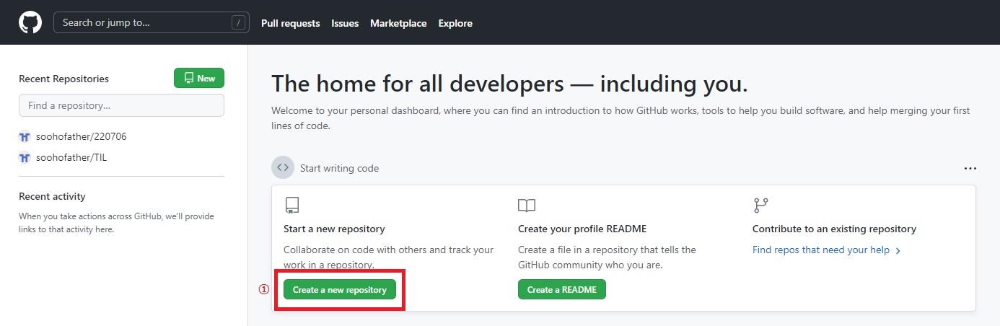
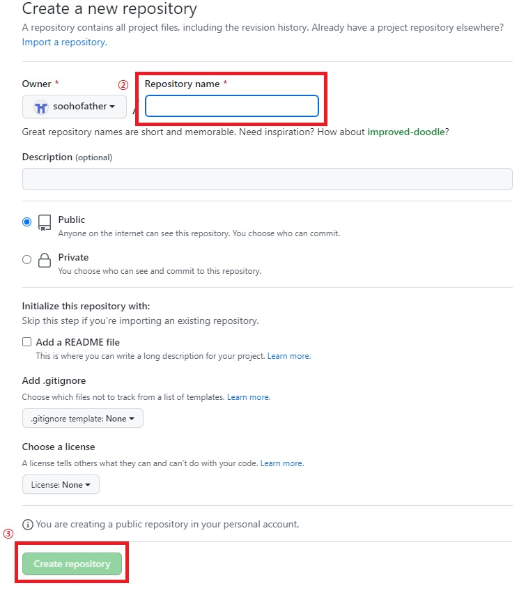

### 2022년 7월 6일

> Git으로 Github에 Push!


- Github에 원격저장소(리포지토리)를 만들기

  

  1.

  

  2.
  
  


- 나의 디렉토리(폴더,파일)를 Github에서 관리시작

  1. 원격저장소 경로 설정하기

     ```python
     $ git remote add 경로이름 경로URL
     ```

     ex) 경로이름으로 경로URL이 설정됨

  2. 현재 나의 디렉토리를 Github로 Push!

     ```python
     $ git push 위에서설정한경로이름 브랜치이름(처음에는 master or main) 
     ```

     ※ 로컬 폴더의 파일/포럳가 아닌 저장소의 버전(커밋)이 올라감

     ※ 기존 버전(커밋)에서 변경사항을 올림. 즉, 변경사항이 없으면 rejected 됨

     ※ 첫 push때는 인증절차가 진행됨. 로그인.

