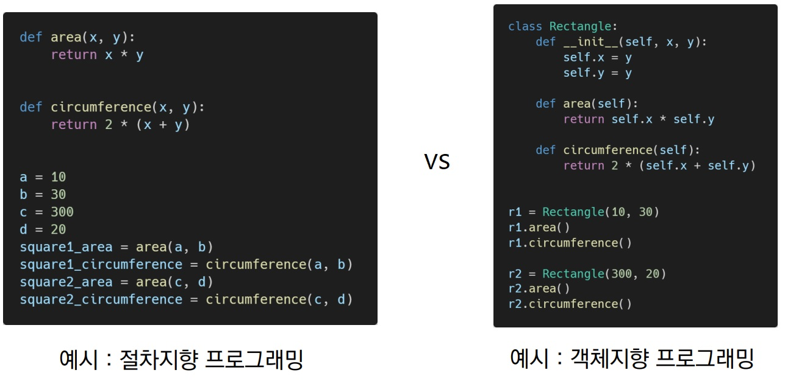
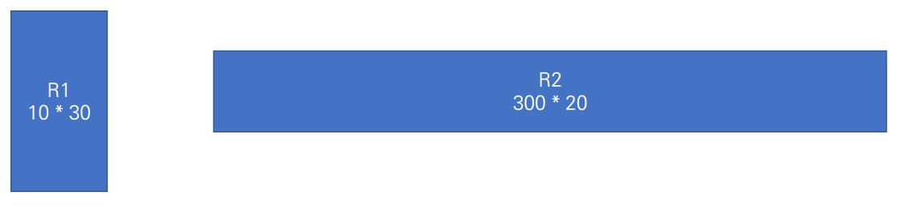

## 2022년 7월 19일(화)

> 파이썬! 객체지향 프로그래밍 이란!?
> 
> Person은 클래스, IU는 인스턴스


#### 1. 객체지향프로그램




- 사각형 : 클래스(class)

- 각 사각형(R1, R2) : 인스턴스(instance)

- 사각형의 정보(가로길이, 세로길이) : 속성(attribute)

- 사각형의 행동/기능(넓이를 구한다. 높이를 구한다) : 메소드(method)

- 객체지향의 장점(위키피디아)
  
  - 객체 지향 프로그래밍은 프로그램을 유연하고 변경이 용이하게 만들기 때문에 대규모 소프트웨어 개발에 많이 사용됩니다.
  
  - 또한, 프로그래밍을 더 배우기 쉽게 하고 소프트웨어 개발과 보수를 간편하게 하며,
    보다 직관적인 코드 분석을 가능하게 하는 장점을 가지고 있습니다.


#### 2. OOP 기초

- 기본 문법

```python
class MyClass:    # 클래스 정의
    pass

my_instance = MyClass()    # 인스턴스 생성

my_instance.my_method()    # 메서드 호출

my_instance.my_attribute    # 속성
```

- 클래스 : 객체들의 분류 (class)

- 인스턴스 : 하나하나의 실체/예(instance)

- 속성 : 특정 데이터 타입/클래스의 객체들이 가지게 될 상태/데이터를 의미

- 메소드 : 특정 데이터 /타입/클래스의 객체에 공통적으로 적용 가능한 행위(함수)

- 객체 비교하기
  
  - ==
    
    - Equal
    
    - 변수가 참조하는 객체가 동등한 경우 True (즉, 내용이 같은 경우)
    
    - 두 객체가 같아 보이지만  실제로 동일한 대상을 가리키고 있다고 확인해 준 것은 아님
  
  - is
    
    - 동일한(identical)
    
    - 두 변수가 동일한 객체를 가리키는 경우 True
    
    ```python
    a = [1, 2, 3]
    b = [1, 2, 3]
    
    print(a == b, a is b)    # True False
    
    
    a = [1, 2, 3]
    b = a
    
    print(a == b, a is b)    # True True
    ```

#### 3. 인스턴스


- 인스턴스 변수
  
  - 인스턴스가 개인적으로 가지고있는 속성(attribute)
  zettlr   
  - 각 인스턴스들의 고유한 변수

- 생성자 메소드에서 self.<name>으로 정의

- 인스턴스가 생성된 이후 <instance>.<name>으로 접근 및 할당

```python
 class Person:
      def __init(self, name):
        self.name = name
        
john = person('john')

print(john.name)			# john

john.name = 'john kim'
print(john.name)			# john kim

```

- 인스턴스 메소드

  - 인스턴스 변수를 사용하거나, 인스턴스 변수에 값을 설정하는 메소드
  - 클래스 내부에 정의되는 메소드의 기본
  - 호출 시, 첫번째 인자로 인스턴스 자기자신(self)이 전달됨

  ```python
  class MyClass
  
  	def instance_method(self, arg1, ...)
      
  # my_instance = MyClass()
  # my_instance.instance_methode(...)
  ```

- self

  - 인스턴스 자기자신
  - 파이썬에서 인스턴스 메소드는 호출 시 첫번째 인자로 인스턴스 자시닝 전달되게 설계
    - 매개변수 이름으로 self를 첫번째로 인자로 정의
    - 다른 단어로 써도 작동하지만, 파이썬의 암묵적인 규칙

- 생성자(constructor) 메소드

  - 인스턴스 객체가 생성될 때 자동으로 호출되는 메소드
  - 인스턴스 변수들의 초기값을 설정
  - 인스턴스 생성
  - __init__메소드 자동 호출

  ```python
  class Person:
      
      def __init(self):
          print('인스턴스가 생성되었습니다.')
          
  person1 = person()				# 인스턴스가 생성되었습니다.
  ```

  ```python
  class Person:
      
      def __init__(self, name):
          print(f'인스턴스가 생성되었습니다. {name}')
          
  person1 = person('지민')			# 인스턴스가 생성되었습니다. 지민
  ```

- 소멸자(destructor) 메소드

  - 인스턴스 객체가 소멸(파괴)되기 직전에 호출되는 메소드

  ```python
  class person:
      
      def __del__(self):
          print('인스턴스가 사라졌습니다.')
          
  pernson1 = person()
  del person1						# 인스턴스가 사라졌습니다.
  ```

  
