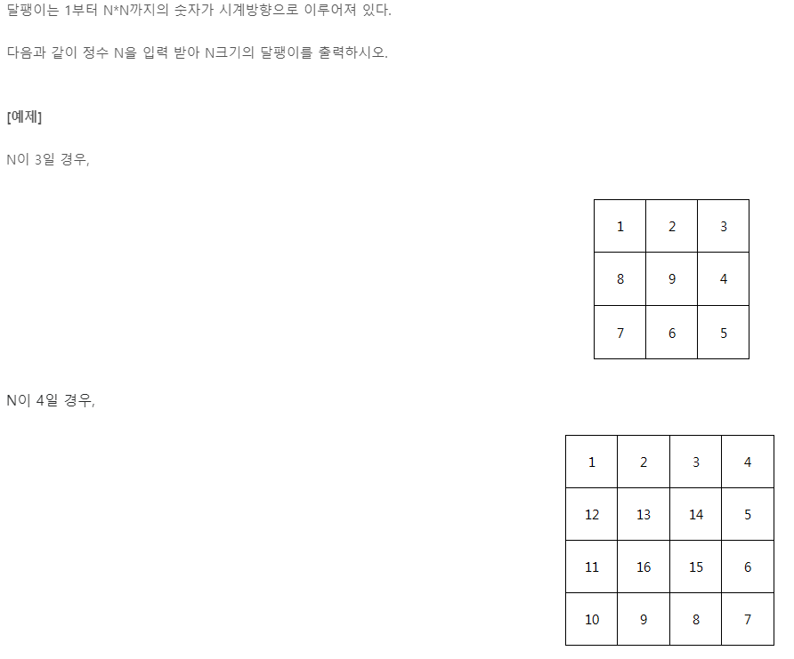

# 2022년 10월 30일(일)


### 1954. 달팽이 숫자



```python
TC = int(input())

for n in range(1, TC + 1):
    print(f"#{n}")

    T = int(input())

    snail = [[[0] for _ in range(T)] for __ in range(T)]

    dx = [0, 1, 0, -1]
    dy = [1, 0, -1, 0]  # 0 = >>, 1 = 아래로, 2 = >>, 3 = 위로

    x = 0
    y = 0
    narrow = 0

    for i in range(1, (T * T) + 1):

        snail[x][y] = i

        x += dx[narrow]
        y += dy[narrow]

        if x < 0 or y < 0 or x >= T or y >= T or snail[x][y] != [0]:
            x -= dx[narrow]
            y -= dy[narrow]

            narrow = (narrow + 1) % 4
            x += dx[narrow]
            y += dy[narrow]

    for ii in snail:
        for iii in ii:
            print(iii, end=" ")
        print()
```

- 델타탐색에 대해서 조금 알게 된 것 같다.
  - 미리 방향으로 가는 조건을 설정하기
- 방향을 바꾸는 if문의 조건이 중요하구나 하고 느꼇고,
  - x나 y가 0 보다 작으면 안되고, 
  - 범위를 벗어나도 안되며
  - 맨 처음 설정되었던 값이 아니면 안된다 (초기 설정값이 아니라는건 이미 한번 다녀갔다는 의미)
- 한바퀴를 돌았을때 다시 맨처음부터 돌아가는 조건을 만드는 접근방법을 생각못했었다.
  - 나누기 4하여 나머지를 이용