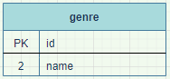

## 2022년 8월 24일(수)

> 데이터베이스! ORM


**수호아빠의 한줄평 : 약간 이제 실무를 들어가는 것 같은 기분이다. 아.. 계속 계속 새로운 것을 마구 들이 붓고는 있는데.. 얼마나 내가 담을 수 있을런지.. 걱정이되는 날...**


### ORM

- Object-Relational-Mapping
- 객체 지향 프로그래밍 언어를 사용하여 호환되지 않는 유형의 시스템 간의 데이터를 변환하는 프로그래밍 기술
- 파이썬에서는 SQLAlchemy, peewee 등 라이브러리가 있으며 Django 프레임워크 에서는 내장 Django ORM을 활용
- **객체(object)로 DB를 조작한다.**

```python
class Genre(models.Model):
name = models.CharField(max_length=30)
```



- 모델 설계 및 반영

  1. 클래스를 생성하여 내가 원하는 DB의 구조를 만든다.
  2. 클래스의 내용으로 데이터베이스에 반영하기 위한 마이그레이션 파일을 생성한다.

  ```python
  $ python manage.py makemigrations
  ```

  3. DB에 migrate 한다.

  ```python
  $ python manage.py migrate
  ```

-  Migration(마이그레이션)
  - Model에 생긴 변화를 DB에 반영하기 위한 방법
  - 마이그레이션 파일을 만들어 DB 스키마를 반영한다.
  - 명령어
    - makemigrations : 마이그레이션 파일 생성
    - migrate : 마이그레이션을 DB에 반영
- Migrate 살펴보기

```sqlite
BEGIN;
--
-- Create model Genre
--
CREATE TABLE "db_genre" (
"id" integer NOT NULL PRIMARY KEY AUTOINCREMENT, 
"name" varchar(30) NOT NULL
);
COMMIT

-- 파이썬으로 작성된 언어를 SQL로 바꿔줌
```


### ORM 기본조작 (CRUD)

- Create

  ```python
  # 1. create 메서드 활용
  Genre.objects.create(name='발라드')
  # 2. 인스턴스 조작
  genre = Genre()
  genre.name = '인디밴드'
  genre.save()
  ```

- Read

  ```python
  # 1. 전체 데이터 조회
  Genre.objects.all()
  # <QuerySet [<Genre: Genre object (1)>, <Genre: 
  Genre object (2)>]>
  
  # 2. 일부 데이터 조회(get)
  Genre.objects.get(id=1)
  # <Genre: Genre object (1)>
  
  # 3. 일부 데이터 조회(filter)
  Genre.objects.filter(id=1)
  # <QuerySet [<Genre: Genre object (1)>]>

- Update

  ```python
  # 1. genre 객체 활용
  genre = Genre.objects.get(id=1)
  # 2. genre 객체 속성 변경
  genre.name = '트로트’
  # 3. genre 객체 저장
  genre.save()
  ```

- Delete

  ```python
  # 1. genre 객체 활용
  genre = Genre.objects.get(id=1)
  # 2. genre 객체 삭제
  genre.delete()
  ```

  
