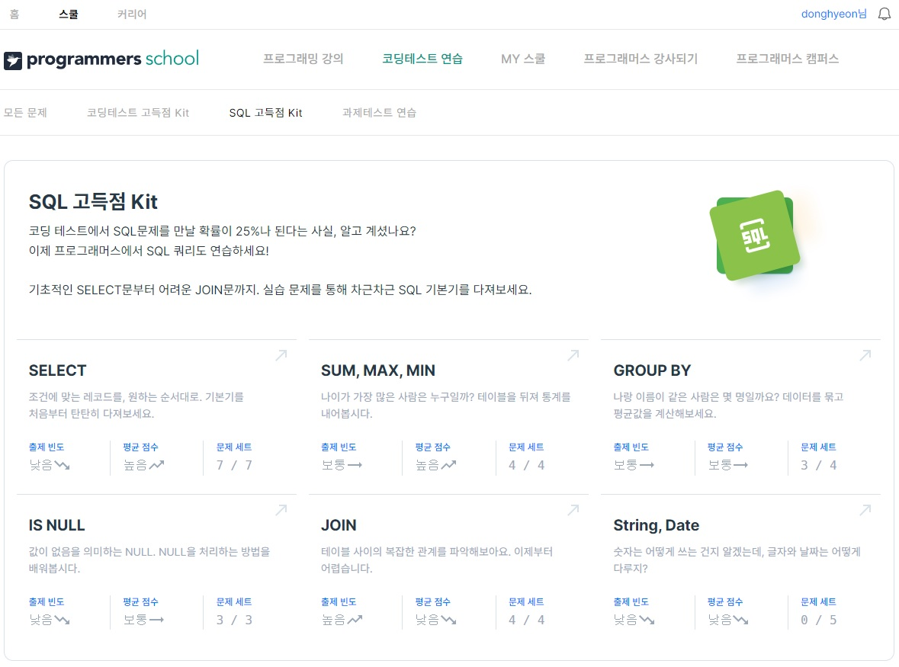

## 2022년 8월 26일(금)

> 프로그래머스 코딩테스트 연습 - SQL 고득점 Kit


**수호아빠의 한줄평 : 오늘 프로그래머스 kit을 풀면서 기초는 그래도 있는건가 싶은 느낌이 조금 들었다. INSERT, UPDATE는 안해봤는데 괜찬으려나 걱정이 살짝..**





### SELECT

- 모든 레코드 조회하기 level 1

```sql
-- 동물 보호소에 들어온 모든 동물의 정보를 ANIMAL_ID순으로 조회하는 SQL문을 작성해주세요. SQL을 실행하면 다음과 같이 출력되어야 합니다.

SELECT * FROM ANIMAL_INS ORDER BY ANIMAL_ID;
```

- 역순 정렬하기 level 1

```sql
-- 동물 보호소에 들어온 모든 동물의 이름과 보호 시작일을 조회하는 SQL문을 작성해주세요. 이때 결과는 ANIMAL_ID 역순으로 보여주세요. SQL을 실행하면 다음과 같이 출력되어야 합니다.

SELECT NAME, DATETIME FROM ANIMAL_INS ORDER BY ANIMAL_ID DESC;
```

- 아픈 동물 찾기 level 1

```sql
-- 동물 보호소에 들어온 동물 중 아픈 동물1의 아이디와 이름을 조회하는 SQL 문을 작성해주세요. 이때 결과는 아이디 순으로 조회해주세요.

SELECT ANIMAL_ID, NAME FROM ANIMAL_INS WHERE INTAKE_CONDITION = 'Sick' ORDER BY ANIMAL_ID;
```

- 어린 동물 찾기 level 1

```sql
-- 동물 보호소에 들어온 동물 중 젊은 동물1의 아이디와 이름을 조회하는 SQL 문을 작성해주세요. 이때 결과는 아이디 순으로 조회해주세요.

SELECT ANIMAL_ID,NAME FROM ANIMAL_INS WHERE INTAKE_CONDITION != 'Aged' ORDER BY ANIMAL_ID;
```

- 동물의 아이디와 이름 level 1

```sql
-- 동물 보호소에 들어온 모든 동물의 아이디와 이름을 ANIMAL_ID순으로 조회하는 SQL문을 작성해주세요. SQL을 실행하면 다음과 같이 출력되어야 합니다.

SELECT ANIMAL_ID, NAME FROM ANIMAL_INS ORDER BY ANIMAL_ID;
```

- 여러 기준으로 정렬하기

```sql
-- 동물 보호소에 들어온 모든 동물의 아이디와 이름, 보호 시작일을 이름 순으로 조회하는 SQL문을 작성해주세요. 단, 이름이 같은 동물 중에서는 보호를 나중에 시작한 동물을 먼저 보여줘야 합니다.

SELECT ANIMAL_ID, NAME, DATETIME FROM ANIMAL_INS ORDER BY NAME, DATETIME DESC;
```

- 상위 n개 레코드

```sql
-- 동물 보호소에 가장 먼저 들어온 동물의 이름을 조회하는 SQL 문을 작성해주세요.

SELECT NAME FROM ANIMAL_INS ORDER BY DATETIME LIMIT 1;
```


### SUM, MAX, MIN

- 최댓값 구하기 level 1

```sql
-- 가장 최근에 들어온 동물은 언제 들어왔는지 조회하는 SQL 문을 작성해주세요.

SELECT DATETIME FROM ANIMAL_INS ORDER BY DATETIME DESC LIMIT 1;
```

- 최솟값 구하기 level 2

```sql
-- 동물 보호소에 가장 먼저 들어온 동물은 언제 들어왔는지 조회하는 SQL 문을 작성해주세요.

SELECT DATETIME FROM ANIMAL_INS ORDER BY DATETIME LIMIT 1;
```

- 동물 수 구하기 level 2

```sql
-- 동물 보호소에 동물이 몇 마리 들어왔는지 조회하는 SQL 문을 작성해주세요.

SELECT COUNT(*) FROM ANIMAL_INS;
```

- 중복 제거하기 level 2

```sql
-- 동물 보호소에 들어온 동물의 이름은 몇 개인지 조회하는 SQL 문을 작성해주세요. 이때 이름이 NULL인 경우는 집계하지 않으며 중복되는 이름은 하나로 칩니다.

SELECT COUNT(DISTINCT NAME) FROM ANIMAL_INS WHERE NAME IS NOT NULL;
```


### GROUP BY

- 고양이와 개는 몇 마리 있을까 level 2

```sql
-- 동물 보호소에 들어온 동물 중 고양이와 개가 각각 몇 마리인지 조회하는 SQL문을 작성해주세요. 이때 고양이를 개보다 먼저 조회해주세요.

SELECT ANIMAL_TYPE, COUNT(*) FROM ANIMAL_INS WHERE ANIMAL_TYPE IN ('Cat', 'Dog') GROUP BY ANIMAL_TYPE ORDER BY ANIMAL_TYPE;
```

- 동명 동물 수 찾기 level 2

```sql
-- 동물 보호소에 들어온 동물 이름 중 두 번 이상 쓰인 이름과 해당 이름이 쓰인 횟수를 조회하는 SQL문을 작성해주세요. 이때 결과는 이름이 없는 동물은 집계에서 제외하며, 결과는 이름 순으로 조회해주세요.

SELECT NAME, COUNT(*) FROM ANIMAL_INS WHERE NAME IS NOT NULL GROUP BY NAME HAVING COUNT(*) >= 2 ORDER BY NAME;
```

- 입양 시각 구하기(1) level 2

```sql
-- 보호소에서는 몇 시에 입양이 가장 활발하게 일어나는지 알아보려 합니다. 09:00부터 19:59까지, 각 시간대별로 입양이 몇 건이나 발생했는지 조회하는 SQL문을 작성해주세요. 이때 결과는 시간대 순으로 정렬해야 합니다.

SELECT HOUR(DATETIME),COUNT(*) FROM ANIMAL_OUTS WHERE HOUR(DATETIME) BETWEEN 9 AND 19 GROUP BY HOUR(DATETIME) ORDER BY HOUR(DATETIME);
```

- 입양 시각 구하기(2) level 4

```sql
-- 못풀었습니다 ㅠ
```


### IS NULL

- 이름이 없는 동물의 아이디 level 1

```SQL
-- 동물 보호소에 들어온 동물 중, 이름이 없는 채로 들어온 동물의 ID를 조회하는 SQL 문을 작성해주세요. 단, ID는 오름차순 정렬되어야 합니다.

SELECT ANIMAL_ID FROM ANIMAL_INS WHERE NAME IS NULL;
```

- 이름이 있는 동물의 아이디 level 1

```sql
-- 동물 보호소에 들어온 동물 중, 이름이 있는 동물의 ID를 조회하는 SQL 문을 작성해주세요. 단, ID는 오름차순 정렬되어야 합니다.

SELECT ANIMAL_ID FROM ANIMAL_INS WHERE NAME IS NOT NULL ORDER BY ANIMAL_ID;
```

- NULL 처리하기 level 2

```sql
-- 입양 게시판에 동물 정보를 게시하려 합니다. 동물의 생물 종, 이름, 성별 및 중성화 여부를 아이디 순으로 조회하는 SQL문을 작성해주세요. 이때 프로그래밍을 모르는 사람들은 NULL이라는 기호를 모르기 때문에, 이름이 없는 동물의 이름은 "No name"으로 표시해 주세요.

SELECT ANIMAL_TYPE,
       CASE
            WHEN NAME IS NULL THEN 'No name'
            ELSE NAME
        END,
        SEX_UPON_INTAKE
FROM ANIMAL_INS 
ORDER BY ANIMAL_ID;
```


### JOIN

- 없어진 기록 찾기 level 3

```sql
-- 천재지변으로 인해 일부 데이터가 유실되었습니다. 입양을 간 기록은 있는데, 보호소에 들어온 기록이 없는 동물의 ID와 이름을 ID 순으로 조회하는 SQL문을 작성해주세요.

SELECT ANIMAL_OUTS.ANIMAL_ID, ANIMAL_OUTS.NAME 
FROM ANIMAL_OUTS 
LEFT OUTER JOIN ANIMAL_INS ON ANIMAL_OUTS.ANIMAL_ID = ANIMAL_INS.ANIMAL_ID 
WHERE ANIMAL_INS.ANIMAL_ID IS NULL 
ORDER BY ANIMAL_OUTS.ANIMAL_ID;
```

- 있었는데요 없었습니다 level 3

```sql
-- 관리자의 실수로 일부 동물의 입양일이 잘못 입력되었습니다. 보호 시작일보다 입양일이 더 빠른 동물의 아이디와 이름을 조회하는 SQL문을 작성해주세요. 이때 결과는 보호 시작일이 빠른 순으로 조회해야합니다.

SELECT ANIMAL_INS.ANIMAL_ID, ANIMAL_INS.NAME
FROM ANIMAL_INS 
LEFT OUTER JOIN ANIMAL_OUTS 
	ON ANIMAL_INS.ANIMAL_ID = ANIMAL_OUTS.ANIMAL_ID
WHERE ANIMAL_INS.DATETIME > ANIMAL_OUTS.DATETIME
ORDER BY ANIMAL_INS.DATETIME;
```

- 오랜 기간 보호한 동물(1) level 3

```sql
-- 아직 입양을 못 간 동물 중, 가장 오래 보호소에 있었던 동물 3마리의 이름과 보호 시작일을 조회하는 SQL문을 작성해주세요. 이때 결과는 보호 시작일 순으로 조회해야 합니다.

SELECT ANIMAL_INS.NAME, ANIMAL_INS.DATETIME
FROM ANIMAL_INS
LEFT OUTER JOIN ANIMAL_OUTS
ON ANIMAL_INS.ANIMAL_ID = ANIMAL_OUTS.ANIMAL_ID
WHERE ANIMAL_OUTS.DATETIME IS NULL
ORDER BY ANIMAL_INS.DATETIME
LIMIT 3;
```

- 보호소에서 중성화한 동물 level 4

```sql
-- 보호소에서 중성화 수술을 거친 동물 정보를 알아보려 합니다. 보호소에 들어올 당시에는 중성화1되지 않았지만, 보호소를 나갈 당시에는 중성화된 동물의 아이디와 생물 종, 이름을 조회하는 아이디 순으로 조회하는 SQL 문을 작성해주세요.

SELECT ANIMAL_INS.ANIMAL_ID, ANIMAL_INS.ANIMAL_TYPE, ANIMAL_INS.NAME
FROM ANIMAL_INS 
INNER JOIN ANIMAL_OUTS
	ON ANIMAL_INS.ANIMAL_ID = ANIMAL_OUTS.ANIMAL_ID
WHERE ANIMAL_INS.SEX_UPON_INTAKE IN ('Intact Male', 'Intact Female')
	AND ANIMAL_OUTS.SEX_UPON_OUTCOME IN ('Neutered Male', 'Spayed Female')
ORDER BY ANIMAL_INS.ANIMAL_ID;
```

