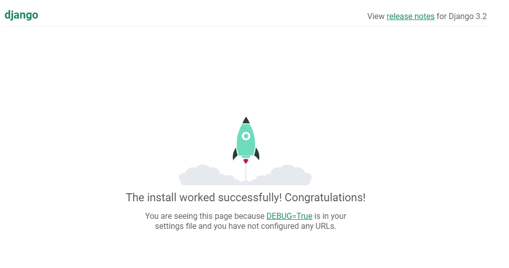

## 2022년 9월 21일(수)

> Django01! 장고 첫 시간! 환경 설정!

**수호아빠의 한줄평: 음..오늘은 수월했지만.. 뭔가 긴장된다.. 또 엄청난 것이 마구마구 올 것만 같아서 무섭다..**

### 1. 가상환경 생성 / 실행

- 각 프로젝트마다 다른버전의 프로그램들을 사용할 가능성이 있어서 각 프로젝트마다 해당 버전에 맞게 각각의 프로그램을 사용하기 위해서 각 프로젝트의 가상환경을 만들어서 진행

1. Git bash를 통하여 서버관리를 할 폴더를 만들고, 해당 폴더로 이동

   - `mkdir [폴더이름]`
   - `cd [이동할 폴더이름]`

   

2. 가상환경 생성

   - `python -m venv [가상환경 이름]`

   

3. 가상환경 실행

   - `source [가상환경 이름]/Script/Activate`
   - MAC은 source 대신 bin
   - 실행되어있는 가상환경을 끄는 것은 `deactivate`
   - 실행되면 아래의 빨간색 부분과 같이 뜸

   
   
   

### 2. Django 설치 및 실행, 웹 서버 돌리기

- 현재 Django의 최신버전은 4.xx이지만, Django LTS version인 3.2.13버전을 설치할 예정이다.
- Django LTS version
  - Long Term Support 버전
  - 장기 지원 되는 버전으로 다른 버전에 비해 조금 더 오래 관리해준다. 일반적으로 3년
  - 현재 기준 가장 최신 LTS version은 3.2.13

1. Django 3.2.13 설치

   - `pip install django==3.2.13`
   - 설치 후 확인이 잘 되었나 확인 `pip list`
   - Django 3.2.13외에 다른 몇가지도 설치되지만 정상이다.

   

2. Django를 이용하여 Web 만들기 시작하기

   - `django-admin startproject [프로젝트 이름] . `
   - 위에 `.`은 현재 폴더를 의미
   - Django에게 새로운 웹을 만들기 위해 setup해달라는 명령
   - 장고에게 명령하기 위해 `django-admin`을 사용

   

   - 위와 같이 `manage.py`파일과 `firstpjt`폴더가 생김

3. 만든 Web의 서버를 실행하기

   - `python manage.py runserver`
   - 실행하면 2번에서 생성된 `manage.py`가 실행되며 서버가 실행됨

   

4. 크롬에서 서버 작동 확인

   - 크롬에서 http://localhost:8000/ 로 접속

   

   - 위 사진과 같이 로켓이 정상적으로 발사가 되었다면, 서버가 잘 실행 되고있는 것이다.
   - 아래와 같이 Git bash에서 접속 현황도 보여준다.

   
