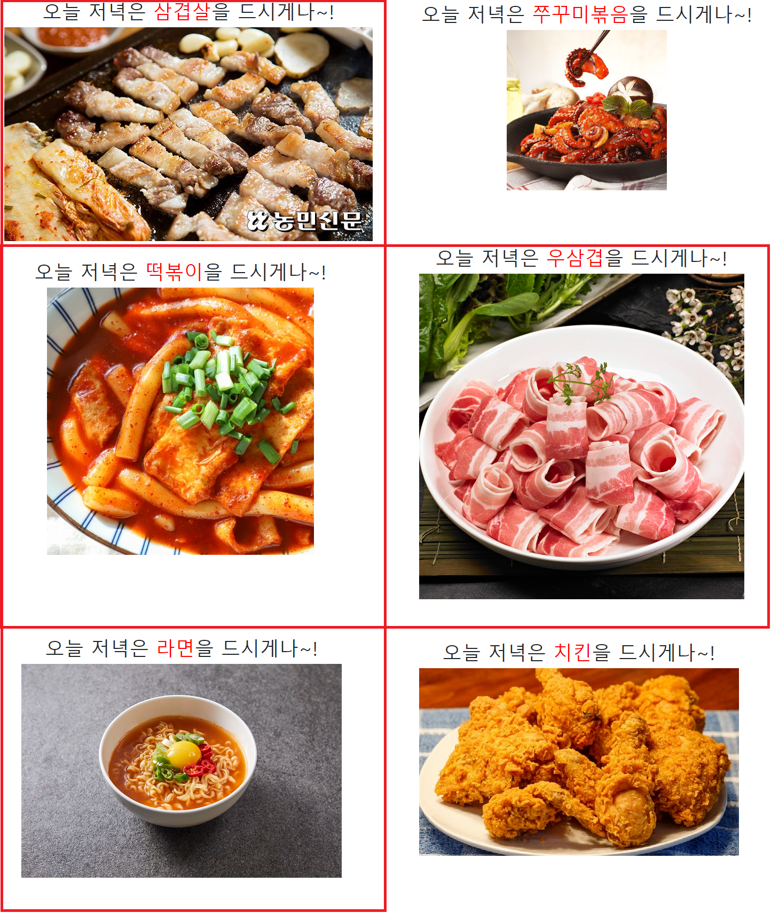
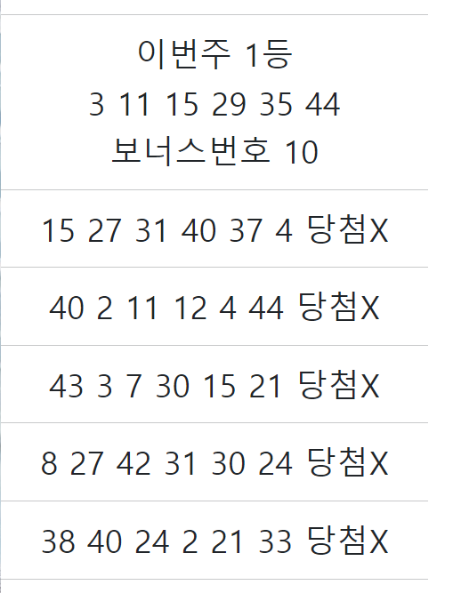

## 2022년 9월 22일(목)

> Django02! 오후실습-저녁 추천 사이트, 로또번호 추천기 사이트


### 저녁 추천 사이트

- 아래 6가지 메뉴중 랜덤으로 추천



#### `views.py`

```python
def dinner(request):

    foods = [
        '삼겹살',
        '우삼겹',
        '쭈꾸미볶음',
        '라면',
        '치킨',
        '떡볶이',
        ]

    food_img = {
        '삼겹살': 'https://m.nongmin.com/upload/bbs/202202/20220226222727022/20220226222727022.jpg',
        '우삼겹': 'https://cdn.imweb.me/thumbnail/20200423/c5f739bde02b6.jpg',
        '라면': 'https://health.chosun.com/site/data/img_dir/2020/09/07/2020090702900_0.jpg',
        '쭈꾸미볶음': 'http://image.auction.co.kr/itemimage/21/bd/98/21bd983ea3.jpg',
        '치킨': 'https://t1.daumcdn.net/cfile/tistory/2403BA485896A5C829',
        '떡볶이': 'https://cdn-std-web-216-59-godomall.spdycdn.net/dothegmal4_godomall_com/data/goods/21/06/22/1000000242/1000000242_detail_071.jpg',
    }
    food = random.choice(foods)
    img = food_img[food]

    context = {
        'food': food,
        'img': img,
    }

    return render(request, 'dinner.html', context)
```


#### `html 파일`

```html
<!DOCTYPE html>
<html lang="en">
<head>
  <meta charset="UTF-8">
  <meta http-equiv="X-UA-Compatible" content="IE=edge">
  <meta name="viewport" content="width=device-width, initial-scale=1.0">
  <link href="https://cdn.jsdelivr.net/npm/bootstrap@5.2.1/dist/css/bootstrap.min.css" rel="stylesheet" integrity="sha384-iYQeCzEYFbKjA/T2uDLTpkwGzCiq6soy8tYaI1GyVh/UjpbCx/TYkiZhlZB6+fzT" crossorigin="anonymous">
  <title>Document</title>
  <style>
    .food{
      color: red;
    }
  </style>
</head>
<body>
  <div class="text-center">
    <h1> 오늘 저녁은 <span class="food">{{ food }}</span>을 드시게나~! </h1>
    

  </div>


  <script src="https://cdn.jsdelivr.net/npm/bootstrap@5.2.1/dist/js/bootstrap.bundle.min.js" integrity="sha384-u1OknCvxWvY5kfmNBILK2hRnQC3Pr17a+RTT6rIHI7NnikvbZlHgTPOOmMi466C8" crossorigin="anonymous"></script>
</body>
</html>
```


### 로또번호 추천기

- 아래와 같이 1~45번중 6개번호를 5개 찍어주고, 지난주 기준으로 당첨결과 알려줌



#### `views.py`

```python
def lotto(request):

    lotto_num = [3, 11, 15, 29, 35, 44]
    numbers = []

    for _ in range(5):
        numbers.append(random.sample(range(1,46), 6))

    result = []

    for i in numbers:
        cnt = 0
        bonus = 0
        for ii in range(len(i)):
            if i[ii] in lotto_num:
                cnt += 1
            elif i[ii] == 10:
                bonus += 1
        if cnt == 6:
            result.append('1등')
        elif cnt == 5 and bonus == 1:
            result.append('2등')
        elif cnt == 5 and bonus != 1:
            result.append('3등')
        elif cnt == 4:
            result.append('4등')
        elif cnt == 3:
            result.append('5등')
        else:
            result.append('당첨X')

    context = {
        'number1': numbers[0],
        'number2': numbers[1],
        'number3': numbers[2],
        'number4': numbers[3],
        'number5': numbers[4],
        'lotto_num': lotto_num,
        'result': result,
        'result1': result[0],
        'result2': result[1],
        'result3': result[2],
        'result4': result[3],
        'result5': result[4],
    }


    return render(request, 'lotto.html', context)
```


#### `html 파일`

````html
<!DOCTYPE html>
<html lang="en">
<head>
  <meta charset="UTF-8">
  <meta http-equiv="X-UA-Compatible" content="IE=edge">
  <meta name="viewport" content="width=device-width, initial-scale=1.0">
  <link href="https://cdn.jsdelivr.net/npm/bootstrap@5.2.1/dist/css/bootstrap.min.css" rel="stylesheet" integrity="sha384-iYQeCzEYFbKjA/T2uDLTpkwGzCiq6soy8tYaI1GyVh/UjpbCx/TYkiZhlZB6+fzT" crossorigin="anonymous">
  <title>Document</title>
</head>
<body>

    <div class="text-center fs-1" style="width: 30rem;"><hr>
      <div>
        이번주 1등<br>
        
          {{num}}
        <br>
        보너스번호 10
        <hr>
      </div>
      <div>
        
          {{num1}}
        {{result1}}<hr>
      </div>
      <div>
        
          {{num2}}
        {{result2}}<hr>
      </div>
      <div>
        
        {{num3}}
        {{result3}}<hr>
      </div>
      <div>
        
          {{num4}}
        {{result4}}<hr>
      </div>
      <div>
        
          {{num5}}
        {{result5}}<hr>
      </div>

    </div>

  <script src="https://cdn.jsdelivr.net/npm/bootstrap@5.2.1/dist/js/bootstrap.bundle.min.js" integrity="sha384-u1OknCvxWvY5kfmNBILK2hRnQC3Pr17a+RTT6rIHI7NnikvbZlHgTPOOmMi466C8" crossorigin="anonymous"></script>
</body>
</html>
````

