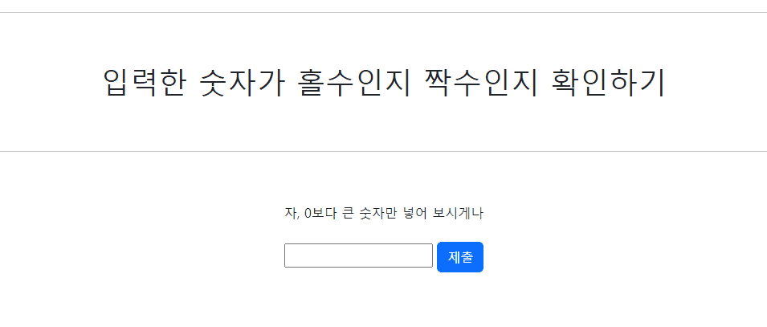
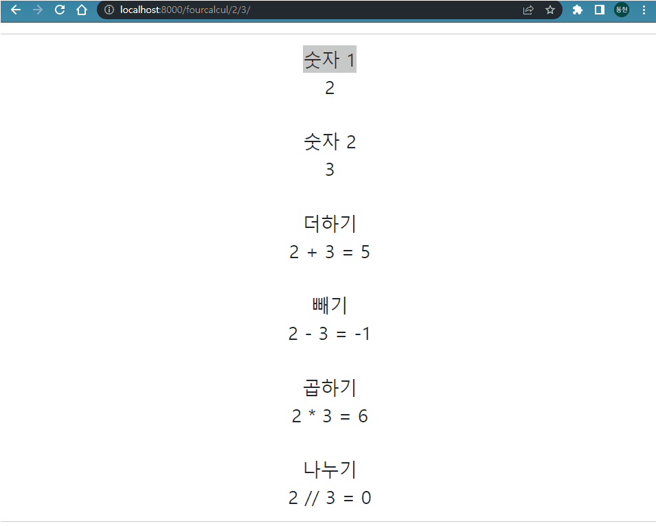
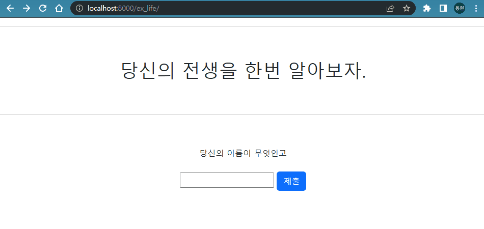

# 9월 26일 (월)

> Django03!  실습

### 1. 입력한 숫자가 홀수인지 짝수인지 확인하기

- 숫자를 입력하면 숫자가 홀수인지 짝수인지 0인지 판단하고 화면에 표시하는 프로그램을 개발하세요.
- 해당 프로그램은 Path parameter를 활용해야 합니다.

- 주소창에 직접 값을 넣는 형태로 실습을 진행합니다.(form 사용 x)
  - EX) is-odd-even/1 , is-odd-even/2 , is-odd-even/0
- `수호아빠: 아.. form 사용x를 못봐서 form 사용으로 만들었다...`

### 2. 사칙연산 수행하기

- 숫자 2개를 입력하면 사칙연산 수행 결과를 화면에 표시하는 프로그램을 개발하세요.
- 해당 프로그램은 Path parameter를 활용해야 합니다.
  - 주소창에 직접 값을 넣는 형태로 실습을 진행합니다.(form 사용 x)
  - 사칙연산은 view에서 수행합니다. view에서 연산한 결과를 템플릿에 출력합니다.

### 3. 랜덤 전생

- 이름을 입력하면 랜덤으로 대상의 전생을 화면에 표시하는 프로그램을 개발하세요. 
- 해당 프로그램은 form 태그를 활용하여 사용자에게 텍스트 1개를 입력 받아야 합니다.

### 4. 로렘 입숨 한글 버전

- https://www.lipsum.com/ 의 한글 버전 프로그램을 개발하세요.
- 해당 프로그램은 form 태그를 활용하여 사용자에게 숫자 2개를 입력 받아야 합니다.
  - 문단의 수
  - 문단 별 단어의 수
    - 사용할 단어 꾸러미는 자유롭게 만들어주세요.

