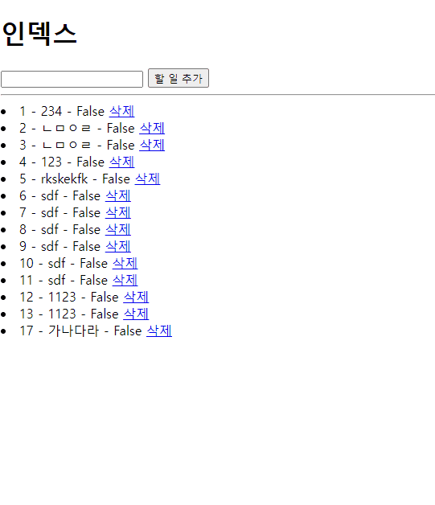

# 2022년 9월 28일 (수)

> Django05!  게시판 만들기


`수호아빠의 한마디: 뭔가 흥미진진해졌다. `


### 게시판을 만들어보자.

1. 작성한 글이 바로 반영됨
2. 새로고침을 해도 사라지지 않음
3. 삭제 버튼을 누르면 삭제됨



- 작성한 글 바로 반영

  - redirect함수 사용

- 새로고침을 해도 사라지지 않음

  - DB를 사용하여 거기에 데이터를 넣는 방식

  - 먼저 DB를 만들 클라스를 정의함 (models.py)

    ```python
    class Todo(models.Model):
    
        content = models.CharField(max_length=80)
        completed = models.BooleanField(default=False)
    ```

  - 위에서 만든 클라스를 실제 DB로 만듬 (Terminal)

    - python manage.py makemigrations
    - python manage.py migrate

  - 화면에 보여지게 하기위해 ORM을 사용 (views.py)

    ```python
    # 데이터를 가져와 content에 넣고
    content = request.GET.get("content")
    
    # 위에서 content에 넣은 값을 Todo테이블의 content에 데이터를 넣기
    Todo.objects.create(content=content)
    ```

  - 위에서 넣은 Todo게시판에 content내용을 가져오기 (views.py)

    ```python
    # todos에다가 Todo테이블 전체정보를 가져오는 ORM
    todos = Todo.objects.all()
    ```

  - 템플릿에다가 넣어서 화면에 나오게하기 (html)

    ```html
    <!-- 그냥 {{ todos }} 로 출력하면 이상하게 나옴.. -->
    <!-- 아래와 같이 for 반복문을 사용해서 나오게 해야함. -->
    <!-- 또 주의해야 할것은 꺼내올때 .하고 원하는것을 붙여줘야 정확히 나옴 -->
    <!-- {{ todo.id }} 이렇게 -->
    
      
        <li>{{ todo.id }} - {{ todo.content }} - {{ todo.completed }}
        </li>
      
    ```

- 게시글 삭제

  ```python
  # 처음 보낼때 데이터를 todo_pk를 추가해서 보냄 url/delete/todo_pk
  # 여기서 todo_pk가 삭제하려는 그 글의 pk(고유번호)가 됨
  # pk(프라이머리키)가 todo_pk(url 두번째꺼)인 것을 가져와서 todo변수에 넣어줘라는 의미
  # todo.delete()를 이용하여 todo에 넣은 것을 삭제
  
  def delete(request, todo_pk):
      todo = Todo.objects.get(pk=todo_pk)
      todo.delete()
  
      return redirect("todos:index")
  ```

  
