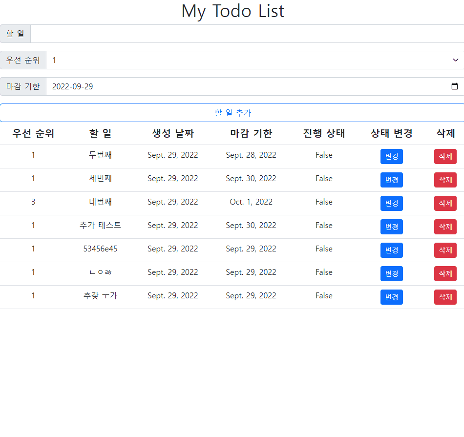

# 2022년 9월 29일 (목)

> Django05-2! CRUD를 사용하여 게시판 만들기

`수호아빠의 한마디: 아..상태 변경하는것 거의 3시간 걸린듯...ㅜㅠㅠ `

### CRUD를 사용하여 게시판을 만들어보자.

1. 작성한 글을 바로 아래에서 확인
2. 상태 변경 버튼을 누르면 해당 라인의 글씨가 변하고 진행상태 값이 변경됨
3. 삭제 버튼을 누르면 해당 라인이 삭제됨

`ps) 앗.. 녹화하면서 찾았는데.. 우선순위 버그를 발견하였다..`
