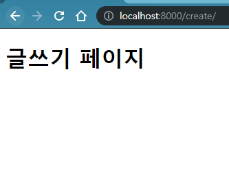
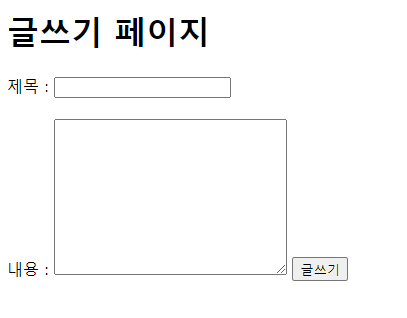
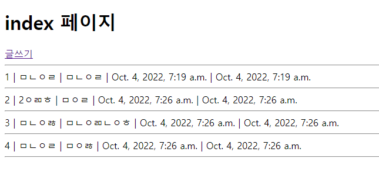
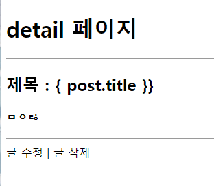

# 2022년 10월 4일 (화)

> Django07!  CRUD 복습 및 Django ModelForm


`수호아빠의 한마디: 주말에 복습을 못해서 복습 했더니..하루 다갔네..`


## Django CRUD 복습

### 1. Django 개발환경 만들기

1. `$ python -m venv afternoon1004-venv`

   - afternoon1004-venv라는 가상환경 생성

2. `$ source afternoon1004-venv/Scripts/Activate`

   - 1번에서 생성한 가상환경 실행

   - 아래 빨간색 표시가 보이면 정상 실행

     

3. `$ pip install django==3.2.13`

   - 장고 3.2.13 설치 (LTS 버전)

4. `$ django-admin startproject pjtafternoon . `

   - 지금 폴더에 pjtafternoon이라는 프로젝트를 만듬

5. `$ django-admin startapp appcsrf`

   - appcsrf라는 앱을 (기능을) 만듬

6. ` $ python manage.py runserver`

   - 위에서 만든 프로젝트의 서버를 로컬에서 돌림

   - 아래와 같이 크롬에서 http://localhost:8000/에 들어가서, 로켓이 보이면 성공

     


7. setting.py에서 `INSTALLED_APPS` 안에 위에서 만든 `appcsrf` 추가

8. pjtafternoon/urls.py에서  url나누기

- `import include` 추가
- `path("", include("appcsrf.urls")),` 입력

9. appcsrf/urls.py 생성 후 해당 파일에 urls.py 추가 및 기본 세팅

- ` from django.urls import path`
- `app_name = "appcsrf"`
- `urlpatterns = []`


### 2. Django CRUD - Index 페이지 생성, 테이블 만들기

1. appcsrf/urls.py에서 url 생성

   - `path("", views.index, name="index"),`
   - `from . import views`

2. appcsrf/views.py에서 `index` 함수 정의

   ```python
   def index(request):
   
       return render(request, "appcsrf/index.html")
   ```

3. appcsrf폴더에 templates폴더를 만들고 그 안에 appcsrf 폴더를 만듬

4. 위 3번에서 만든 폴더에 index.html을 만든 후 http://localhost:8000/에서 확인

   ```html
   <!DOCTYPE html>
   <html lang="en">
   <head>
     <meta charset="UTF-8">
     <meta http-equiv="X-UA-Compatible" content="IE=edge">
     <meta name="viewport" content="width=device-width, initial-scale=1.0">
     <title>Document</title>
   </head>
   <body>
   
     <h1> index 페이지 </h1>
     
   </body>
   </html>
   ```

​	

5. appcsrf/models.py 에서 테이블 만들기

   - 아래 내용 입력

   ```python
   class Article(models.Model):
       title = models.CharField(max_length=20)
       content = models.TextField()
       created_at = models.DateTimeField(auto_now_add=True)
       updated_at = models.DateTimeField(auto_now=True)
   ```

   - `$ python manage.py makemigrations`
   - `$ python manage.py migrate`

### 3. Django CRUD - Create

1. appcsrf/urls.py에서 `create` url 생성
   - `path('create/', views.create, name='create'),`

2. appcsrf/views.py에서 `create` 함수 정의

   ```python
   def create(request):
   
       return render(request, "appcsrf/create.html")
   ```

3. templates/appcsrf에 create.html 생성

   ```html
   <!DOCTYPE html>
   <html lang="en">
   <head>
     <meta charset="UTF-8">
     <meta http-equiv="X-UA-Compatible" content="IE=edge">
     <meta name="viewport" content="width=device-width, initial-scale=1.0">
     <title>Document</title>
   </head>
   <body>
   
     <h1>글쓰기 페이지</h1>
     
   </body>
   </html>
   ```

   

4. index 페이지에서 글쓰기 페이지로 넘어가도록 만듬
   - `<a href="">글쓰기</a>`

5. templates/appcsrf/create.html에 제목과 내용을 입력하는 form 생성

   ```html
     <form action="">
   
       <label for="title">제목 : </label>
       <input type="text" name="title" id="title">
       <br><br>
   
       <label for="content">내용 : </label>
       <textarea name="content" id="content" cols="30" rows="10" required></textarea>
      
   
       <input type="submit" value="글쓰기">
   ```

   

6. 제목과 내용을 테이블에 넣게 만들기

   - urls.py에서 위에 작성된 제목과 내용을 받을 url을 추가함

     - `path('new/', views.new, name='new'),` 추가

   - views.py에서 받은 내용을 `Article` 테이블에 추가하고 화면을 index로 가는 `new`함수 정의

     ```python
     def new(request):
     
         title = request.GET.get("title")
         content = request.GET.get("content")
     
         Article.objects.create(title=title, content=content)
     
         return redirect("appcsrf:index")
     
     ```

   - create.html에서 form action 수정
     - `<form action="">`

7. index 페이지에서 추가한 내용을 보이게 만들기

   - views.py에서 index 함수 내용 추가

     ```python
     def index(request):
     
         posts = Article.objects.all()
         
         context = {
             "posts": posts,
         }
     
         return render(request, "appcsrf/index.html", context)
     ```

   - index.html에서 위에서 posts에 넣은 테이블 제목 보이게 만들기위해 내용추가

     ```html
     
     {{ post.id }}
     {{ post.title }}
     {{ post.created_at }}
     {{ post.updated_at }}
     
     ```

     

### 4. Django CRUD - Read

1. urls.py에서 pk값을 받을수 있도록 내용 추가

   - `path("detail/<int:pk>", views.detail, name="detail"),`

2. views.py에서도 함수를 정의할때 pk값을 받을 수 있도록 내용 추가

   ```python
   def detail(request, pk):
   
       return render(request, "appcsrf/detail.html")
   ```

3. index.html파일에서 해당 제목의 pk값을 보낼수 있도록 내용 수정

   - 타이틀에 a태그를 걸어서 detail 페이지로 이동 및 해당 제목의 pk를 보내도록 설정

   ```html
   <body>
       
     
     {{ post.id }} | 
     <a href="">{{ post.title }}</a> | 
     {{ post.created_at }} | 
     {{ post.updated_at }}
     <hr>
     
   </body>
   ```

4. detail페이지에서 이전에 클릭한 제목의 상세내용이 보이도록 설정

   - views.py에서 받은 pk의 내용을 보일수 있도록 내용 추가

     ```python
     def detail(request, pk):
     
         post = Article.objects.get(pk=pk)
     
         context = {
             "post": post,
         }
     
         return render(request, "appcsrf/detail.html", context)
     ```

   - detail.html에서 views에서 가져온 정보를 보이도록 설정

     ```html
       <h2>제목 : { post.title }}</h2>
       <h4>{{ post.content }}</h4>
       <hr>
     ```

     

### 5. Django CRUD - Delete

1. urls.py

   - `path("delete/<int:pk>", views.delete, name="delete"),`

2. views.py

   ```python
   def delete(request, pk):
   
       post_delete = Article.objects.get(pk=pk)
   
       post_delete.delete()
   
       return redirect("appcsrf:index")
   ```

3. detail.html
   - `<a href=""> 글 삭제</a>`

### 6. Django CRUD - Update

1. 먼저 글을 작성할 템플릿을 만들기

   - urls.py

     - `path("update/<int:pk>", views.update, name="update"),`

   - views.py

     ```python
     def update(request, pk):
     
         return render(request, "appcsrf/update.html")
     ```

   - 템플릿 `update.html` 생성 (create와 동일한 폼 복사)

     ```html
     <!DOCTYPE html>
     <html lang="en">
     <head>
       <meta charset="UTF-8">
       <meta http-equiv="X-UA-Compatible" content="IE=edge">
       <meta name="viewport" content="width=device-width, initial-scale=1.0">
       <title>Document</title>
     </head>
     <body>
       <h1>글수정 페이지</h1>
     
       <form action="">
     
         <label for="title">제목 : </label>
         <input type="text" name="title" id="title>
         <br><br>
     
         <label for="content">내용 : </label>
         <textarea name="content" id="content" cols="30" rows="10" required></textarea>
        
         <input type="submit" value="글쓰기">
       </form>
       
     </body>
     </html>
     ```

     

   - detail페이지에서 글수정을 누르면 update.html로 가지게 `글 수정`에 a태그

     - `<a href=""> 글 수정</a> `

2. 글 수정을 하려는 pk의 내용을 가져오게 하기

   - views.py에서 기존 update 함수의 내용 추가

     ```python
     def update(request, pk):
     
         old_post = Article.objects.get(pk=pk)
     
         context = {
             "old_post": old_post,
         }
     
         return render(request, "appcsrf/update.html", context)
     ```

   - update.html에서 위에서 설정한 old_post의 title과 content 값을 넣어줌
     - `<input type="text" name="title" id="title" value="{{ old_post.title }}">`
     - `<textarea name="content" id="content" cols="30" rows="10" required>{{ old_post.content }}</textarea>`

3. 새로 입력한 내용을 테이블에 반영한 후 index화면으로 가기

   - urls.py

     - `path("newupdate/", views.newupdate, name="newupdate"),`

   - views.py

     ```python
     def newupdate(request, pk):
     
         new_update = Article.objects.get(pk=pk)
     
         title = request.GET.get("title")
         content = request.GET.get("content")
     
         new_update.title = title
         new_update.content = content
         new_update.save()
     
         return redirect("appcsrf:index")
     ```

   - update.html에서 입력한 내용을 newupdate로 pk값과 함께 보내지도록 form action 값 수정
     - `<form action="">`


## Django ModelForm

### 1. ModelForm을 이용한 Create

1. Forms.py를 생성 후 함수 정의

   ```python
   from django import forms
   from .models import Article
   
   
   class ArticleForm(forms.ModelForm):
       class Meta:
           model = Article
           fields = ["title", "content"]
   
   ```

2. veiws.py 에서 글쓰기 페이지에 내용추가

   ```python
   from .forms import ArticleForm
   
   def create(request):
   
       article_form = ArticleForm()
   
       context = {
           "article_form": article_form,
       }
   
       return render(request, "appcsrf/create.html", context)
   ```

3. create.html 에서 기존 글쓰는 칸은 없애고, ``, `{{ article_form.as_p }}` 넣음

   ```html
   <body>
   
     <h1>글쓰기 페이지</h1>
   
     <form action="" method="POST">
       
       {{ article_form.as_p }}
     
       <input type="submit" value="글쓰기">
     </form>
     
   </body>
   ```

4. views.py에서 메서드가 GET에서 POST로 바뀌어 전달온 것을 저장하는 것으로 바꿈

   - 수정 전

   ```html
   def new(request):
   
       title = request.GET.get("title")
       content = request.GET.get("content")
   
       Article.objects.create(title=title, content=content)
   
   	return redirect("appcsrf:index")
   ```

   - 수정 후

   ```html
   def new(request):
   
       if request.method == "POST":
           # DB에 저장하는 로직
           article_form = ArticleForm(request.POST)
           if article_form.is_valid():
               article_form.save()
               return redirect("appcsrf:index")
       else:
           article_form = ArticleForm()
       context = {
           "article_form": article_form,
       }
       return render(request, "appcsrf/create.html", context=context)
   
   ```

### 2. ModelForm을 이용한 Update

1. views.py에서 수정

   - 수정 전

   ```python
   def update(request, pk):
   
       old_post = Article.objects.get(pk=pk)
   
       context = {
           "old_post": old_post,
   
       }
       
       return render(request, "appcsrf/update.html", context)
       
   
   def newupdate(request, pk):
   
       new_update = Article.objects.get(pk=pk)
   
       title = request.GET.get("title")
       content = request.GET.get("content")
   
       new_update.title = title
       new_update.content = content
       new_update.save()
   
       return redirect("appcsrf:index")
   ```

   - 수정 후

   ```python
   def update(request, pk):
   
       # old_post = Article.objects.get(pk=pk)
   
       # context = {
       #     "old_post": old_post,
   
       # }
   
       article = Article.objects.get(pk=pk)
       if request.method == "POST":
           # POST : input 값 가져와서, 검증하고, DB에 저장
           article_form = ArticleForm(request.POST, instance=article)
           if article_form.is_valid():
               # 유효성 검사 통과하면 저장하고, 상세보기 페이지로
               article_form.save()
               return redirect("appcsrf:detail", article.pk)
           # 유효성 검사 통과하지 않으면 => context 부터해서 오류메시지 담긴 article_form을 랜더링
       else:
           # GET : Form을 제공
           article_form = ArticleForm(instance=article)
       context = {
           "article_form": article_form,
       }
       return render(request, "appcsrf/update.html", context)
   
   # def newupdate(request, pk):
   
   #     new_update = Article.objects.get(pk=pk)
   
   #     title = request.GET.get("title")
   #     content = request.GET.get("content")
   
   #     new_update.title = title
   #     new_update.content = content
   #     new_update.save()
   
   #     return redirect("appcsrf:index")
   ```

   
