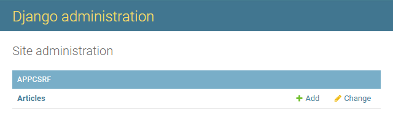
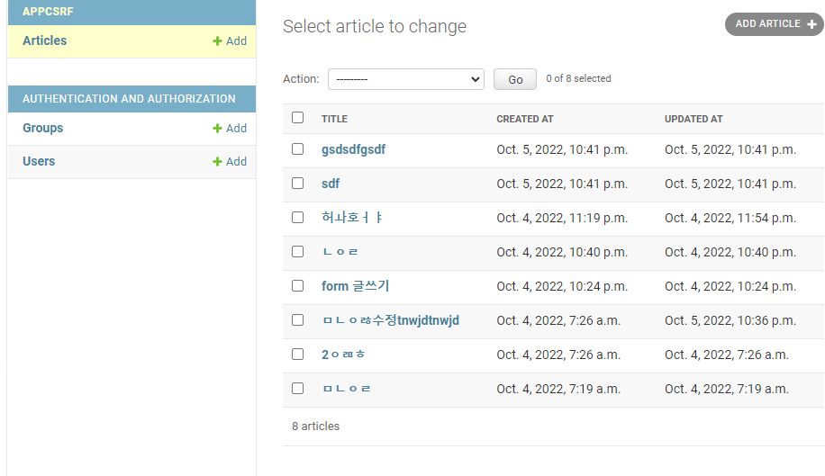
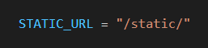
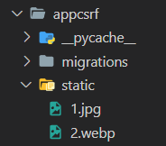

# 2022년 10월 5일 (수)

> Django08!  Admin site, Static files


`수호아빠의 한마디: 저번시간것 모델폼에 비하면 이쯤은..뭐.. `


## Admin site

### 1. 관리자 페이지

- 사용자가 아닌 서버의 관리자가 활용하기 위한 페이지
- 모델 class를 admin.py에 등록하고 관리
-  레코드 생성 여부 확인에 매우 유용하며 직접 레코드를 삽입할 수도 있음

### 2. admin 계정 생성 및 로그인

- `$ python manage.py createsuperuser` 를 입력후 엔터치면 순서대로 아래와 같이 나옴
  - Username: 
  - Email address:
  - Password:
  - Password (again):
  - This password is too common.
    Bypass password validation and create user anyway? [y/N]:
  - Superuser created successfully.
- 이메일은 선택사항이라 값 안넣고 엔터 가능
- 비밀번호창은 보안상으로 값을 넣어도 표시가 안되니 참고
- http://127.0.0.1:8000/admin/  or http://localhost:8000/admin/ 에서 로그인

### 3. admin에 모델 클래스 등록

- Model에서 생성된 테이블의 정보를 보기 위해서 admin.py에 등록 필요

```python
class ArticleAdmin(admin.ModelAdmin):
    list_display = ["title", "created_at", "updated_at"]


admin.site.register(Article, ArticleAdmin)
```

- 위에서 등록을 하면 아래와 같이 admin 첫 페이지에 테이블이 생성됨



- 클릭하면 아래와 같이 내용도 볼수 있음.




## Static files

### 1. 정적 파일

- 응답할 때 별도의 처리 없이 파일 내용을 그대로 보여주면 되는 파일
- 파일 자체가 고정되어 있고, 서비스 중에도 추가되거나 변경되지 않고 고정되어 있음
- Django에서는 이러한 파일들을 "Static file"이라 함

### 2. 정적 파일 활용

- 프로젝트 폴더에서 setting.py에 아래와 같이 경로가 되어있다면,



- 앱 폴더 안에 static 폴더를 만들고 그 폴더 안에 정적 파일을 관리하면 된다.



- 관리 된 파일 사용하기

```html



```

