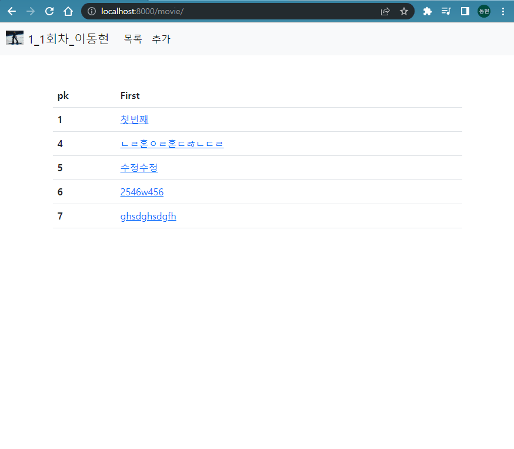

# 2022년 10월 6일 (목)

> Django09!  ModelForm / Staticfiles을 이용한 실습

`수호아빠의 한마디: 익숙치가 않으니까.. 진도가 엄청 느리네.. 와..  `

## ModelForm / Staticfiles기능을 사용하여 영화 정보 제공 서비스 개발

1. 네비게이션바, Bootstrap Navbar 컴포넌트
   - 서비스 로고
     - Django Staticfiles 활용
   - 목록 버튼
     - 클릭 시 메인 페이지로 이동
   - 추가 버튼
     - 클릭 시 정보 추가 페이지로 이동
2. 메인 페이지
   - `GET` http://127.0.0.1:8000/movies/
   - 영화 목록 출력
   - 제목을 클릭하면 해당 영화의 정보 페이지로 이동
3. 영화 정보 페이지
   - `GET` http://127.0.0.1:8000/movies/[int:pk](int:pk)/
   - 해당 영화 정보 출력
   - 수정 / 삭제 버튼
4. 영화 작성 페이지
   - `GET` http://127.0.0.1:8000/movies/create/
   - 영화 정보 작성 폼
5. 영화 수정 페이지
   - `GET` http://127.0.0.1:8000/movies/[int:pk](int:pk)/update/
   - 영화 정보 수정 폼

## 수호아빠의 완성

### 수호아빠 후기

- Form은 아직 익숙치가 않아서 기존 코드를 그대로 가져옴.
- 그래도 조금은 전반적인 흐름? 스케치? 정도는 이해가 가는듯.
- 기능 구현까지가 딱 재밌고.. 아 꾸미는건 진짜..뭔가 급 귀찮고.. 의욕 저하..
- 오늘만든 코드는 적어도 3번정도 더 해보아야 익숙해지지 않을까....

