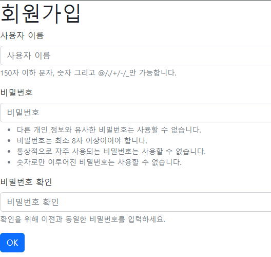

# 2022년 10월 11일 (목)

> Django09!  Authentication(인증)과 Authorization(권한) 그리고 회원가입


`수호아빠의 한마디: ...ㅇ_ㅇ... 정리가 안된다.. 개념 너무 어려운데...........  `




- `views.py`

```python
from django.shortcuts import render
from django.contrib.auth.forms import UserCreationForm

# Create your views here.


def signup(request):

    form = UserCreationForm()

    context = {
        "form": form,
    }
    return render(request, "accounts/signup.html", context=context)
```

- `from django.contrib.auth.forms import UserCreationForm`으로 장고가 이미 위 사진과 같이 양식을 제공해줌.

