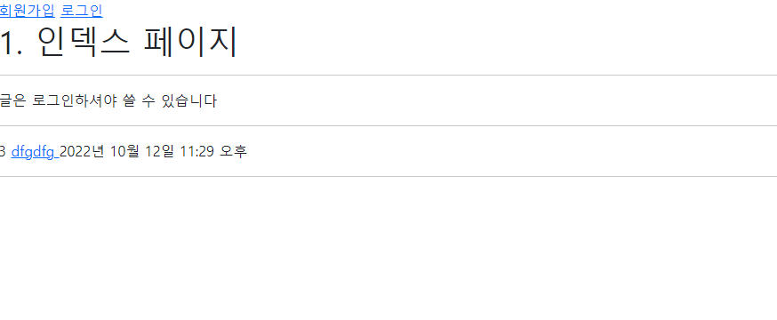

# 2022년 10월 12일 (수)

> Django10!  로그인과 로그아웃


`수호아빠의 한마디: ㅇ_ㅇ.......못따라가고있다............  `


### 1. 프로필 디테일 페이지 (어제 진도)

- URL: /accounts/2/
- View : detail
- Template 반환 : 사용자 정보 (username)


- 위 디테일 페이지를 사용할 때, Forms.py에서 `model = User`였던 것을

    `from django.contrib.auth import get_user_model`로 바꿔서 사용

- `urls.py`

```python
from django.contrib.auth.forms import UserCreationForm

# from .models import User
from django.contrib.auth import get_user_model

class CustomUserCreationForm(UserCreationForm):
    class Meta:
        model = get_user_model()
        fields = ("username",)
```

- `views.py`

```python
from django.shortcuts import render, redirect

# from .models import User
from django.contrib.auth import get_user_model

def detail(request, pk):

    user = get_user_model().objects.get(pk=pk)

    context = {
        "user": user,
    }

    return render(request, "accounts/detail.html", context)
```


### 2. 로그인, 로그아웃 기능

- URL: GET /accounts/login/
  - 템플릿: 사용자에게 Form을 제공한다.
- URL: POST /accounts/login/
  - 로그인: 로직처리
    - 사용자인지 확인하고, django_session 테이블에 저장, 쿠키 주기
  - 성공: 게시글 목록 페이지로 redirect
  - 실패: 로그인 Form



- 로그인과 로그아웃을 도와주는 기능을 사용하였다.

  - 로그인을 도와주는 기능 `from django.contrib.auth import login as auth_login`
  - 로그아웃을 도와주는 기능 `from django.contrib.auth import logout as auth_logout`

- 로그인

  - `view.py`

  ```python
  # 로그인 함수, 그런데 기존에 login이라고 쓴 함수랑 겹쳐서 autho_login으로
  from django.contrib.auth import login as auth_login
  
  def login(request):
  
      if request.method == "POST":
          form = AuthenticationForm(request, data=request.POST)
          if form.is_valid():
              auth_login(request, form.get_user())
              # 아래 코드는 글 수정버튼 눌러서 로그인한 경우에 사용됨
              if request.GET.get("next"):
                  return redirect(request.GET.get("next"))
              else:
                  return redirect("article:index")
      else:
          form = AuthenticationForm()
      context = {
          "form": form,
      }
  
      return render(request, "accounts/login.html", context)
  ```

- 로그아웃

  - `view.py`

  ```python
  # 로그아웃을 도와주는 함수, 역시나 기존 logout함수와 이름이 겹치니 auth_logout으로 변경
  from django.contrib.auth import logout as auth_logout
  
  def logout(request):
      auth_logout(request)
      return redirect("article:index")
  ```


### 3. 로그인이 되어야 글 작성, 글 수정 되게하는 기능

- if문과 `is_authenticated`을 사용

```python
def create(request):
    # 1. 만약에 request에 user가 로그인 되었다면
    if request.user.is_authenticated:
        if request.method == "POST":
            article_form = ArticleForm(request.POST)
            if article_form.is_valid():
                article_form.save()
                # 2. 글 생성페이지로 이동
                return redirect("article:index")
        else:
            article_form = ArticleForm()
        context = {
            "article_form": article_form,
        }
        return render(request, "article/create.html", context=context)
    # 3. 로그인이 안되었다면, 로그인 페이지로
    else:
        redirect("accounts:login")
```

- `from django.contrib.auth.decorators import login_required`에 `@login_required`를 사용
  - 이것을 사용해서 알아서 로그인 되었을때만 글쓰기 창으로 가지게 해줌. Got Django

```python
from django.contrib.auth.decorators import login_required

@login_required
def create(request):
    if request.method == "POST":
        article_form = ArticleForm(request.POST)
        if article_form.is_valid():
            article_form.save()
            return redirect("article:index")
    else:
        article_form = ArticleForm()
    context = {
        "article_form": article_form,
    }
    return render(request, "article/create.html", context=context)
```


### 4. 정리

- 버튼을 안 만들어왔는데, URL로 직접 접근할 수 있음

  - 이것을 서버에서 막는다. -> `view.py`를 이용

- 막는 방법

  - 인증여부를 직접 조건문
    - `@login_required` 데코레이터를 쓸 수 있음
    - 이 친구의 역할은 아래와 같은 URL로 로그인페이지로 보내줌
    - http://127.0.0.1:8000/accounts/login/?next=/articles/1/update/

- 사용자가 로그인 HTML Form을 보고 내용을 채우고 로그인 버튼을 누르면

  - URL: POST http://127.0.0.1:8000/accounts/login/?next=/articles/1/update/
  - view: login

  ```python
  if request.method == "POST":
      form = AuthenticationForm(request, data=request.POST)
      if form.is_valid():
          auth_login(request, form.get_user())
          # 글 수정버튼 눌러서 로그인한 경우 사용
  
          if request.GET.get("next"):
              return redirect(request.GET.get("next"))
          else:
              return redirect("article:index")
          # request.GET.get("next")가 있으면, 
          # /articles/1/update/ or 'darticles:index'
          # 없으면 
          # None or 'articles:index'
  ```

  - redirect 할 때, URL GET 파라미터로 보내준 값을 쓴다. 
  - 아래와 같이 코드를 줄여쓸 수 있다.

  ```python
  if request.GET.get("next"):
      return redirect(request.GET.get("next"))
  else:
      return redirect("article:index")
  
  # 위 아래의 코드는 같은 내용
  
  else:
      return redirect(request.GET.get("next") or "article:index")
  
  or은 하나만 True면 True임
  
  # or은 하나만 True면 True임
  # 즉, 단축평가로 앞에 값이 True면 리턴하고 뒤는 검사 X
  # 앞의 갚이 false면 뒤의 값을 리턴함
  ```

- 이 기능을 활용하여, 글 수정 페이지도 로그인이 되어있으면 해당 글 수정페이지로 넘어가고 아니면 로그인 페이지로 넘어가게 할 수 있음.

  - 이 경우에는 아래의 코드를써서 수정하려는 글의 페이지로 넘어갈 내용을 보내게 하면 됨

  ```python
  if request.GET.get("next"):
      return redirect(request.GET.get("next"))
  ```

  
