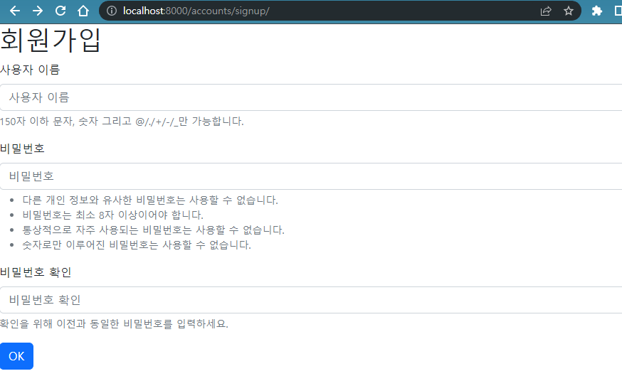

# 2022년 10월 12일 (수)

> Django10!  로그인과 로그아웃


`수호아빠의 한마디: ㅇ_ㅇ.......못따라가고있다............  `


### 1. 프로필 디테일 페이지 (어제 진도)

- URL: /accounts/2/
- View : detail
- Template 반환 : 사용자 정보 (username)



- 위 디테일 페이지를 사용할 때, Forms.py에서 `model = User`였던 것을

    `from django.contrib.auth import get_user_model`로 바꿔서 사용

- `urls.py`

```python
from django.contrib.auth.forms import UserCreationForm

# from .models import User
from django.contrib.auth import get_user_model

class CustomUserCreationForm(UserCreationForm):
    class Meta:
        model = get_user_model()
        fields = ("username",)
```

- `views.py`

```python
from django.shortcuts import render, redirect

# from .models import User
from django.contrib.auth import get_user_model

def detail(request, pk):

    user = get_user_model().objects.get(pk=pk)

    context = {
        "user": user,
    }

    return render(request, "accounts/detail.html", context)
```


### 2. 로그인기능

- URL: GET /accounts/login/
  - 템플릿: 사용자에게 Form을 제공한다.
- URL: POST /accounts/login/
  - 로그인: 로직처리
    - 사용자인지 확인하고, django_session 테이블에 저장, 쿠키 주기
  - 성공: 게시글 목록 페이지로 redirect
  - 실패: 로그인 Form

