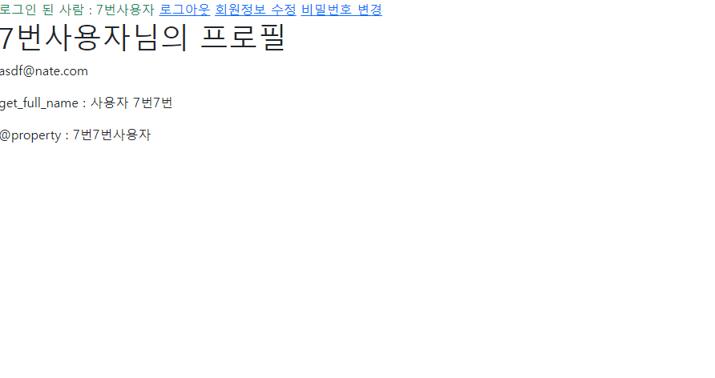
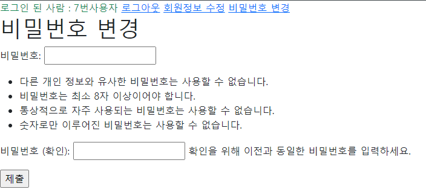

# 2022년 10월 13일 (목)

> Django11! 회원 정보 수정 및 비밀번호 변경


`수호아빠의 한마디: ㅇ_ㅇ.......못따라가고있다............222222  `


### 1. 회원 정보 수정

- URL : /accounts/\<int:pk>/update/

  - 위처럼 한다고 가정하면 회원 정보 수정시 과연..

    1번 유저 수정, 2번 유저 수정, 3번 유저 수정이 필요한가..?

    간단히, 로그인한 유저의 정보를 수정하면 되는것 아닌가?

  - 즉, URL : /accounts/update/ (단, 로그인을 한 사용자)

- 기능(views.py)

  - GET 요청 : Form

    - User ModelForm을 사용하면 됨

    - Article C/U는 ArticleForm을 같이 썼는데, User C/U는 From을 다르게 쓰는 이유?

      - 사용자는 "비밀번호"가 다르다

      - User C : 비밀번호 두개를 받아서 일치하는 로직이 포함된 감사한 친구

         => UserCreationForm

      - User U :
        - 의문 1 : 우선은 비밀번호 두개를 받을 필요가 있을까?
        - 의문 2 : 구성 자체가 다르지 않을까?
        - 의문 3 : 비밀번호는 그대로 입력해서 주면 될까?

  - POST 요청 : 실제 수정

    - 개인프로필 페이지로 이동

- `@login_required`는 언제쓰죠?

  - 로그인해서 사용해야하는 곳에서!




### 2. 비밀번호 변경

- `from django.contrib.auth.forms import PasswordChangeForm`의 기능 사용
- `views.py`

```python
from django.contrib.auth.forms import PasswordChangeForm

def change_password(request):
if request.method == 'POST':
pass
else:
form = PasswordChangeForm(request.user)
context = {
'form': form,
}
return render(request, 'accounts/change_password.html', context)

```

- `change_password.html`

```python




<h1>비밀번호 변경</h1>
<form action="" method="POST">

{{ form.as_p }}
<input type="submit">
</form>


```



