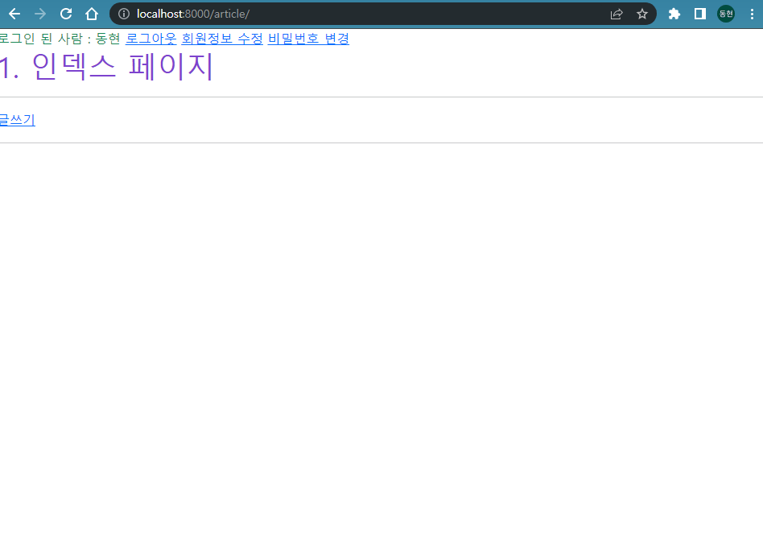
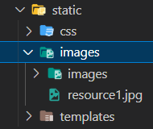
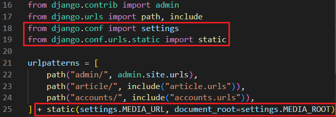
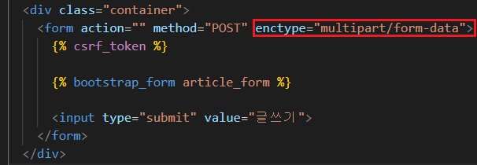

# 2022년 10월 17일 (월)

> Django12! 이미지파일 업로드 


`수호아빠의 한마디: 아..아들에게서 감기를 옮아 온듯하다..컨디션관리 실패 ㅠㅠ  `


### 1. 이미지 파일 업로드 - Create



- 사용자가 업로드 한 파일(미디어 파일)들을 보관할 디렉토리의 절대 경로

  - `MEDIA_ROOT = BASE_DIR / "static" / "images"`

  

  - django는 성능을 위해 업로드 파일은 데이터베이스에 저장하지 않음
  - 실제 데이터베이스에 저장되는 것은 파일의 경로

- `urls.py`  개발 단계에서 사용자가 업로드 한 파일 제공하기

  

  - 사용자가 업로드 한 파일이 우리 프로젝트에 업로드 되지만,  실제로 사용자에게 제공하기 위해서는 업로드 된 파일의 URL이 필요함

- `models.py` ImageField 설정

  ```python
  class Article(models.Model):
      ...
      image = models.ImageField(black=True, upload_to='images/')
      ...
     
  ```

  - `upload_to=‘images/’`
    - 실제 이미지가 저장되는 경로를 지정
  - `blank=True`
    - 이미지 필드에 빈 값(빈 문자열)이 허용되도록 설정 (이미지를 선택적으로 업로드 할 수 있도록)
  - 모델 설정 후에는 마이그레이션

- `templates.html` 게시글 작성시 POST 옆에  form enctype 속성 지정



- `views.py` 업로드한 파일 전달
  - 업로드 한 파일은 request.FILES 객체로 전달됨

​	


### 2. 이미지 파일 업로드 - Read

- `templates.html`
  - ``
    - `article.image.url` : 업로드 파일의 경로
    - `article.image` : 업로드 파일의 파일 이름
