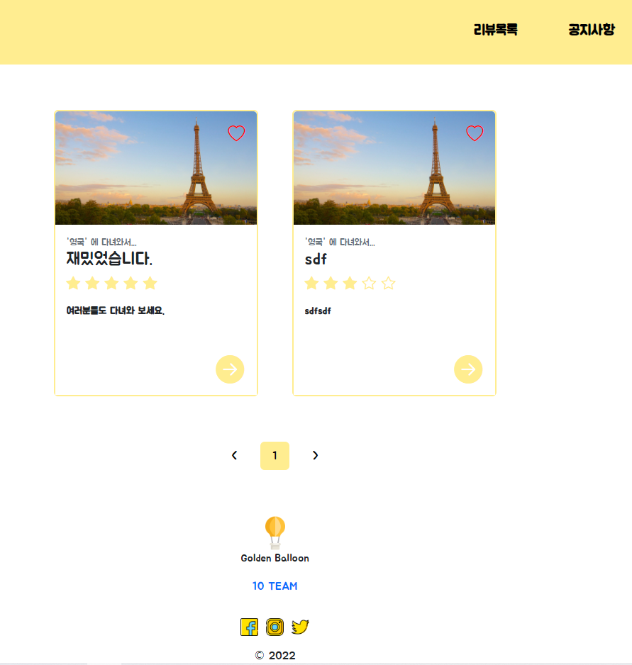
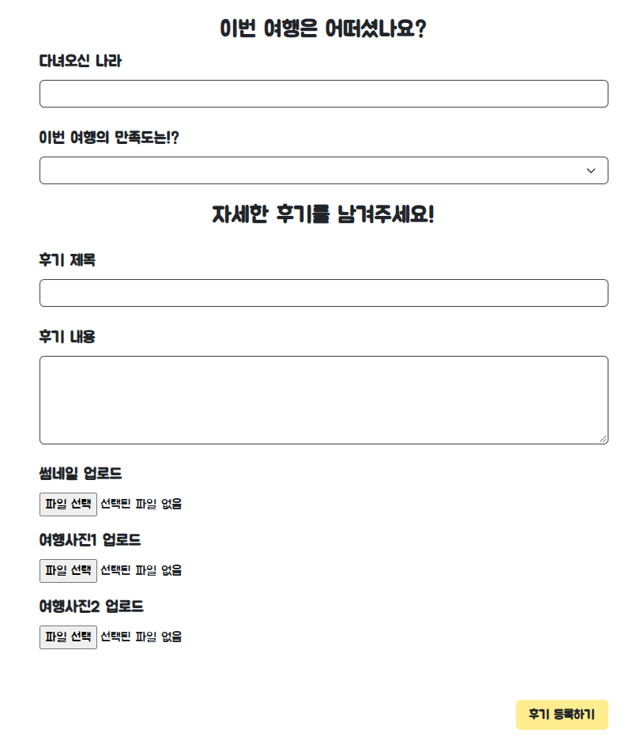
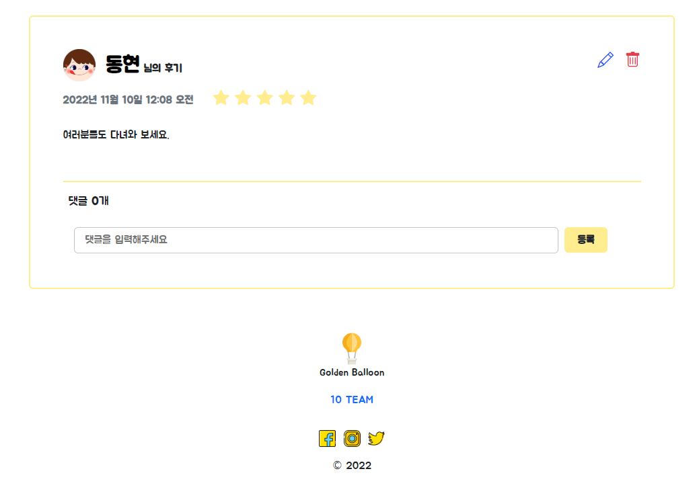
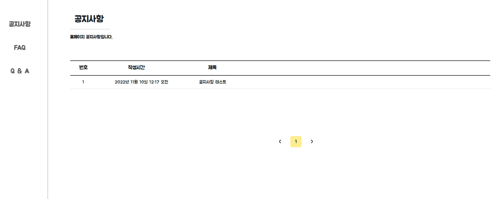
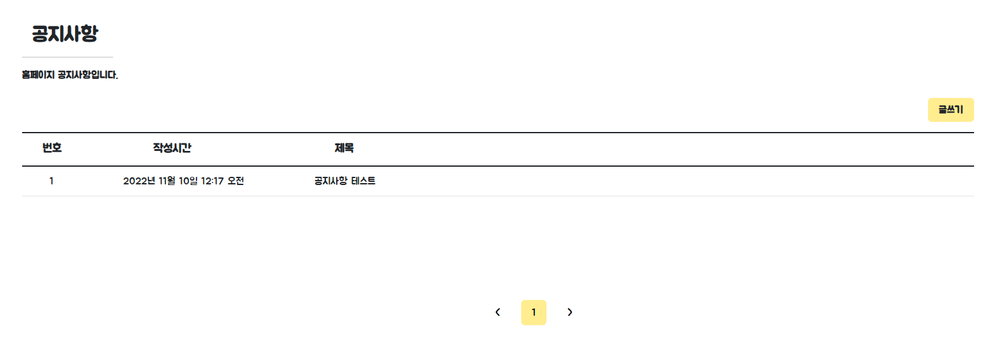
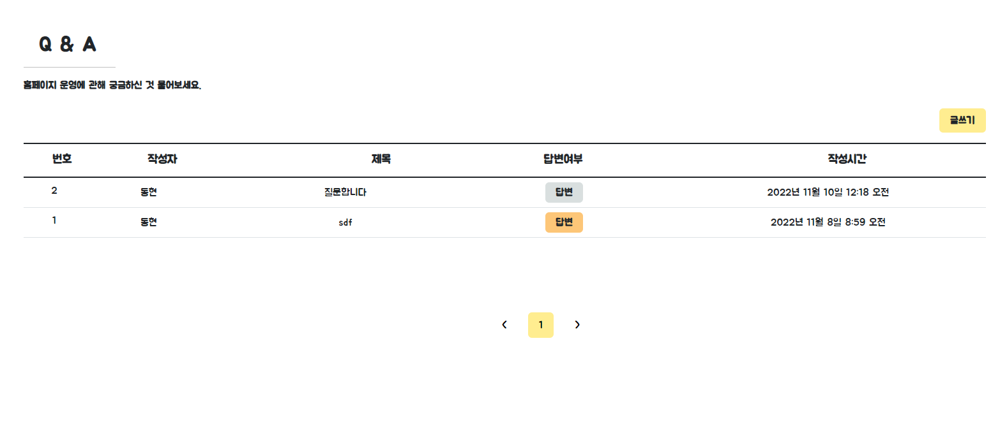
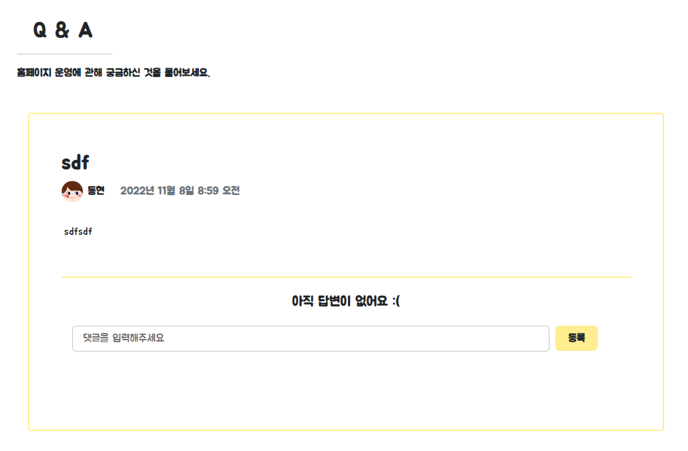
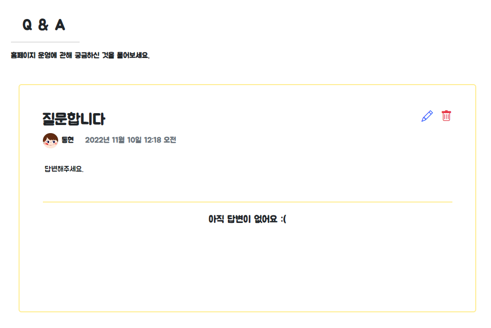
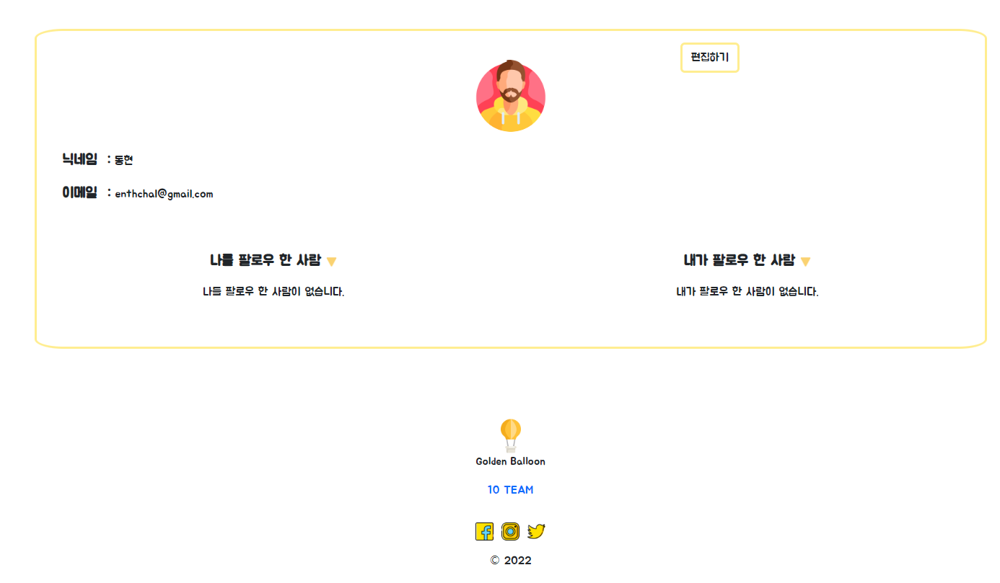
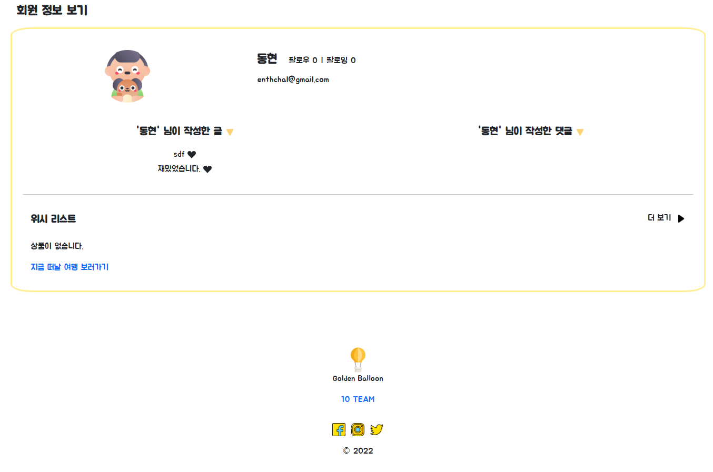

# Semi Project 1 - Golden-Balloon
> 2022년 10월 31일 (수) ~ 2022년 11월 08일 (목) 1주일

## 1. 프로젝트 깃허브

https://github.com/soohofather/Golden-Balloon

## 2. 이 프로젝트에서의 내 역할

**`Backend 이동현`**

- **리뷰페이지**
  -  **CRUD 기능 구현**
  -  **상세페이지에서 사진 클릭하면 사진 크게 보는 기능 구현**
  -  **페이지네이션 구현**
- **공지사항, FAQ, Q&A**
  - **각 게시판 CRUD 기능 구현**
  - **각 페이지 페이지네이션 구현**
  - **공지사항, FAQ admin만 글 작성 권한 기능 구현**
  - **Q&A admin만 댓글 작성 권한 기능 구현**
  - **Q&A 댓글 있는 경우 목록페이지에서 상태 확인 기능 구현**

## 3. 팀원들 역할

`Backend 김예린(팀장)` 

- 인덱스 페이지 데이터 크롤링
- 회원관리
  - 회원가입
  - 로그인
  - 회원정보 수정
- 마이페이지
  - 팔로우, 팔로잉 하는 사람 마이페이지1에 표시되는 기능 구현
  - 팔로우, 팔로잉 하는 사람숫자 마이페이지2에 표시되는 기능 구현
  - 작성글, 작성 댓글 마이페이지2에 표시되는 기능 구현

`Frontend 백솔비` 

- 리뷰 페이지 디자인 코드작성
  - 리뷰 목록 페이지
  - 리뷰 글쓰기 페이지
  - 리뷰 상세 페이지
- 공지사항, FAQ, Q&A 페이지 디자인 코드 작성
  - 공지사항 목록, 글쓰기, 상세 페이지 
  - FAQ 목록, 글쓰기, 상세 페이지
  - Q&A 목록, 글쓰기, 상세 페이지
- 홈페이지  전반적으로 디테일 체크 및 버그 수정

`Frontend 임수경` 

- 인덱스 페이지 디자인 담당
  - nav바 포함
- 로그인 페이지 디자인 코드 작성
  - 로그인, 회원가입 페이지
- 회원정보 페이지 디자인 코드 작성
  - 회원정보 1페이지
  - 회원정보 2페이지

## 4. 내가 참여한 페이지 소개

- **리뷰 CRUD 기능 구현**
- **리뷰 좋아요 기능**
- **리뷰 페이지 페이지네이션**
- **리뷰 상세페이지 댓글 기능**
- **공지사항, FAQ, Q&A 각 게시판 CRUD, 댓글, 페이지네이션 기능 구현**
- **공지사항과 FAQ 게시판의 글쓰기는 admin 권한만 글쓰기 기능**
- **Q&A 게시판 댓글은 admin 권한만 글쓰기능**

### 1. 리뷰목록 탭 - (프론트 백솔비, 백엔드 이동현)

- 좋아요기능
- 페이지네이션
- 썸네일 이미지 추가 가능
- 평점 별로 표시

`리뷰 목록` 페이지

`리뷰 작성 페이지`

`리뷰 상세페이지`

### 2. 공지사항 페이지(FAQ 동일 양식) - (프론트 백솔비, 백엔드 이동현)

- admin 계정만 글쓰기 가능 (일반 유저는 글쓰기 버튼 없음)

`일반 유저 화면`

`admin 화면`

### 3. Q&A 페이지 - (프론트 백솔비, 백엔드 이동현)

- 모든 유저 글작성 가능
- admin 계정만 댓글 가능
- 댓글 있는 글 없는글 표시

`Q&A 페이지`

`admin Q&A 상세페이지`

`일반 유저 Q&A 상세페이지`

## 4. 팀원들이 만들 페이지 소개

### 1. 인덱스 페이지 - (프론트 임수경, 백엔드 김예린 )

- 크롤링으로 데이터를 가져옴 

### 2. 회원정보 페이지 - (프론트 임수경, 백엔드 김예린 ) 

`회원정보 페이지 1`

- 팔로우, 팔로워 한 유저 목록 표시
- 회원정보 수정

`회원정보 페이지 2`

- 팔로우 수, 팔로잉 수
- 작성 글, 작성 댓글
- 상품 위시리스트 표시

