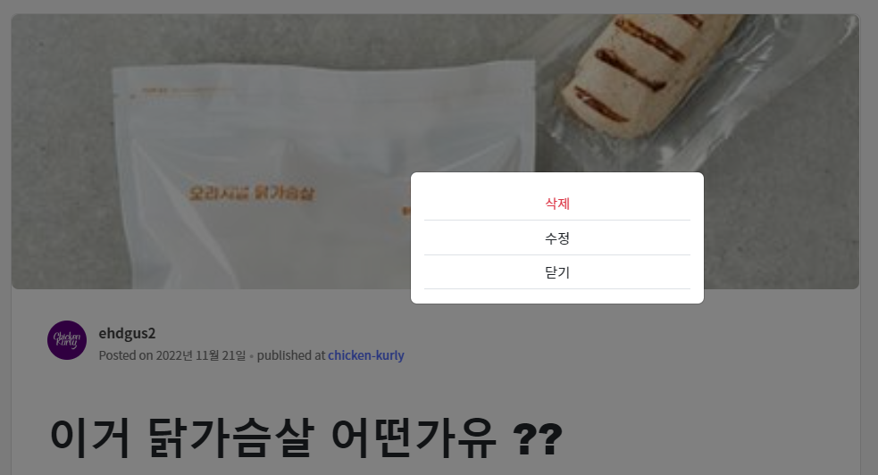

# Semi Project 2 - Chicken-Kurly
> 2022년 11월 09일 (수) ~ 2022년 11월 21일 (월) - 2주
>
> https://github.com/soohofather/Chicken-Kurly.git

## 1. 이 프로젝트에서 나의 역할

**`Backend 이동현`**

- **헬짱피드 페이지 담당 (Articles app)**
  -  **게시판 CRUD 기능 구현**
  -  **페이지네이션 기능 구현**
  -  **게시글 좋아요 비동기로 기능 구현**
  -  **상세페이지에서 사진 클릭하면 사진 크게 보는 기능 구현**
  -  **댓글및 대댓글 기능 구현**
  -  **댓글 좋아요 비동기로 기능 구현**

## 2. 팀원들 역할

`Fullstack 장영진(팀장)`

- 개발환경 구축
- 페이지 전체 프론트 디자인
- 인스타 해시태그 크롤링
- AWS 배포

`Fullstack 최보영` & `Fullstack 차화영`

- 상품 페이지 담당 (Products App)
  - 상품 목록
    - 카테고리별 검색 기능
    - 판매 상품
    - 인기 상품
    - 상품 추천 기능
    - 인스타그램 고객 후기 크롤링
  - 상품 정보
    - 사용자의 후기 및 문의
    - 사용자는 문의와 후기 작성 가능
    - 문의에 답변이 달리면 수정 및 삭제 불가
    - 문의 페이지네이션
    - 수량/옵션 선택
    - 장바구니
    - 장바구니 담기 모달
    - 상품 수량 추가
    - 이전에 장바구니에 담았던 상품의 경우, 상품 수량을 추가하는 방식
    - 찜하기
    - 결제
    - 상품 결제 화면으로 이동
    - 카카오톡 QRL 결제

`Fullstack 최정아`

- 회원관리 페이지 담당 (Accounts App)
  - 회원가입
    - 아이디/아이디 중복확인, 비밀번호/비밀번호 확인, 주소(주소 검색)
  - 로그인
    - 아이디/비밀번호 오류 메시지 렌더
  - 회원 프로필
    - 사용자 본인일 경우, 회원정보 수정 버튼 렌더
    - 사용자 본인이 아닐 경우, 팔로우 버튼 렌더
    - 구매한 상품 목록
    - 찜한 상품 목록
    - 작성한 글 목록
    - 누적 구매 금액/포인트/누적 구매 횟수
    - 회원 등급
    - 팔로우/언팔로우
  - 회원 정보 수정
    - 기존 비밀번호 -> 새 비밀번호 변경
    - 배송받을 주소 검색
    - 이미지 변경
    - 회원탈퇴

## 3. 내가 참여한 페이지 소개

- 헬스피드 페이지(Articles app)

  - 글쓰기
  - 이미지 업로드
  - 글 상세페이지에서 이미지 확대창
  - 게시글 좋아요 (비동기)
  - 

  - 게시글 삭제, 수정 모달창 기능
  - 

  - 게시글 페이지 페이지네이션

  - 댓글 작성

  - 댓글 좋아요 (비동기)

  - 대댓글 작성

  - 대댓글 페이지 페이지네이션
  - 

## 4. 팀원들이 만든 페이지 소개

- 인덱스페이지
  - 데이터를 원하는 순서대로 정렬( 카테고리별, 조회수 높은순, 구매가 많이 된 상품 등)
  - 인스타그램 크롤링
  - 각 상품들 옆으로 이동되는 크로셀 기능
  - 
- 상품 상세페이지
  - 상품 장바구니, 결제기능
  - 상품 찜기능(내 회원정보 페이지에서 확인가능)
  - 상품 결제시 수량, 수량에 따른 가격 정보변경 등 비동기로 구현
- 회원정보 페이지
  - 찜한 상품 목록
  - 팔로우 팔로워 기능
  - 구매금액에 따른 등급 변경기능
  - 

- 회원가입 및 로그인 페이지
  - 아이디 중복확인
  - 아이디 한글 가입 불가
  - 비밀번호 틀리면 진행 안됨
  - 주소검색 가능

