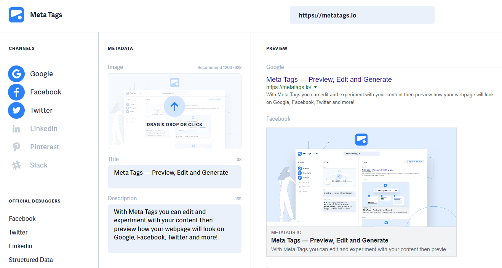
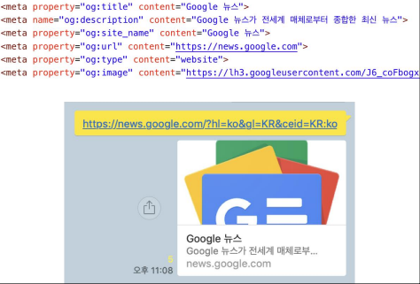
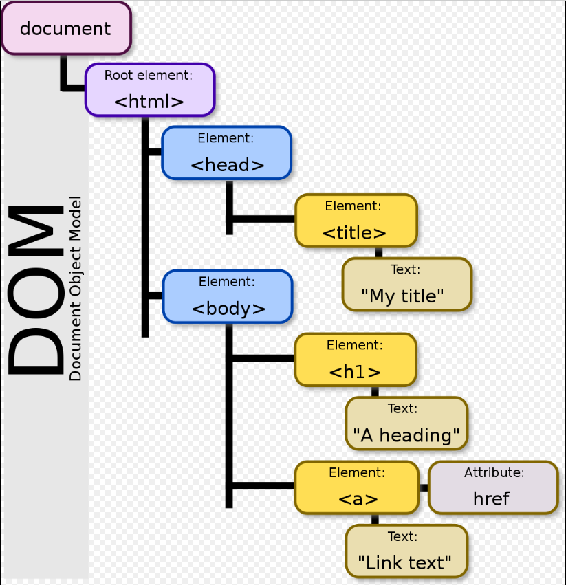

## 2022년 8월 29일(월)

> Web! 첫 시간! HTML 기초 문법


**수호아빠의 한줄평 : 


### HTML 이란..

- Hyper Text Markup Language
  - Markup Language : ex) 마크다운, HTML
  - Hyper Text : 텍스트를 넘어서는 연결을 만듬. 즉, 링크

- 웹 페이지를 작성(구조화)하기 위한 언어
- HTML 스타일 가이드

```html
<body>
    <h1>
        웹문서
    </h1>
    <ul>
        <li>HTML</li>
        <li>HTML</li>
    </ul>
</body>
```


### HTML 구조

- html 기본구조

```html
<!DOCTYPE html>
<html lang="en">
<head>
	<meta charset="UTF-8">
	<title>Document</title>
</head>
<body>
    
</body>
</html>
```

- **html** : 문서의 최상위(root) 요소
- **head** : 문서 메타데이터 요소
  - 문서 제목, 인코딩, 스타일, 외부 파일 로딩 등
  - 일반적으로 브라우저에 나타나지 않는 내용
- **body** : 문서 본문 요소
  - 실제 화면 구성과 관련된 내용


### head

- head 예시

```html
  <head>
	<title>HTML 수업</title>
	<meta charset="UTF-8">
	<link href="style.css" rel="stylesheet">
	<script src="javascript.js"></script>
	<style>
        p {
            color: black;
            }
	</style>
  </head>
```

- \<title> : 브라우저 상단 타이틀
- \<meta> : 문서 레벨 메타데이터 요소
- \<link> : 외부 리소스 연결 요소 (CSS 파일, favicon 등)
- \<script> : 스크립트 요소 (JavaScript 파일/코드)
- \<style> : CSS 직접 작성
- 메타 데이터를 표현하는 새로운 규약
  - HTML 문서의 메타 데이터를 통해 문서의 정보를 전달
  - 메타정보에 해당하는 제목, 설명 등을 쓸 수 있도록 정의	




### 요소(element)

-  HTML 요소는 시작 태그와 종료 태그 그리고 태그 사이에 위치한 내용으로 구성
  - 요소는 태그로 컨텐츠(내용)를 감싸는 것으로 그 정보의 성격과 의미를 정의
  - 내용이 없는 태그들도 존재(닫는 태그가 없음)
    - br, hr, img, input, link, meta
- 요소는 중첩(nested)될 수 있음
  - 요소의 중첩을 통해 하나의 문서를 구조화
  - 여는 태그와 닫는 태그의 쌍을 잘 확인해야함
    - 오류를 반환하는 것이 아닌 그냥 레이아웃이 깨진 상태로 출력되기 때문에, 디버깅이 힘들어 질 수 있음

### 속성(attribute)

```html
<a href="https://google.com"></a>
   속성명        속성값
※ 공백 No, ""(쌍 따옴표) 사용
```

- 속성을 통해 태그의 부가적인 정보를 설정할 수 있음

- 요소는 속성을 가질 수 있으며, 경로나 크기와 같은 추가적인 정보를 제공

- 요소의 시작 태그에 작성하며 보통 이름과 값이 하나의 쌍으로 존재

- 태그와 상관없이 사용 가능한 속성(HTML Global Attribute)들도 있음

- 모든 HTML 요소가 공통으로 사용할 수 있는 대표적인 속성 (몇몇 요소에는 아무 효과가 없을 수 있음)
  - **id** : 문서 전체에서 유일한 고유 식별자 지정
  - **class** : 공백으로 구분된 해당 요소의 클래스의 목록 (CSS, JS에서 요소를 선택하거나 접근)
  - **data-\*** : 페이지에 개인 사용자 정의 데이터를 저장하기 위해 사용
  - **style** : inline 스타일
  - **title** : 요소에 대한 추가 정보 지정
  - **tabindex** : 요소의 탭 순서

  

### 기타

- DOM 트리
  - Document Object Model
  - html과 head는 부모와 자식 관계
  - head와 body는 형제관계
  - h1과 a는 형제 관계



- 텍스트 파일인 HTML 문서를 브라우저에서 렌더링 하기 위한 구조
  - 렌더링(Rendering) : 웹사이트 코드를 사용자가 보게 되는 웹 사이트로 바꾸는 과정
  - HTML 문서에 대한 모델을 구성함
  - HTML 문서 내의 각 요소에 접근 / 수정에 필요한 프로퍼티와 메서드를 제공함


- 인라인 / 블록 요소
  - HTML 요소는 크게 인라인 / 블록 요소로 나눔
  - 인라인 요소는 글자처럼 취급
  - 블록 요소는 한 줄 모두 사용

- 텍스트 요소
  - \<a>\</a> : href 속성을 활용하여 다른 URL로 연결하는 하이퍼링크 생성
  - \<b>\</b> : 굵은 글씨 요소
    - \<strong>\</strong> :  중요한 강조하고자 하는 요소 (보통 긁은 글씨로 표현)
    - \<b>\</b> 와 \<strong>\</strong> 가 보이는 것은 같지만, 웹 접근성에서는 다르게 표현 됨
  - \<i>\</i> : 기울임 글씨 요소
    - \<em>\</em> 중요한 강조하고자 하는 요소 (보통 기울임 글씨로 표현)
    - 위 굵은 글씨 표현과 동일 케이스
  - \<br> : 텍스트 내에 줄 바꿈 생성
  - \ : src 속성을 활용하여 이미지 표현, alt 속성을 활용하여 대체 텍스트
  - \<span>\</span> : 의미 없는 인라인 컨테이너
- 그룹 컨텐츠
  - \<p>\</p> : 하나의 문단 (paragraph)
  - \<hr> : 문단 레벨 요소에서의 주제의 분리를 의미하며, 수평선으로 표현됨
  - \<ol>\</ol> : 순서가 있는 리스트
  - \<ul>\</ul> : 순서가 없는 리스트
  - \<pre>\</pre> : HTML에 작성한 내용을 그대로 표현. 보통 고정폭 글꼴이 사용되고 공백문자를 유지
  - \<blockquote>\</blockquote> : 텍스트가 긴 인용문. 주로 들여쓰기를 한 것으로 표현됨
  - \<div>\</div> : 의미 없는 블록 레벨 컨테이너


### CSS

- Cascading Style Sheets
  - 위에서 아래로 흐르는..
  - 내가 여기에 이 스타일을 담을거야
- 스타일을 지정하기 위한 언어

```css
h1 {
    color: blue;
    font-size: 15px;
    }
```

- CSS 구문
  - h1 : 선택자
  - color: blue : 선언
  - font-size : 속성
  - 15px : 값
-  CSS 구문은 선택자를 통해 스타일을 지정할 HTML 요소를 선택
- 중괄호 안에서는 속성과 값, 하나의 쌍으로 이루어진 선언을 진행 
- 각 쌍은 선택한 요소의 속성, 속성에 부여할 값을 의미
  - 속성 (Property) : 어떤 스타일 기능을 변경할지 결정 
  - 값 (Value) : 어떻게 스타일 기능을 변경할지 결정

- CSS 정의 방법

  - 인라인

  ```css
  <h1 style="color: blue; font-size: 100px;">
  ```

  - 내부 참조

  ```css
  <style>
  h1 {
      color: blue;
      font-size: 100px;
      }
  ```

  - 외부 참조

  ```css
  <link rel="stylesheet" href="mystyle.css">
  ```

- CSS 기초 선택자
  - 요소 선택자
    - HTML 태그를 직접 선택
  - 클래스(class) 선택자
    - 마침표(.)문자로 시작하며, 해당 클래스가 적용된 항목을 선택
  - 아이디(id) 선택자
    - \# 문자로 시작하며, 해당 아이디가 적용된 항목을 선택
    - 일반적으로 하나의 문서에 1번만 사용
    - 여러 번 사용해도 동작하지만, 단일 id를 사용하는 것을 권장
  - 우선순위 : id > 클래스 > 태그
    - 우선순위가 같은 두개인 경우 나중의 것이 우선순위를 가짐.


## 오후 실습

[오후실습! 태그별 문서 읽고 정리](./practice.md)

