## 2022년 8월 29일(월)

> 오후실습! 태그별 문서 읽고 정리

https://developer.mozilla.org/ko/docs/Web/HTML/Element/img 

### \<area>

- 이미지의 핫스팟 영역을 정의하고 [하이퍼링크 (en-US)](https://developer.mozilla.org/en-US/docs/Glossary/Hyperlink)를 추가하는 요소
- \<map> 요소 안에서만 사용할 수 있습니다.

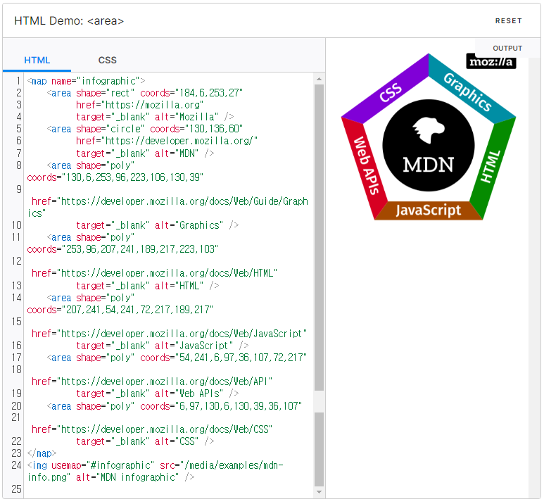

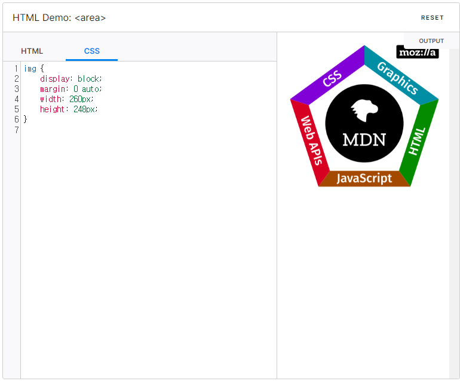

### \<audio>

- 문서에 소리 콘텐츠를 포함할 때 사용하는 요소
- src 특성 또는 \<source> 요소를 사용해 한 개 이상의 오디오 소스를 지정할 수 있음
- 다수를 지정한 경우 가장 적절한 소스를 브라우저가 고름
- MediaStream을 사용하면 미디어 스트림을 바라볼 수도 있습니다.

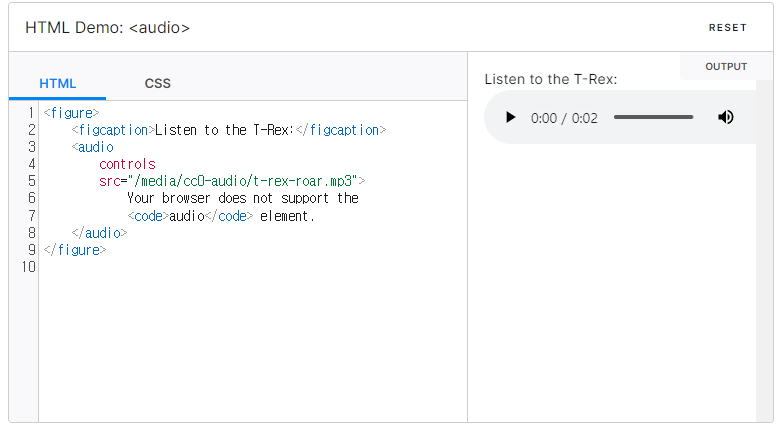

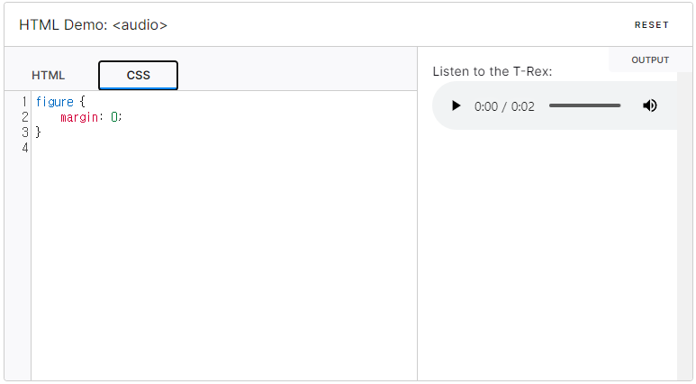

### \<iframe>

- 중첩 브라우딩 맥락을 나타내는 요소
- 현재문서 안에 다른 HTML 페이지를 삽입합니다.

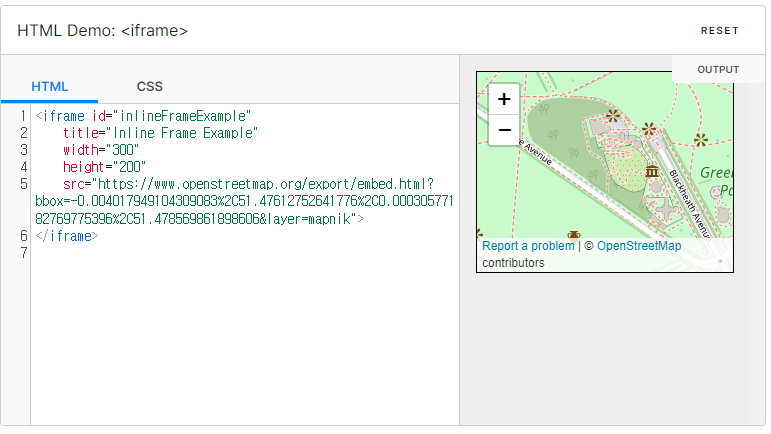

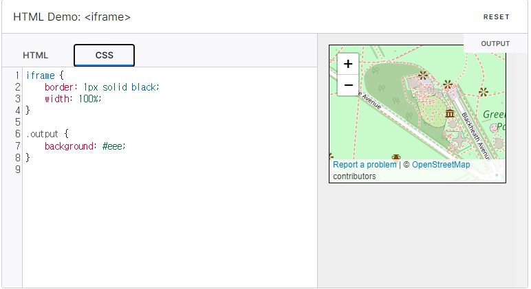

### \

- 이미지 삽입 요소
- `src` 특성은 **필수**이며, 포함하고자 하는 이미지로의 경로를 지정합니다.
- `alt` 특성은 이미지의 텍스트 설명이며 필수는 아니지만, 스크린 리더가 `alt`의 값을 읽어 사용자에게 이미지를 설명하므로, 접근성 차원에서 **매우 유용**합니다. 또한 네트워크 오류, 콘텐츠 차단, 죽은 링크 등 이미지를 표시할 수 없는 경우에도 이 속성의 값을 대신 보여줍니다.

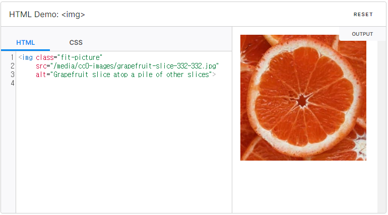

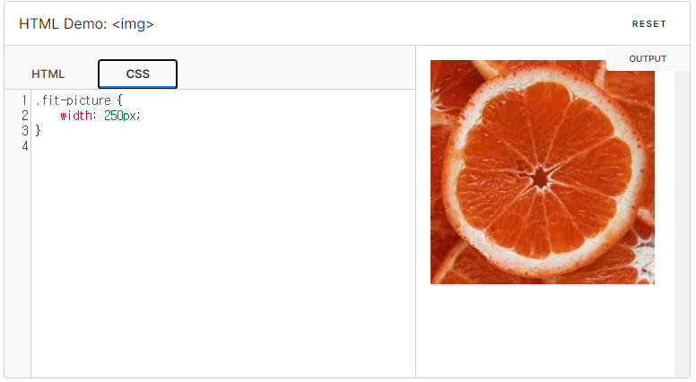

### \<map>

- \<area> 요소와 함께 이미지 맵(클릭 가능한 링크 영역)을 정의할 때 사용합니다.

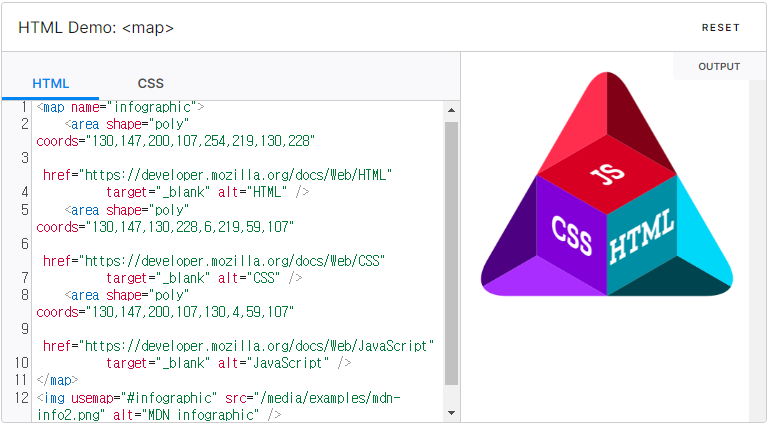

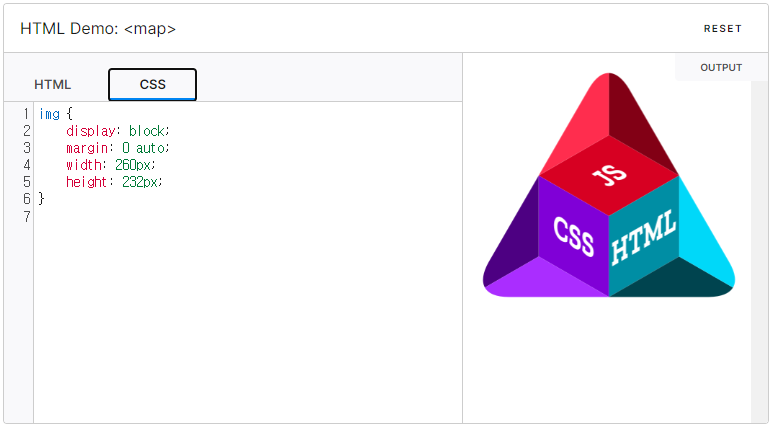

### \<param>

- \<object> 요소의 매개변수를 정의합니다.
- 이 요소는 전역 특성을 포함합니다.

### \<track>

- 미디어 요소 \<autio>, \<video>의 자식으로서, 자막 등 시간별 텍스트 트랙(시간기반 데이터)를 지정할 때 사용
- 트랙은 WebVTT(Web Video Text Tracks, `vtt` 파일) 또는 TTML(Timed Text Martup Language)형식을 사용해야 합니다.

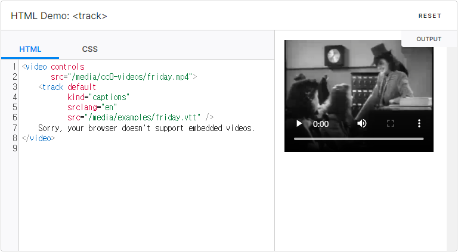

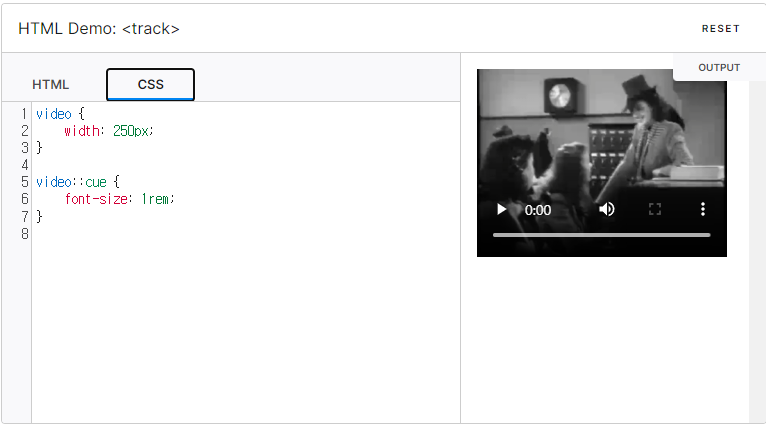

### \<video>

- 비디오 플레이백을 지원하는 미디어 플레이어를 문서에 삽입함
- 오디오 콘텐츠에도 사용할 수 있으나, \<audio> 요소가 사용자 경험에 좀 더 적합합니다.

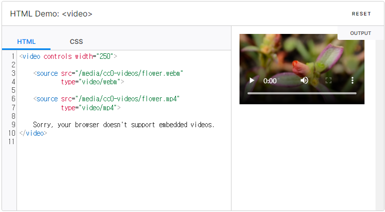

