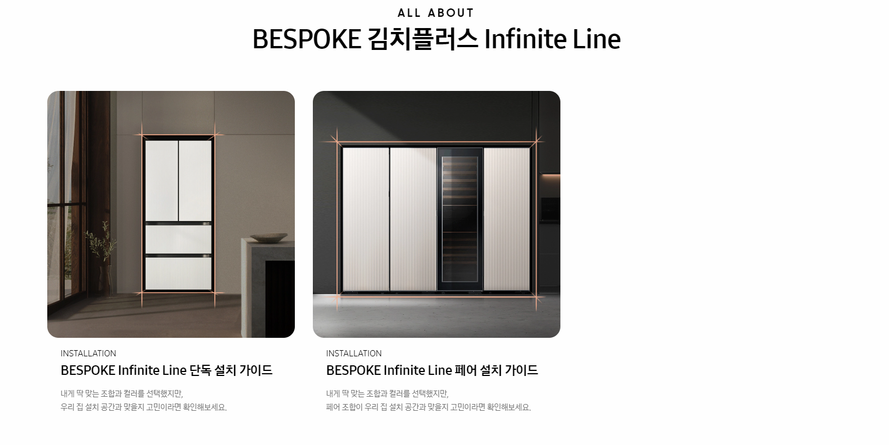
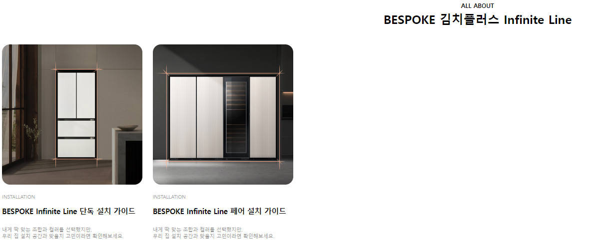
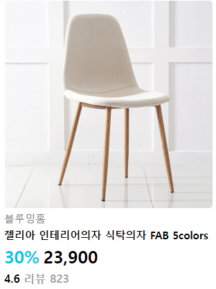

## 2022년 8월 30일(화)

> 오후실습! 주어진 이미지 만들어보기


**수호아빠의 한줄평 : 정말 뜻대로 되어주지 않는다..ㅋㅋ 파이썬과는 너무 다른 어려움**

### 실습 1



#### 상단 문구

* 상단 문구는 `h2` 태그를 활용하여 작성합니다.

* ALL ABOUT의 글씨 크기만 12px로 변경하고 줄바꿈을 합니다.

#### 카드

* 카드들의 전체 영역의 너비는 900px입니다.

* 개별 카드 아이템(이미지 및 텍스트)의 너비는 300px입니다.

* 이미지는 `images` 폴더를 활용합니다. 

### 수호아빠 작품



```html
<!DOCTYPE html>
<html lang="ko">
<head>
  <meta charset="UTF-8">
  <meta http-equiv="X-UA-Compatible" content="IE=edge">
  <meta name="viewport" content="width=device-width, initial-scale=1.0">
  <title>Document</title>
  <link rel="stylesheet" href="style.css">
  <style>
    .products {
      width: 900px;
    }
    .card_1 {
      display: inline-block;
      width: 296px;
    }
    .card {
      width: 95%;
      border-radius: 1rem;
      text-align: center;
    }
    .title {
      margin: 3px;
      text-align: center;
    }
    .contant {
      text-align: start;
    }
    .font_1 {
      font-size: 14.5px;
      text-align: start;
    }
    .font_2 {
      font-size: 10px;
      text-align: start;
      color: #999999
    }
    .font_3 {
      font-size: 12px;
      text-align: center;
    }
  </style>
</head>
<body>
  <!-- 아래에 코드를 작성하세요. -->
  <div>
    <div class="font_3">
      <b>ALL ABOUT</b>
    </div>
    <h2 class="title">
      BESPOKE 김치플러스 Infinite Line<br><br>
    </h2>
  </div>
  <div class="products">
    <div class="card_1">
      <br>
      <div>
        <div class="font_2">
           <br>
          INSTALLATION
          <br><br>
        </div>
        <div class="font_1">
        <b>BESPOKE Infinite Line 단독 설치 가이드</b><br><br>
        </div>
      </div>
      <div class="font_2">
      내게 딱 맞는 조합과 컬러를 선택했지만,<br>
      우리 집 설치 공간과 맞을지 고민이라면 확인해보세요.
      </div>
    </div>
    <div class="card_1">
      <br>
      <div>
        <div class="font_2">
           <br>
          INSTALLATION
          <br><br>
        </div>
        <div class="font_1">
        <b>BESPOKE Infinite Line 페어 설치 가이드</b><br><br>
        </div>
      </div>
      <div class="font_2">
      내게 딱 맞는 조합과 컬러를 선택했지만,<br>
      우리 집 설치 공간과 맞을지 고민이라면 확인해보세요.
      </div>
    </div>
  </div>
</body>
</html>
```


### 실습 2


#### 카드

* 카드의 너비는 300px입니다.

* 상품명은 `h3` 태그를 활용하며 나머지 모든 글씨는 자유롭게 활용합니다.


### 수호아빠 작품



```html
<!DOCTYPE html>
<html lang="ko">
<head>
  <meta charset="UTF-8">
  <meta http-equiv="X-UA-Compatible" content="IE=edge">
  <meta name="viewport" content="width=device-width, initial-scale=1.0">
  <title>Document</title>
  <link rel="stylesheet" href="style.css">
  <style>
  .products {
      width: 300px;
    }
  .card {
    margin: 1px;
    text-align: center;
    border-radius: 5px;
    width: 300px;
  }
  .font_1 {
    font-size: 15px;
    text-align: start;
    color: #818181;
  }
  .font_2 {
    font-size: 25px;
    color: #00C6ED;
    text-align: start;
  }
  .font_3 {
    font-size: 25px;
    text-align: start;
  }
  .font_4 {
    color: #A5A5A5;
  }
  .font_5 {
    font-size: 15px;
    margin: 4px 0px;
  }
  </style>
</head>
<body>
  <!-- 아래에 코드를 작성하세요. -->
  <div class="products">
    <br>
    <div class="font_1">블루밍홈</div>
    <h3 class="font_5">
    젤리아 인테리어의자 식탁의자 FAB 5colors<br>
    </h3>
    <div>
    <span class="font_2"><b>30%</b></span>&nbsp;<span class="font_3"><b>23,900</b></span><br>
    </div>
    <div style="margin: 5px 0px">
    <b>4.6</b>&nbsp;<span class="font_4"><b>리뷰 823</b></span><br>
    </div>
  </div>

</body>
</html>
```

