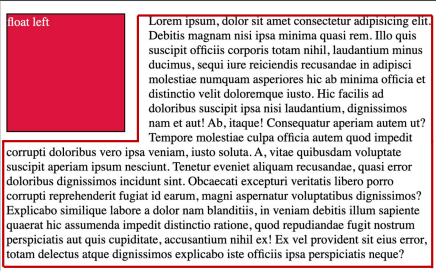

## 2022년 8월 31일(수)

> Web! CSS Position에 등장한 Flex!


**수호아빠의 한줄평 : 와씨.. 양이 왜이렇게 많은거... 후덜덜..**


### CSS Position

- 문서 상에서 요소의 위치를 지정
- static : 모든 태그의 기본 값(기준 위치)
  - 일반적인 요소의 배치 순서에 따름(좌측 상단)
  - 부모 요소 내에서 배치될 때는 부모 요소의 위치를 기준으로 배치 됨
- 아래는 좌표 프로퍼티(top, bottom, left, right)를 사용하여 이동 가능
  1. `relative` : 상대 위치
     - 자기 자신의 static 위치를 기준으로 이동 (normal flow 유지)
     - 레이아웃에서 요소가 차지하는 공간은 static일 때와 같음 (normal position 대비 offset)
  2. `absolute` : 절대 위치
     - 요소를 일반적인 문서 흐름에서 제거 후 레이아웃에 공간을 차지하지 않음
     - normal flow에서 벗어남
     - static이 아닌 가장 가까이 있는 부모/조상 요소를 기준으로 이동 (없는 경우 브라우저 화면 기준으로 이동)
     - **네모안에 네모를 넣을때 사용**
  3. fixed : 고정 위치
     - 요소를 일반적인 문서 흐름에서 제거 후 레이아웃에 **공간을 차지하지 않음**
     - normal flow에서 벗어남
     - 부모 요소와 관계없이 viewport를 기준으로 이동
     - 스크롤 시에도 항상 같은 곳에 위치함
     - **위로가기 버튼**
  4. sticky: 스크롤에 따라 static -> fixed로 변경
     - 속성을 적용한 박스는 평소에 문서 안에서 position: static 상태와 같이 일반적인 흐름에 따르지만 스크롤 위치가 임계점에 이르면 position: fixed와 같이 박스를 화면에 고정할 수 있는 속성
     - 공간을 차지한다는 부분에서 fixed와 차이가 있음.
     - **쇼핑몰 사이트에서 맨위에 로그인상태나, 메뉴바 따라오는 기능**

- CSS 원칙
  - CSS 원칙 I, II : Normal flow
    - 모든 요소는 네모(박스모델), 좌측상단에 배치
    - display에 따라 크기와 배치가 달라짐
  - CSS 원칙 III
    - **position으로 위치의 기준을 변경**
      - relative : 본인의 원래 위치
      - absolute : 특정 부모의 위치
      - fixed : 화면의 위치
      - sticky: 기본적으로 static이나 스크롤 이동에 따라 fixed로 변경


### CSS Layout

- Display
- Position
- **Float (CSS1, 1996)**
- **Flexbox (2012)**
- Grid (2017)
- 기타
  - Responsive Web Design(2010), Media Queries (2012)

### Float

- 박스를 왼쪽 혹은 오른쪽으로 이동시켜 텍스트를 포함 인라인요소들이 주변을 wrapping 하도록 함
- 요소가 Normal flow를 벗어나도록 함

- Float 예시



```css
.box{
    width: 150px;
    height: 150px;
    border: 1px solid black;
    background-color: crimson;
    color: white;
    margin-right: 30px;
}

.left{
    float: left;
}
```


### Flexbox

- 사용해야하는 이유:
  - 이전까지 Normal Flow를 벗어나는 수단은 Float 혹은 Position
  - Flex는 수직정렬 용이
  - 아이템 너비와 높이 혹은 간격을 동일하게 배치

- Flex 속성
  - 배치 설정
    - **flex-direction**
      - Main axis의 방향을 설정
    - **flex-wrap**
      - `nowrap`: 모든 요소들을 한 줄에 정렬합니다.
      - `wrap`: 요소들을 여러 줄에 걸쳐 정렬합니다.
      - `wrap-reverse`: 요소들을 여러 줄에 걸쳐 반대로 정렬합니다.
    - **flex-flow**
      - ex) flex-flow: row wrap
  - 공간 나누기
    - **justify-content (main axis)**
      - `flex-start`: 요소들을 컨테이너의 왼쪽으로 정렬합니다.
      - `flex-end`: 요소들을 컨테이너의 오른쪽으로 정렬합니다.
      - `center`: 요소들을 컨테이너의 가운데로 정렬합니다.
      - `space-between`: 요소들 사이에 동일한 간격을 둡니다.
      - `space-around`: 요소들 주위에 동일한 간격을 둡니다.
    - **align-content (cross axis)**
      - `flex-start`: 여러 줄들을 컨테이너의 꼭대기에 정렬합니다.
      - `flex-end`: 여러 줄들을 컨테이너의 바닥에 정렬합니다.
      - `center`: 여러 줄들을 세로선 상의 가운데에 정렬합니다.
      - `space-between`: 여러 줄들 사이에 동일한 간격을 둡니다.
      - `space-around`: 여러 줄들 주위에 동일한 간격을 둡니다.
      - `stretch`: 여러 줄들을 컨테이너에 맞도록 늘립니다.
  - 정렬 
    - **align-items (모든 아이템을 cross axis 기준으로)**
      - `flex-start`: 요소들을 컨테이너의 꼭대기로 정렬합니다.
      - `flex-end`: 요소들을 컨테이너의 바닥으로 정렬합니다.
      - `center`: 요소들을 컨테이너의 세로선 상의 가운데로 정렬합니다.
      - `baseline`: 요소들을 컨테이너의 시작 위치에 정렬합니다.
      - `stretch`: 요소들을 컨테이너에 맞도록 늘립니다.
    - **align-self (개별 아이템)**
      - `stretch (기본 값)` : 컨테이너를 가득 채움
      - `flex-start` : 위
      - `flex-end` : 아래
      - `center` : 가운데
      - `baseline` : 텍스트 baseline에 기준선을 맞춤
  - 기타
    - **flex-grow : 남은 영역을 아이템에 분배**
    - **order : 배치 순서**


## 오후 실습

[오후실습! FLEXBOXFROGGY](./flexboxfroggy.md)

