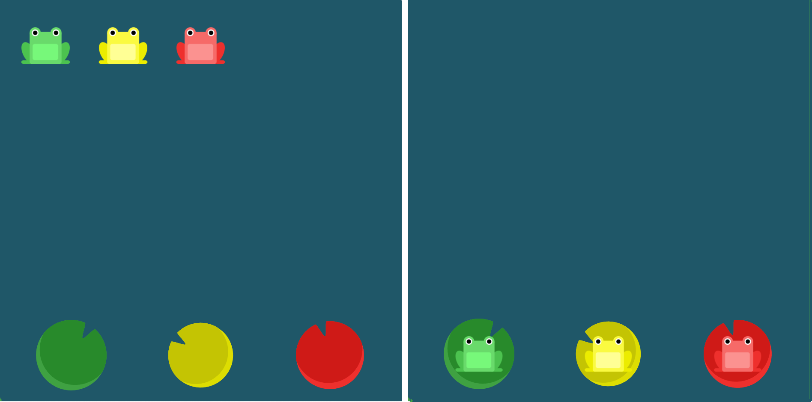

## 2022년 8월 31일(수)

> 오후실습! flexboxfroggy 완료


**수호아빠의 한줄평 : 오..이런 게임형식 너무 좋네..**

[FLEXBOX FROGGY](https://flexboxfroggy.com/#ko)

`단계 1`


```css
#pond {
  display: flex;
  justify-content: flex-end;
}
```

`단계 2`


```css
#pond {
  display: flex;
  justify-content: center;
}
```

`단계 3`


```css
#pond {
  display: flex;
  justify-content: space-around;
}
```

`단계 4`


```css
#pond {
  display: flex;
  justify-content: space-between;
}
```


`단계 5`


```css
#pond {
  display: flex;
  align-items: flex-end;
}
```

`단계 6`


```css
#pond {
  display: flex;
  justify-content: center;
  align-items: center;
}
```

`단계 7`



```css
#pond {
  display: flex;
  justify-content: space-around;
  align-items: flex-end;
}
```

`단계 8`


```css
#pond {
  display: flex;
 flex-direction: row-reverse;
}
```

`단계 9`


```css
#pond {
  display: flex;
  flex-direction: column;
}
```


`단계 10`


```css
#pond {
  display: flex;
  flex-direction: row-reverse;
  justify-content: flex-end;
}
```

`단계 11`


```css
#pond {
  display: flex;
  flex-direction: column;
  justify-content: flex-end;
}
```

`단계 12`


```css
#pond {
  display: flex;
  flex-direction: column-reverse;
  justify-content: space-between;
}
```

`단계 13`


```css
#pond {
  display: flex;
  flex-direction: row-reverse;
  justify-content: center;
  align-items: flex-end;
}
```


`단계 14`


```css
#pond {
  display: flex;
}

.yellow {
  order: 1;
}
```

`단계 15`


```css
#pond {
  display: flex;
}

.red {
  order: -1;
}
```

`단계 16`


```css
#pond {
  display: flex;
  align-items: flex-start;
}

.yellow {
  align-self: flex-end;
}
```

`단계 17`


```css
#pond {
  display: flex;
  align-items: flex-start;
}

.yellow {
  order: 1;
  align-self: flex-end;
}
```

`단계 18`


```css
#pond {
  display: flex;
  flex-wrap: wrap;
}
```

`단계 19, 20`


```css
/* 단계 19 */
#pond {
  display: flex;
  flex-wrap: wrap;
  flex-direction: column;
}

/* 단계 20 */
#pond {
  display: flex;
  flex-flow: column wrap;
}
```

`단계 21`


```css
#pond {
  display: flex;
  flex-wrap: wrap;
  align-content: flex-start;
}
```

`단계 22`


```css
#pond {
  display: flex;
  flex-wrap: wrap;
  align-content: flex-end;
}
```

` 단계 23`


```css
#pond {
  display: flex;
  flex-wrap: wrap;
  flex-direction: column-reverse;
  align-content: center;
}
```

`단계 24`


```css
#pond {
    display: flex;
	flex-flow: column-reverse wrap-reverse;
	justify-content: center;
	align-content: space-between;
}
```

`완료`


### justify-content

- `flex-start`: 요소들을 컨테이너의 왼쪽으로 정렬합니다.
- `flex-end`: 요소들을 컨테이너의 오른쪽으로 정렬합니다.
- `center`: 요소들을 컨테이너의 가운데로 정렬합니다.
- `space-between`: 요소들 사이에 동일한 간격을 둡니다.
- `space-around`: 요소들 주위에 동일한 간격을 둡니다.

### align-items

- `flex-start`: 요소들을 컨테이너의 꼭대기로 정렬합니다.
- `flex-end`: 요소들을 컨테이너의 바닥으로 정렬합니다.
- `center`: 요소들을 컨테이너의 세로선 상의 가운데로 정렬합니다.
- `baseline`: 요소들을 컨테이너의 시작 위치에 정렬합니다.
- `stretch`: 요소들을 컨테이너에 맞도록 늘립니다.

### flex-direction

- `row`: 요소들을 텍스트의 방향과 동일하게 정렬합니다.
- `row-reverse`: 요소들을 텍스트의 반대 방향으로 정렬합니다.
- `column`: 요소들을 위에서 아래로 정렬합니다.
- `column-reverse`: 요소들을 아래에서 위로 정렬합니다.

### order

- 각 요소에 적용
- `order`: \<integer> (... -1, 0 (default), 1, ...)
-  기본 값은 0이며, 양수나 음수로 바꿀 수 있습니다.

### align-self

- `flex-start` `flex-end` `center` `baseline` `stretch`

### flex-wrap

- `nowrap`: 모든 요소들을 한 줄에 정렬합니다.
- `wrap`: 요소들을 여러 줄에 걸쳐 정렬합니다.
- `wrap-reverse`: 요소들을 여러 줄에 걸쳐 반대로 정렬합니다.

### flex-flow

- ex) flex-flow: row wrap

### align-content

- `flex-start`: 여러 줄들을 컨테이너의 꼭대기에 정렬합니다.
- `flex-end`: 여러 줄들을 컨테이너의 바닥에 정렬합니다.
- `center`: 여러 줄들을 세로선 상의 가운데에 정렬합니다.
- `space-between`: 여러 줄들 사이에 동일한 간격을 둡니다.
- `space-around`: 여러 줄들 주위에 동일한 간격을 둡니다.
- `stretch`: 여러 줄들을 컨테이너에 맞도록 늘립니다.
