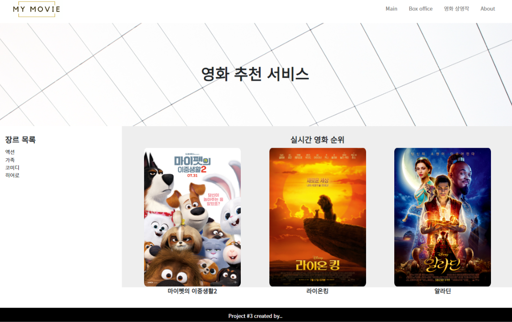
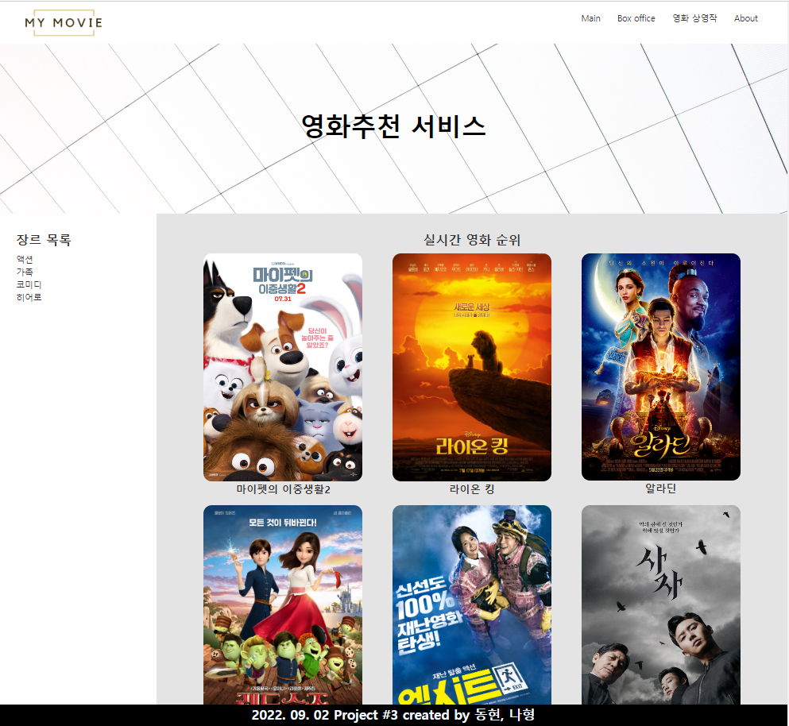

## 2022년 9월 2일(금)

> 협업 프로젝트! 드라이버와 네비게이터!

### 오늘의 과제

### 오늘의 완성작

### 오늘의 프로젝트 후기

`1기_1회차_이동현`

처음으로 이렇게 이야기를 나눠보며 협업을 하였는데, 처음에는 걱정을 엄청 했었는데.. 막상 해보니 대화도 너무 잘되고 팀웍도 너무 잘되어서 평소 혼자하는 것보다 훨씬 재미있게 프로젝트를 하였습니다. 그리고 처음에는 생각하는 것을 말로 하는것이 좀 어색하고, 어려웠는데 확실히 하다보니까 나중에는 조금 더 자연스러워진 저의 모습을 볼 수 있었습니다! 

매우 만족스러운 프로젝트였습니다. 

`1기_2회차_김나형`

페어 프로젝트 처음으로 진행해 보았는데 좋은 조원을 만나 진행이 수월했던 것 같습니다. 제가 모르거나 애매하게 습득했던 지식에 대해서도 돌아가며 설명하게 되니 정확히 짚고 넘어갈 수 있어서 좋았습니다. 또 팀 프로젝트다 보니 소통과 서로를 이해하는 과정도 중요다는 생각이 들었습니다. 이번 계기가 좋은 출발점이 된 것 같아서 만족스럽습니다.
