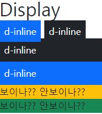

## 2022년 9월 5일(월)

> Web-04! Form!? Bootstrap!?


**수호아빠의 한줄평 : 말만 들어서는 모르겠고.. 이것저것 해봐야 알듯한 느낌..**


### 1. HTML

#### (1) FORM

- \<form>은 정보(데이터)를 서버에 제출하기 위해 사용하는 태그
- \<form> 기본 속성 
  - action : form을 처리할 서버의 URL(데이터를 보낼 곳)
  - method : form을 제출할 때 사용할 HTTP 메서드 (GET 혹은 POST)
  - enctype : method가 post인 경우 데이터의 유형
    - application/x-www-form-urlencoded : 기본값
    - multipart/form-data : 파일 전송시 (input type이 file인 경우)
    - text/plain : HTML5 디버깅 용 (잘 사용되지 않음)

#### (2) INPUT

- 다양한 타입을 가지는 입력 데이터 유형과 위젯이 제공됨
- \<input> 대표적인 속성
  - name : form control에 적용되는 이름 (이름/값 페어로 전송됨)
  - value : form control에 적용되는 값 (이름/값 페어로 전송됨)
  - required, readonly, autofocus, autocomplete, disabled 등

#### (3) INPUT LABEL

- label을 클릭하여 input 자체의 초점을 맞추거나 활성화 시킬 수 있음
  - 사용자는 선택할 수 있는 영역이 늘어나 웹 / 모바일(터치) 환경에서 편하게 사용할 수 있음
  - label과 input 입력의 관계가 시각적 뿐만 아니라 화면리더기에서도 label을 읽어 쉽게 내용을 확인 할 수 있도록 함
- \<input>에 id 속성을, \<label>에는 for 속성을 활용하여 상호 연관을 시킴

#### (4) INPUT 유형 - 일반 (\<input type="">)

- 일반적으로 입력을 받기 위하여 제공되며 타입별로 HTML기본 검증 혹은 추가 속성을 활용할 수 있음
  - text : 일반 텍스트 입력
  - password : 입력 시 값이 보이지 않고 문자를 특수기호(*)로 표현
  - email : 이메일 형식이 아닌 경우 form 제출 불가
  - number : min, max, step 속성을 활용하여 숫자 범위 설정 가능
  - file : accept 속성을 활용하여 파일 타입 지정 가능\

#### (5) INPUT 유형 - 기타 (\<input type="">)

- 일반적으로 label 태그와 함께 사용하여 선택 항목을 작성함
- 동일 항목에 대하여는 name을 지정하고 선택된 항목에 대한 value를 지정해야 함
  - checkbox : 다중 선택
  - radio : 단일 선택
- 다양한 종류의 input을 위한 picker를 제공
  - color : color picker
  - date : date picker
- hidden input을 활용하여 사용자 입력을 받지 않고 서버에 전송되어야 하는 값을 설정
  - hidden : 사용자에게 보이지 않는 input

### 2. BOOTSTRAP

#### (1) SPACING ({property}{sides}-{size})

- property
  - m - margin
  - p - padding
- sides
  - t - margin-top or padding-top
  - b - margin-bottom or padding-bottom
  - s - (start)
    - margin-left or padding-left in LTR
    - margin-right or padding-right in RTL
  - e - (end)
    - s와 반대
  - x - *-left and *-right 왼쪽 오른쪽 세팅
  - y - *top and *-bottom 위 아래 세팅
  - blank - magin or padding 4방향 세팅
- size
  - 0 = 0
  - 3 = 1rem (16px)
  - 2 = 0.5rem (8px) // 1 =  0.25rem (4px)
  - 4 = 1.5rem (24px) // 5 = 3rem (48px)
  - auto = 세팅 자동 (화면 가운데로 정렬할 때)
- 예시
  - .mx-0 : 마진 좌우 0
  - .py-0 : 패딩 위아래 0

#### (2) COLOR

- \<div class="bg-">


#### (3) TEXT

- \<p class="text-"
  - start
  - center
  - end


- <p class="fw-"

  - bold
  - normal
  - light

  

- \<p class="fst-italic">
  - 기울인 글씨

- \<a href="#">
  - 링크 글씨

#### (4) DISPLAY

```html
    <h2>Display</h2>
      <div class="d-inline p-2 bg-primary text-white">d-inline</div>
      <div class="d-inline p-2 bg-dark text-white">d-inline</div>
      <div class="d-block p-2 bg-dark text-white">d-inline</div>
      <div class="d-block p-2 bg-primary text-white">d-inline</div>
      <div class="box bg-warning d-sm-none d-md-block">보이나?? 안보이나??</div>
      <div class="box bg-success d-md-none d-xl-block">보이나?? 안보이나??</div>
```



#### (5) POSITION

```html
    <h2></h2>
      <div class="box fixed-top">fixed-top</div>
      <div class="box fixed-bottom">fixed-bottom</div>
```


## 오후 실습

[오후실습! 부트스트랩 써보기](./practice.md)

