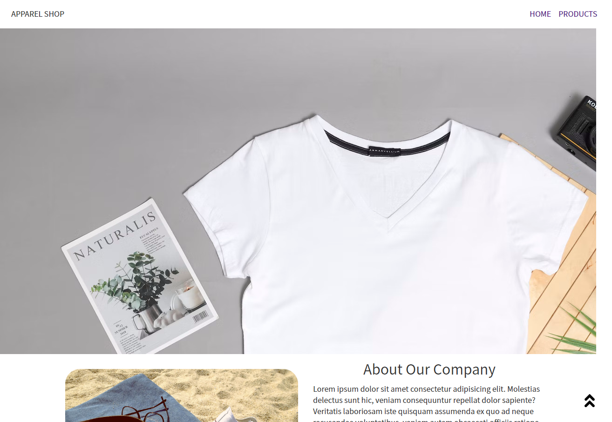
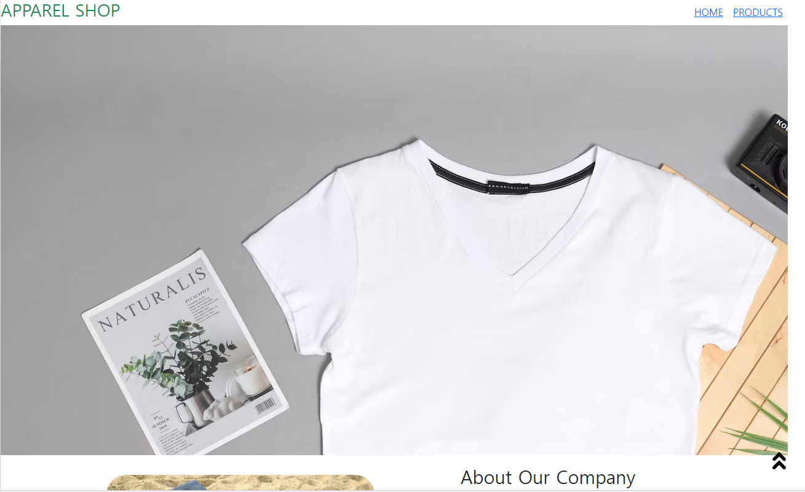

## 2022년 9월 5일(월)

> 부트스트랩 써보기


### 오후 실습 과제: 기존에 만들었던 것에서 부트스트랩을 사용해보기.

### 9월 4일 실습

`기존`



`코드`

```html
  <nav class="nav">
    <h1 class="nav-a" href="">APPAREL SHOP</h1>
    <ul class="nav-list">
      <li class="nav-item">
        <a class="nav-a" href="">HOME</a>
      </li>
      <li class="nav-item">
        <a class="nav-a" href="">PRODUCTS</a>
      </li>
    </ul>
  </nav>
```

### 9월 5일 오후 실습

`부트 스트랩 사용하여 수정`



`코드`

```html
  <nav class="d-flex justify-content-between w-70">
    <h1 class="fs-3 text-success" href="">APPAREL SHOP</h1>
    <ul class="d-flex align-items-cente my-auto">
      <li class="nav-item">
        <a class="" href="">HOME</a>
      </li>
      <li class="nav-item">
        <a class="" href="">PRODUCTS</a>
      </li>
    </ul>
  </nav>
```


