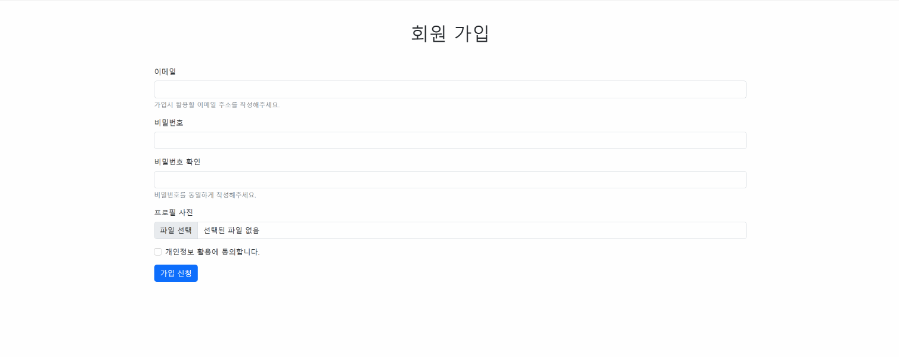
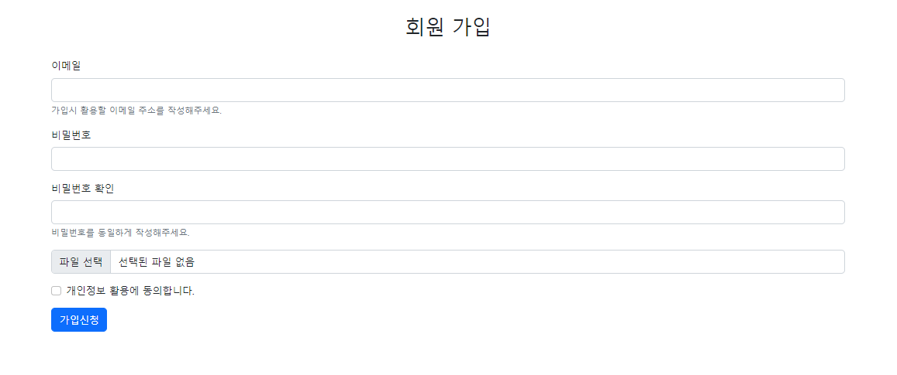
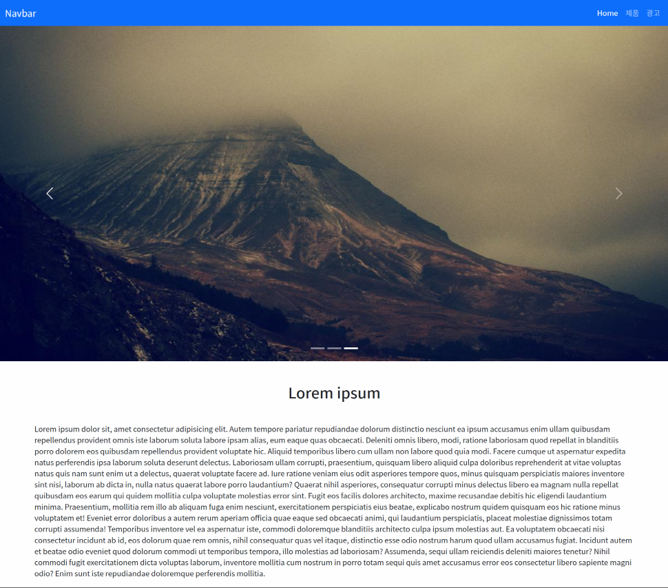
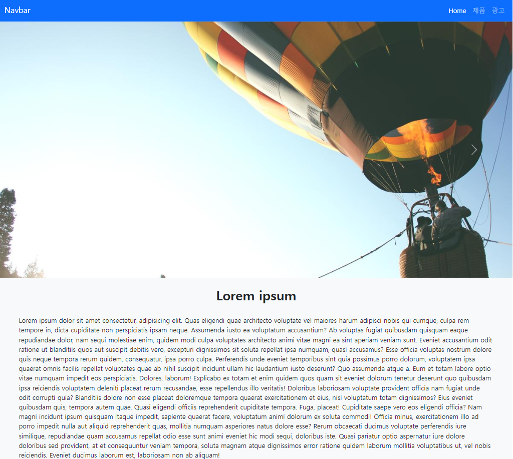

## 2022년 9월 6일(화)

> Web-06! 실습 과제! 주어진 사진과 같이 만들어보기 - 부트스트랩


**수호아빠의 한줄평: CSS보다 훨씬 꾸미기가 쉽긴하다.. 마음에 드는것을 골라서 가져오는 느낌?**

### 

### 9월 4일 실습 - 부트스트랩을 이용하여 주어진 사진을 만들어보자.

`실습 과제_01`



`수호아빠의 작품`



`수호아빠의 코드`

```html
<!DOCTYPE html>
<html lang="en">
  <head>
    <meta charset="UTF-8">
    <meta http-equiv="X-UA-Compatible" content="IE=edge">
    <meta name="viewport" content="width=device-width, initial-scale=1.0">
    <link href="https://cdn.jsdelivr.net/npm/bootstrap@5.2.0/dist/css/bootstrap.min.css" rel="stylesheet" integrity="sha384-gH2yIJqKdNHPEq0n4Mqa/HGKIhSkIHeL5AyhkYV8i59U5AR6csBvApHHNl/vI1Bx" crossorigin="anonymous">
    <title>1기_1회차_이동현_실습1</title>
  </head>
  <body class="mx-auto my-auto" style="width: 1280px">
      <h1 class="fs-2 text-center p-4">회원 가입</h1>
      <form>
        <div class="mb-3">
          <label for="exampleInputEmail1" class="form-label">이메일</label>
          <input type="email" class="form-control" id="exampleInputEmail1" aria-describedby="emailHelp">
          <div id="emailHelp" class="form-text">가입시 활용할 이메일 주소를 작성해주세요.</div>
        </div>
        <div class="mb-3">
          <label for="exampleInputPassword1" class="form-label">비밀번호</label>
          <input type="password" class="form-control" id="exampleInputPassword1">
        </div>
        <div class="mb-3">
          <label for="exampleInputPassword1" class="form-label">비밀번호 확인</label>
          <input type="password" class="form-control" id="exampleInputPassword1">
          <div id="emailHelp" class="form-text">비밀번호를 동일하게 작성해주세요.</div>
        </div>
        <div class="input-group mb-3">
          <input type="file" class="form-control" id="inputGroupFile02">
        </div>
        <div class="mb-3 form-check">
          <input type="checkbox" class="form-check-input" id="exampleCheck1">
          <label class="form-check-label" for="exampleCheck1">개인정보 활용에 동의합니다.</label>
        </div>
        <button type="submit" class="btn btn-primary">가입신청</button>
      </form>
  </body>
</html>
```


`실습 과제_02`



`수호아빠의 작품`



`수호아빠의 코드`

```html
<!DOCTYPE html>
<html lang="en">
  <head>
    <meta charset="UTF-8">
    <meta http-equiv="X-UA-Compatible" content="IE=edge">
    <meta name="viewport" content="width=device-width, initial-scale=1.0">
    <link href="https://cdn.jsdelivr.net/npm/bootstrap@5.2.0/dist/css/bootstrap.min.css" rel="stylesheet" integrity="sha384-gH2yIJqKdNHPEq0n4Mqa/HGKIhSkIHeL5AyhkYV8i59U5AR6csBvApHHNl/vI1Bx" crossorigin="anonymous">
    <title>1기_1회차_이동현_실습2</title>
  </head>
  <body class="mx-auto my-auto" style="width: 1280px">
    <nav class="navbar navbar-expand-lg bg-primary ">
      <div class="container-fluid">
        <a class="navbar-brand text-white" href="#">Navbar</a>
        <button class="navbar-toggler" type="button" data-bs-toggle="collapse" data-bs-target="#navbarNav" aria-controls="navbarNav" aria-expanded="false" aria-label="Toggle navigation">
          <span class="navbar-toggler-icon"></span>
        </button>
        <div>
          <ul class="navbar-nav">
            <li class="nav-item">
              <a class="nav-link active text-white" aria-current="page" href="#">Home</a>
            </li>
            <li class="nav-item">
              <a class="nav-link text-white-50" href="#">제품</a>
            </li>
            <li class="nav-item">
              <a class="nav-link text-white-50" href="#">광고</a>
          </ul>
        </div>
      </div>
    </nav>
    <div id="carouselExampleIndicators" class="carousel slide" data-bs-ride="true">
      <div class="carousel-indicators">
        <button type="button" data-bs-target="#carouselExampleIndicators" data-bs-slide-to="0" class="active" aria-current="true" aria-label="Slide 1"></button>
        <button type="button" data-bs-target="#carouselExampleIndicators" data-bs-slide-to="1" aria-label="Slide 2"></button>
        <button type="button" data-bs-target="#carouselExampleIndicators" data-bs-slide-to="2" aria-label="Slide 3"></button>
      </div>
      <div class="carousel-inner">
        <div class="carousel-item active">
          
        </div>
        <div class="carousel-item">
          
        </div>
        <div class="carousel-item">
          
        </div>
      </div>
      <button class="carousel-control-prev" type="button" data-bs-target="#carouselExampleIndicators" data-bs-slide="prev">
        <span class="carousel-control-prev-icon" aria-hidden="true"></span>
        <span class="visually-hidden">Previous</span>
      </button>
      <button class="carousel-control-next" type="button" data-bs-target="#carouselExampleIndicators" data-bs-slide="next">
        <span class="carousel-control-next-icon" aria-hidden="true"></span>
        <span class="visually-hidden">Next</span>
      </button>
    </div>
    <div class="bg-light">
      <h2 class="fw-bold fs-2 text-center p-4">Lorem ipsum</h2>
      <p class="px-5">Lorem ipsum dolor sit amet consectetur, adipisicing elit. Quas eligendi quae architecto voluptate vel maiores harum adipisci nobis qui cumque, culpa rem tempore in, dicta cupiditate non perspiciatis ipsam neque. Assumenda iusto ea voluptatum accusantium? Ab voluptas fugiat quibusdam quisquam eaque repudiandae dolor, nam sequi molestiae enim, quidem modi culpa voluptates architecto animi vitae magni ea sint aperiam veniam sunt. Eveniet accusantium odit ratione ut blanditiis quos aut suscipit debitis vero, excepturi dignissimos sit soluta repellat ipsa numquam, quasi accusamus? Esse officia voluptas nostrum dolore quis neque tempora rerum quidem, consequatur, ipsa porro culpa. Perferendis unde eveniet temporibus sint quia possimus porro dolorum, voluptatem ipsa quaerat omnis facilis repellat voluptates quae ab nihil suscipit incidunt ullam hic laudantium iusto deserunt? Quo assumenda atque a. Eum et totam labore optio vitae numquam impedit eos perspiciatis. Dolores, laborum! Explicabo ex totam et enim quidem quos quam sit eveniet dolorum tenetur deserunt quo quibusdam ipsa reiciendis voluptatem deleniti placeat rerum recusandae, esse repellendus illo veritatis! Doloribus laboriosam voluptate provident officia nam fugiat unde odit corrupti quia? Blanditiis dolore non esse placeat doloremque tempora quaerat exercitationem et eius, nisi voluptatum totam dignissimos? Eius eveniet quibusdam quis, tempora autem quae. Quasi eligendi officiis reprehenderit cupiditate tempora. Fuga, placeat! Cupiditate saepe vero eos eligendi officia? Nam magni incidunt ipsum quisquam itaque impedit, sapiente quaerat facere, voluptatum animi dolorum ex soluta commodi! Officia minus, exercitationem illo ad porro impedit nulla aut aliquid reprehenderit quas, mollitia numquam asperiores natus dolore esse? Rerum obcaecati ducimus voluptate perferendis iure similique, repudiandae quam accusamus repellat odio esse sunt animi eveniet hic modi sequi, doloribus iste. Quasi pariatur optio aspernatur iure dolore doloribus sed provident, at et consequuntur veniam tempora, soluta magnam atque dignissimos error ratione quidem laborum mollitia voluptatibus ut, vel nobis reiciendis. Eveniet ducimus laborum est, laboriosam non ab aliquam!</p>
      
    </div>
    <script src="https://cdn.jsdelivr.net/npm/bootstrap@5.1.3/dist/js/bootstrap.bundle.min.js" integrity="sha384-ka7Sk0Gln4gmtz2MlQnikT1wXgYsOg+OMhuP+IlRH9sENBO0LRn5q+8nbTov4+1p" crossorigin="anonymous"></script>
  </body>
</html>
```

