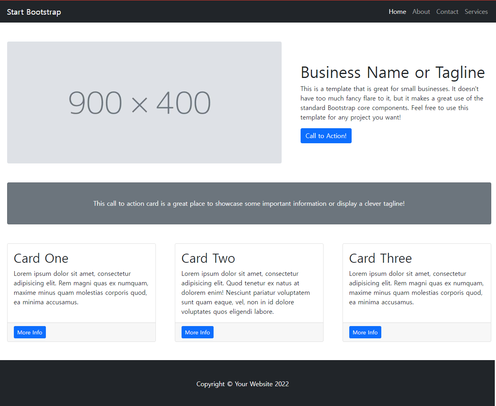
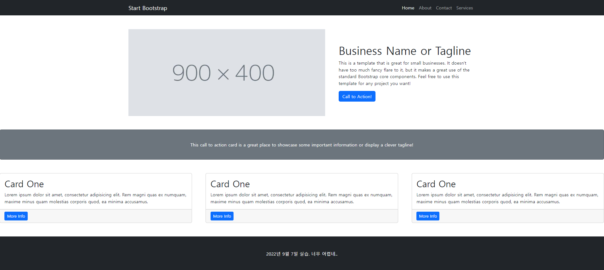

## 2022년 9월 7일(수)

> Web-07! 실습 과제! 주어진 사진과 같이 만들어보기 - GRID


**수호아빠의 한줄평: 오늘 숙취로 인해..수업을 잘 못들었다.. 실습으로 베껴오기는 했는데.. 정확히 알고 한게 아닌 느낌.. 추석때 복습해야지 ㅠㅠ**


### 9월 7일 실습 - GRID를 사용하여 웹을 만들어보자.

`실습 과제_01`



`수호아빠의 작품`



`수호아빠의 코드`

```html
<!doctype html>
<html lang="en">
  <head>
    <meta charset="utf-8">
    <meta http-equiv="X-UA-Compatible" content="IE=edge">
    <meta name="viewport" content="width=device-width, initial-scale=1">
    <title>1기_1회차_이동현</title>
    <link href="https://cdn.jsdelivr.net/npm/bootstrap@5.2.0/dist/css/bootstrap.min.css" rel="stylesheet" integrity="sha384-gH2yIJqKdNHPEq0n4Mqa/HGKIhSkIHeL5AyhkYV8i59U5AR6csBvApHHNl/vI1Bx" crossorigin="anonymous">
  </head>
  <body>

    <nav class="navbar navbar-expand-lg navbar-dark bg-dark">
      <div class="container px-5">
          <a class="navbar-brand" href="#!">Start Bootstrap</a>
          <button class="navbar-toggler collapsed" type="button" data-bs-toggle="collapse" data-bs-target="#navbarSupportedContent" aria-controls="navbarSupportedContent" aria-expanded="false" aria-label="Toggle navigation"><span class="navbar-toggler-icon"></span></button>
          <div class="navbar-collapse collapse" id="navbarSupportedContent">
              <ul class="navbar-nav ms-auto mb-2 mb-lg-0">
                  <li class="nav-item"><a class="nav-link active" aria-current="page" href="#!">Home</a></li>
                  <li class="nav-item"><a class="nav-link" href="#!">About</a></li>
                  <li class="nav-item"><a class="nav-link" href="#!">Contact</a></li>
                  <li class="nav-item"><a class="nav-link" href="#!">Services</a></li>
              </ul>
          </div>
      </div>
    </nav>

    <div class="container px-4 px-lg-5">
      <div class="row gx-4 gx-lg-5 align-items-center my-5">
        <div class="col-lg-7">
          
        </div>
        <div class="col-lg-5">
          <h1>Business Name or Tagline</h1>
          <p>This is a template that is great for small businesses. It doesn't have too much fancy flare to it, but it makes a great use of the standard Bootstrap core components. Feel free to use this template for any project you want!</p>
          <a class="btn btn-primary" href="#!">Call to Action!</a>
        </div>
      </div>
    </div>
    <div>
      <div class="card text-bg-secondary text-center my-5 py-4 col-12">
        <div class="card-body">
          <p class="card-text">This call to action card is a great place to showcase some important information or display a clever tagline!</p>
      </div>
    </div>
    <div class="row gx-4 gx-lg-5">
      <div class="col-md-4 mb-5">
        <div class="card h-100">
            <div class="card-body">
                <h2 class="card-title">Card One</h2>
                <p class="card-text">Lorem ipsum dolor sit amet, consectetur adipisicing elit. Rem magni quas ex numquam, maxime minus quam molestias corporis quod, ea minima accusamus.</p>
            </div>
            <div class="card-footer"><a class="btn btn-primary btn-sm" href="#!">More Info</a></div>
        </div>
      </div>
      <div class="col-md-4 mb-5">
        <div class="card h-100">
            <div class="card-body">
                <h2 class="card-title">Card One</h2>
                <p class="card-text">Lorem ipsum dolor sit amet, consectetur adipisicing elit. Rem magni quas ex numquam, maxime minus quam molestias corporis quod, ea minima accusamus.</p>
            </div>
            <div class="card-footer"><a class="btn btn-primary btn-sm" href="#!">More Info</a></div>
        </div>
      </div>
      <div class="col-md-4 mb-5">
        <div class="card h-100">
            <div class="card-body">
                <h2 class="card-title">Card One</h2>
                <p class="card-text">Lorem ipsum dolor sit amet, consectetur adipisicing elit. Rem magni quas ex numquam, maxime minus quam molestias corporis quod, ea minima accusamus.</p>
            </div>
            <div class="card-footer"><a class="btn btn-primary btn-sm" href="#!">More Info</a></div>
        </div>
      </div>
    </div>

    <footer class="py-5 bg-dark">
      <div class="container px-4 px-lg-5"><p class="m-0 text-center text-white">2022년 9월 7일 실습. 너무 어렵네..</p></div>
    </footer>


    <script src="https://cdn.jsdelivr.net/npm/bootstrap@5.2.0/dist/js/bootstrap.bundle.min.js" integrity="sha384-A3rJD856KowSb7dwlZdYEkO39Gagi7vIsF0jrRAoQmDKKtQBHUuLZ9AsSv4jD4Xa" crossorigin="anonymous"></script>
  </body>
</html>
```
