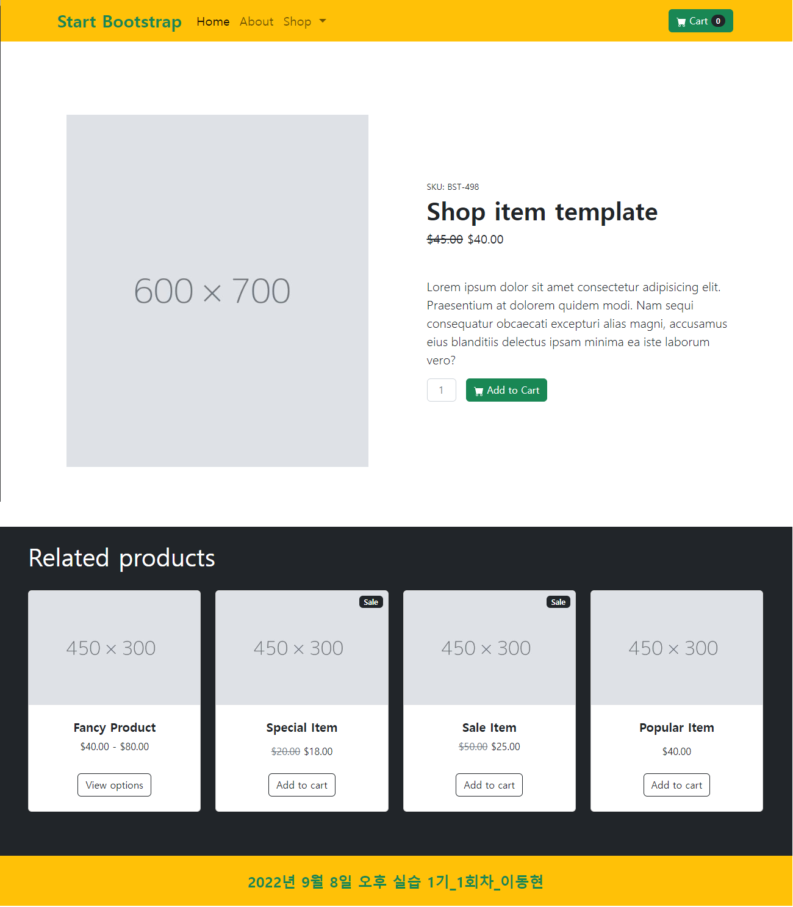

## 2022년 9월 8일(목)

> Web-08! 실습 과제! 웹 만들어보기.


**수호아빠의 한줄평: 으.. 잘 모르겠따..**


`수호아빠의 작품`



`수호아빠의 코드`

```html
<!doctype html>
<html lang="en">
  <head>
    <meta charset="utf-8">
    <meta http-equiv="X-UA-Compatible" content="IE=edge">
    <meta name="viewport" content="width=device-width, initial-scale=1">
    <title>1기_1회차_이동현</title>
    <link href="https://cdn.jsdelivr.net/npm/bootstrap@5.2.0/dist/css/bootstrap.min.css" rel="stylesheet" integrity="sha384-gH2yIJqKdNHPEq0n4Mqa/HGKIhSkIHeL5AyhkYV8i59U5AR6csBvApHHNl/vI1Bx" crossorigin="anonymous">
  </head>
  <body>
    <!-- nav -->
    <nav class="navbar navbar-expand-lg bg-warning">
      <div class="container">
        <a class="navbar-brand fs-3 text-success fw-bold" href="#">Start Bootstrap</a>
        <button class="navbar-toggler" type="button" data-bs-toggle="collapse" data-bs-target="#navbarScroll" aria-controls="navbarScroll" aria-expanded="false" aria-label="Toggle navigation">
          <span class="navbar-toggler-icon"></span>
        </button>
        <div class="collapse navbar-collapse" id="navbarScroll">
          <ul class="navbar-nav me-auto my-2 my-lg-0 navbar-nav-scroll" style="--bs-scroll-height: 100px;">
            <li class="nav-item">
              <a class="nav-link active fs-5" aria-current="page" href="#">Home</a>
            </li>
            <li class="nav-item">
              <a class="nav-link fs-5" href="#">About</a>
            </li>
            <li class="nav-item dropdown">
              <a class="nav-link dropdown-toggle fs-5" href="#" role="button" data-bs-toggle="dropdown" aria-expanded="false">
                Shop
              </a>
              <ul class="dropdown-menu">
                <li><a class="dropdown-item" href="#">All Products</a></li>
                <li><hr class="dropdown-divider"></li>
                <li><a class="dropdown-item" href="#">Popular Items</a></li>
                <li><a class="dropdown-item" href="#">New Arrivals</a></li>
              </ul>
            </li>

          </ul>
          <form class="d-flex">
            <button class="btn btn-success me-2" type="button">
              <svg xmlns="http://www.w3.org/2000/svg" width="16" height="16" fill="currentColor" class="bi bi-cart-fill" viewBox="0 0 16 16">
                <path d="M0 1.5A.5.5 0 0 1 .5 1H2a.5.5 0 0 1 .485.379L2.89 3H14.5a.5.5 0 0 1 .491.592l-1.5 8A.5.5 0 0 1 13 12H4a.5.5 0 0 1-.491-.408L2.01 3.607 1.61 2H.5a.5.5 0 0 1-.5-.5zM5 12a2 2 0 1 0 0 4 2 2 0 0 0 0-4zm7 0a2 2 0 1 0 0 4 2 2 0 0 0 0-4zm-7 1a1 1 0 1 1 0 2 1 1 0 0 1 0-2zm7 0a1 1 0 1 1 0 2 1 1 0 0 1 0-2z"/>
              </svg>  
              Cart <span class="badge rounded-pill text-bg-dark">0</span></button>
          </form>
        </div>
      </div>
    </nav>
    <!-- section-->
    <section class="py-4 px-4">
      <div class="py-4 px-4">
        <div class="row py-4 px-4 align-items-center">
          <!-- 이미지 -->
          <div class="col-md-6 py-5 px-5">
            
          </div>
          <!-- 이미지 설명-->
          <div class="col-md-6 py-5 px-5">
            <div class="small mb-1">SKU: BST-498</div>
            <h1 class="fs-1 fw-bolder">Shop item template</h1>
            <div class="fs-5 mb-5">
                <span class="text-decoration-line-through">$45.00</span>
                <span>$40.00</span>
            </div>
            <p class="lead">Lorem ipsum dolor sit amet consectetur adipisicing elit. Praesentium at dolorem quidem modi. Nam sequi consequatur obcaecati excepturi alias magni, accusamus eius blanditiis delectus ipsam minima ea iste laborum vero?</p>
            <div class="d-flex">
                <input class="form-control text-center me-3" type="text" placeholder="1" aria-label="default input example" style="max-width: 3rem">
                <button class="btn btn-success me-2" type="button">
                  <svg xmlns="http://www.w3.org/2000/svg" width="16" height="16" fill="currentColor" class="bi bi-cart-fill" viewBox="0 0 16 16">
                    <path d="M0 1.5A.5.5 0 0 1 .5 1H2a.5.5 0 0 1 .485.379L2.89 3H14.5a.5.5 0 0 1 .491.592l-1.5 8A.5.5 0 0 1 13 12H4a.5.5 0 0 1-.491-.408L2.01 3.607 1.61 2H.5a.5.5 0 0 1-.5-.5zM5 12a2 2 0 1 0 0 4 2 2 0 0 0 0-4zm7 0a2 2 0 1 0 0 4 2 2 0 0 0 0-4zm-7 1a1 1 0 1 1 0 2 1 1 0 0 1 0-2zm7 0a1 1 0 1 1 0 2 1 1 0 0 1 0-2z"/>
                  </svg>  
                  Add to Cart
                </button>
            </div>
          </div>
        </div>
      </div>
    </section>

    <!-- cards -->
    <section class="bg-dark">

      <div class="px-5 pt-4">
        <h1 class="text-white">Related products</h1> 
      </div>
      <div class="row py-4 px-5 row-cols-2 row-cols-md-3 row-cols-xl-4">
        <!-- card 1 -->
        <div class="col mb-5">
          <div class="card h-100">
              <!-- Product image-->
              
              <!-- Product details-->
              <div class="card-body p-4">
                  <div class="text-center">
                      <!-- Product name-->
                      <h5 class="fw-bolder">Fancy Product</h5>
                      <!-- Product price-->
                      $40.00 - $80.00
                  </div>
              </div>
              <!-- Product actions-->
              <div class="card-footer p-4 pt-0 border-top-0 bg-transparent">
                  <div class="text-center"><a class="btn btn-outline-dark mt-auto" href="#">View options</a></div>
              </div>
          </div>
        </div>
        <!-- card 2-->
        <div class="col mb-5">
          <div class="card h-100">
              <!-- Sale badge-->
              <div class="badge bg-dark text-white position-absolute" style="top: 0.5rem; right: 0.5rem">Sale</div>
              <!-- Product image-->
              
              <!-- Product details-->
              <div class="card-body p-4">
                  <div class="text-center">
                      <!-- Product name-->
                      <h5 class="fw-bolder">Special Item</h5>
                      <!-- Product reviews-->
                      <div class="d-flex justify-content-center small text-warning mb-2">
                          <div class="bi-star-fill"></div>
                          <div class="bi-star-fill"></div>
                          <div class="bi-star-fill"></div>
                          <div class="bi-star-fill"></div>
                          <div class="bi-star-fill"></div>
                      </div>
                      <!-- Product price-->
                      <span class="text-muted text-decoration-line-through">$20.00</span>
                      $18.00
                  </div>
              </div>
              <!-- Product actions-->
              <div class="card-footer p-4 pt-0 border-top-0 bg-transparent">
                  <div class="text-center"><a class="btn btn-outline-dark mt-auto" href="#">Add to cart</a></div>
              </div>
          </div>
        </div>
        <!-- card 3 -->
        <div class="col mb-5">
          <div class="card h-100">
              <!-- Sale badge-->
              <div class="badge bg-dark text-white position-absolute" style="top: 0.5rem; right: 0.5rem">Sale</div>
              <!-- Product image-->
              
              <!-- Product details-->
              <div class="card-body p-4">
                  <div class="text-center">
                      <!-- Product name-->
                      <h5 class="fw-bolder">Sale Item</h5>
                      <!-- Product price-->
                      <span class="text-muted text-decoration-line-through">$50.00</span>
                      $25.00
                  </div>
              </div>
              <!-- Product actions-->
              <div class="card-footer p-4 pt-0 border-top-0 bg-transparent">
                  <div class="text-center"><a class="btn btn-outline-dark mt-auto" href="#">Add to cart</a></div>
              </div>
          </div>
        </div>
        <!-- card 4-->
        <div class="col mb-5">
          <div class="card h-100">
              <!-- Product image-->
              
              <!-- Product details-->
              <div class="card-body p-4">
                  <div class="text-center">
                      <!-- Product name-->
                      <h5 class="fw-bolder">Popular Item</h5>
                      <!-- Product reviews-->
                      <div class="d-flex justify-content-center small text-warning mb-2">
                          <div class="bi-star-fill"></div>
                          <div class="bi-star-fill"></div>
                          <div class="bi-star-fill"></div>
                          <div class="bi-star-fill"></div>
                          <div class="bi-star-fill"></div>
                      </div>
                      <!-- Product price-->
                      $40.00
                  </div>
              </div>
              <!-- Product actions-->
              <div class="card-footer p-4 pt-0 border-top-0 bg-transparent">
                  <div class="text-center"><a class="btn btn-outline-dark mt-auto" href="#">Add to cart</a></div>
              </div>
          </div>
        </div>
      </div>

      <!-- Footer -->
      <footer class="py-4 bg-warning">
        <div class="container"><p class="m-0 text-center text-success fs-4 fw-bold">2022년 9월 8일 오후 실습 1기_1회차_이동현</p></div>
      </footer>

    </section>

    <script src="https://cdn.jsdelivr.net/npm/bootstrap@5.2.0/dist/js/bootstrap.bundle.min.js" integrity="sha384-A3rJD856KowSb7dwlZdYEkO39Gagi7vIsF0jrRAoQmDKKtQBHUuLZ9AsSv4jD4Xa" crossorigin="anonymous"></script>
  </body>
</html>
```
