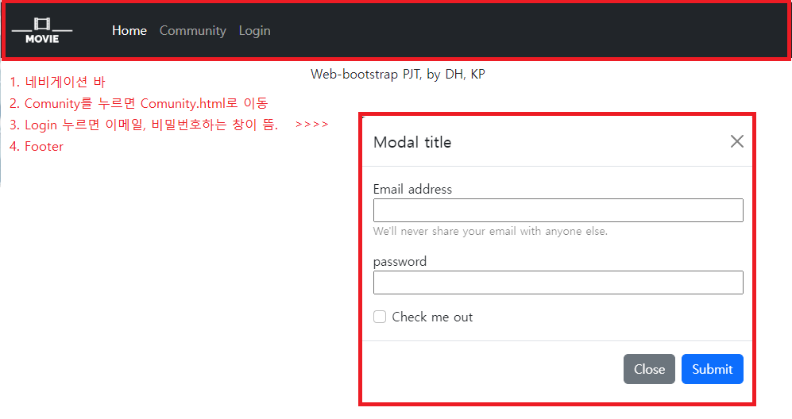

## 2022년 9월 13일(화)

> Web-Project02! 협업 프로젝트- 부트스트랩


**수호아빠의 한줄평: 와.. 팀원 빨 제대로..**


`프로젝트 1`



`수호아빠의 코드`

```html
<!DOCTYPE html>
<html lang="en">
<head>
    <meta charset="UTF-8">
    <meta http-equiv="X-UA-Compatible" content="IE=edge">
    <meta name="viewport" content="width=device-width, initial-scale=1.0">
    <meta name="description" content="">
    <meta name="author" content="">
    <title>nav_footer</title>
    <link href="https://cdn.jsdelivr.net/npm/bootstrap@5.2.0/dist/css/bootstrap.min.css" rel="stylesheet"
    integrity="sha384-gH2yIJqKdNHPEq0n4Mqa/HGKIhSkIHeL5AyhkYV8i59U5AR6csBvApHHNl/vI1Bx" crossorigin="anonymous">
    <link rel="stylesheet" href="https://cdn.jsdelivr.net/npm/bootstrap-icons@1.7.1/font/bootstrap-icons.css">
</head>

<body>
    <script src="https://cdn.jsdelivr.net/npm/bootstrap@5.2.1/dist/js/bootstrap.bundle.min.js" integrity="sha384-u1OknCvxWvY5kfmNBILK2hRnQC3Pr17a+RTT6rIHI7NnikvbZlHgTPOOmMi466C8" crossorigin="anonymous"></script>
    <script src="https://code.jquery.com/jquery-3.2.1.slim.min.js"></script>
    <script src="https://cdnjs.cloudflare.com/ajax/libs/popper.js/1.11.0/umd/popper.min.js"></script>
    <script src="https://maxcdn.bootstrapcdn.com/bootstrap/4.0.0-beta/js/bootstrap.min.js"></script>
    <nav class="navbar navbar-expand-lg navbar-dark text-bg-dark p-0 p-lg-0">
        <div class="container-fluid">
          <a class="navbar-brand" href="#!">
            
          </a>
          <button class="navbar-toggler" type="button" data-bs-toggle="collapse" 
          data-bs-target="#navbarSupportedContent" aria-controls="navbarSupportedContent" 
          aria-expanded="false" aria-label="Toggle navigation">
              <span class="navbar-toggler-icon"></span>
          </button>
          </button>
          <div class="collapse navbar-collapse" id="navbarSupportedContent">
            <ul class="navbar-nav me-auto mb-2 mb-lg-0 ms-lg-4">
                <li class="nav-item">
                    <a class="nav-link active" href="./02_home.html">Home</a>
                </li>
                <li class="nav-item">
                    <a class="nav-link" href="./03_community.html">Community</a>
                </li>
                <li class="nav-item">
                    <a class="nav-link" data-toggle="modal" href="#myModal">Login</a>
                </li>  
            </ul>  
        </div>
    </nav>
    <div class="modal hide" id="myModal">
        <div class="modal-dialog">
            <div class="modal-content">
              <div class="modal-header">
                <h5 class="modal-title">Modal title</h5>
                <button type="button" class="btn-close" data-dismiss="modal" aria-label="Close"></button>
              </div>
              <div class="modal-body">
                <form action="">
                    <div class="input-group">
                        <label for="username">Email address</label>
                    </div>
                    <input class="w-100" type="text" name="username" id="username" autofocus>
                    <p class="small text-black-50">We'll never share your email with anyone else.</p>
                    <div class="input-group">
                        <label for="name">password</label>
                    </div>
                    <input class="w-100" type="password" name="password">
                    <div class="form-check pt-3 pb-0">
                        <input class="form-check-input" type="checkbox" value="" id="flexCheckDefault">
                        <label class="form-check-label px-0" for="flexCheckDefault">
                          Check me out
                        </label>
                    </div>
                </form>

              </div>
              <div class="modal-footer">
                <button type="button" class="btn btn-secondary" data-dismiss="modal">Close</button>
                <button type="button" class="btn btn-primary">Submit</button>
              </div>
            </div>
          </div>
    </div>
    <footer class="text-center py-2 ">
        <div class="container sticky-bottom">
            <p>Web-bootstrap PJT, by DH, KP</p>
        </div>
    </footer>
</body>
</html>
 
```


`프로젝트 2`


`수호아빠의 코드`

```html
<!DOCTYPE html>
<html lang="en">
<head>
    <meta charset="UTF-8">
    <meta http-equiv="X-UA-Compatible" content="IE=edge">
    <meta name="viewport" content="width=device-width, initial-scale=1.0">
    <meta name="description" content="">
    <meta name="author" content="">
    <title>home</title>
    <link href="https://cdn.jsdelivr.net/npm/bootstrap@5.2.0/dist/css/bootstrap.min.css" rel="stylesheet"
    integrity="sha384-gH2yIJqKdNHPEq0n4Mqa/HGKIhSkIHeL5AyhkYV8i59U5AR6csBvApHHNl/vI1Bx" crossorigin="anonymous">
    <link rel="stylesheet" href="https://cdn.jsdelivr.net/npm/bootstrap-icons@1.7.1/font/bootstrap-icons.css">
</head>

<body>
  <script src="https://cdn.jsdelivr.net/npm/bootstrap@5.2.1/dist/js/bootstrap.bundle.min.js" integrity="sha384-u1OknCvxWvY5kfmNBILK2hRnQC3Pr17a+RTT6rIHI7NnikvbZlHgTPOOmMi466C8" crossorigin="anonymous"></script>
  <script src="https://code.jquery.com/jquery-3.2.1.slim.min.js"></script>
  <script src="https://cdnjs.cloudflare.com/ajax/libs/popper.js/1.11.0/umd/popper.min.js"></script>
  <script src="https://maxcdn.bootstrapcdn.com/bootstrap/4.0.0-beta/js/bootstrap.min.js"></script>
    <nav class="navbar navbar-expand-lg navbar-dark text-bg-dark p-0 p-lg-0">
        <div class="container-fluid">
          <a class="navbar-brand" href="#!">
            
          </a>
          <button class="navbar-toggler" type="button" data-bs-toggle="collapse" 
          data-bs-target="#navbarSupportedContent" aria-controls="navbarSupportedContent" 
          aria-expanded="false" aria-label="Toggle navigation">
              <span class="navbar-toggler-icon"></span>
          </button>
          </button>
          <div class="collapse navbar-collapse" id="navbarSupportedContent">
            <ul class="navbar-nav me-auto mb-2 mb-lg-0 ms-lg-4">
                <li class="nav-item">
                    <a class="nav-link active" href="./02_home.html">Home</a>
                </li>
                <li class="nav-item">
                    <a class="nav-link" href="./03_community.html">Community</a>
                </li>
                <li class="nav-item">
                    <a class="nav-link" data-toggle="modal" href="#myModal">Login</a>
                </li>  
            </ul>  
        </div>
    </nav>
    <div class="modal hide" id="myModal">
        <div class="modal-dialog">
            <div class="modal-content">
              <div class="modal-header">
                <h5 class="modal-title">Modal title</h5>
                <button type="button" class="btn-close" data-dismiss="modal" aria-label="Close"></button>
              </div>
              <div class="modal-body">
                <form action="">
                    <div class="input-group">
                        <label for="username">Email address</label>
                    </div>
                    <input class="w-100" type="text" name="username" id="username" autofocus>
                    <p class="small text-black-50">We'll never share your email with anyone else.</p>
                    <div class="input-group">
                        <label for="name">password</label>
                    </div>
                    <input class="w-100" type="password" name="password">
                    <div class="form-check pt-3 pb-0">
                        <input class="form-check-input" type="checkbox" value="" id="flexCheckDefault">
                        <label class="form-check-label px-0" for="flexCheckDefault">
                          Check me out
                        </label>
                    </div>
                </form>

              </div>
              <div class="modal-footer">
                <button type="button" class="btn btn-secondary" data-dismiss="modal">Close</button>
                <button type="button" class="btn btn-primary">Submit</button>
              </div>
            </div>
          </div>
    </div>
    <!-- 네비 아래거-->
    <div id="carouselExampleControls" class="carousel slide carousel-fade" data-bs-ride="carousel">
      <div class="carousel-inner">
        <div class="carousel-item active">
          
        </div>
        <div class="carousel-item">
          
        </div>
        <div class="carousel-item">
          
        </div>
      </div>
      <button class="carousel-control-prev" type="button" data-bs-target="#carouselExampleControls" data-bs-slide="prev">
        <span class="carousel-control-prev-icon" aria-hidden="true"></span>
        <span class="visually-hidden">Previous</span>
      </button>
      <button class="carousel-control-next" type="button" data-bs-target="#carouselExampleControls" data-bs-slide="next">
        <span class="carousel-control-next-icon" aria-hidden="true"></span>
        <span class="visually-hidden">Next</span>
      </button>
    </div>
    <!-- 1920 x 600 아래부분 -->
    <section class="py-5">
        <div class="container px-4 px-lg-5 mt-5">
            <h2 class="text-center pb-4">Boxoffice</h2>
            <div class="row g-4 g-sm-4 g-md-3 row-cols-1 row-cols-sm-2 row-cols-md-3">
                <div class="col">
                    <div class="card">
                        
                        <div class="card-body">
                            <h3>Card title</h3>
                            <p class="card-text">Lorem ipsum dolor sit, amet consectetur adipisicing elit. Libero, numquam laboriosam molestiae odio dicta sequi quae iusto quod vero ipsam id molestias totam nihil sint. </p>
                        </div>
                    </div>
                </div>
                <div class="col">
                    <div class="card">
                        
                        <div class="card-body">
                            <h3>Card title</h3>
                            <p class="card-text">Lorem ipsum dolor sit, amet consectetur adipisicing elit. Libero, numquam laboriosam molestiae odio dicta sequi quae iusto quod vero ipsam id molestias totam nihil sint. </p>
                        </div>
                    </div>
                </div>
                <div class="col">
                    <div class="card">
                        
                        <div class="card-body">
                            <h3>Card title</h3>
                            <p class="card-text">Lorem ipsum dolor sit, amet consectetur adipisicing elit. Libero, numquam laboriosam molestiae odio dicta sequi quae iusto quod vero ipsam id molestias totam nihil sint. </p>
                        </div>
                    </div>
                </div>
                <div class="col">
                    <div class="card">
                        
                        <div class="card-body">
                            <h3>Card title</h3>
                            <p class="card-text">Lorem ipsum dolor sit, amet consectetur adipisicing elit. Libero, numquam laboriosam molestiae odio dicta sequi quae iusto quod vero ipsam id molestias totam nihil sint. </p>
                        </div>
                    </div>
                </div>
                <div class="col">
                    <div class="card">
                        
                        <div class="card-body">
                            <h3>Card title</h3>
                            <p class="card-text">Lorem ipsum dolor sit, amet consectetur adipisicing elit. Libero, numquam laboriosam molestiae odio dicta sequi quae iusto quod vero ipsam id molestias totam nihil sint. </p>
                        </div>
                    </div>
                </div>
                <div class="col">
                    <div class="card">
                        
                        <div class="card-body">
                            <h3>Card title</h3>
                            <p class="card-text">Lorem ipsum dolor sit, amet consectetur adipisicing elit. Libero, numquam laboriosam molestiae odio dicta sequi quae iusto quod vero ipsam id molestias totam nihil sint. </p>
                        </div>
                    </div>
                </div>
            </div>
        </div>
    </section>

    <!-- footer -->
    <footer class="text-center py-2 ">
        <div class="container sticky-bottom">
            <p>Web-bootstrap PJT, by DH, KP</p>
        </div>
    </footer>

</body>
</html>
```


`프로젝트 3`


`수호아빠의 코드`

```html
<!DOCTYPE html>
<html lang="en">
<head>
    <meta charset="UTF-8">
    <meta http-equiv="X-UA-Compatible" content="IE=edge">
    <meta name="viewport" content="width=device-width, initial-scale=1.0">
    <meta name="description" content="">
    <meta name="author" content="">
    <title>community</title>
    <link href="https://cdn.jsdelivr.net/npm/bootstrap@5.2.0/dist/css/bootstrap.min.css" rel="stylesheet"
    integrity="sha384-gH2yIJqKdNHPEq0n4Mqa/HGKIhSkIHeL5AyhkYV8i59U5AR6csBvApHHNl/vI1Bx" crossorigin="anonymous">
    <link rel="stylesheet" href="https://cdn.jsdelivr.net/npm/bootstrap-icons@1.7.1/font/bootstrap-icons.css">
</head>

<body>
    <script src="https://cdn.jsdelivr.net/npm/bootstrap@5.2.1/dist/js/bootstrap.bundle.min.js" integrity="sha384-u1OknCvxWvY5kfmNBILK2hRnQC3Pr17a+RTT6rIHI7NnikvbZlHgTPOOmMi466C8" crossorigin="anonymous"></script>
    <script src="https://code.jquery.com/jquery-3.2.1.slim.min.js"></script>
    <script src="https://cdnjs.cloudflare.com/ajax/libs/popper.js/1.11.0/umd/popper.min.js"></script>
    <script src="https://maxcdn.bootstrapcdn.com/bootstrap/4.0.0-beta/js/bootstrap.min.js"></script>
    <nav class="navbar navbar-expand-lg navbar-dark text-bg-dark p-0 p-lg-0">
        <div class="container-fluid">
          <a class="navbar-brand" href="#!">
            
          </a>
          <button class="navbar-toggler" type="button" data-bs-toggle="collapse" 
          data-bs-target="#navbarSupportedContent" aria-controls="navbarSupportedContent" 
          aria-expanded="false" aria-label="Toggle navigation">
              <span class="navbar-toggler-icon"></span>
          </button>
          </button>
          <div class="collapse navbar-collapse" id="navbarSupportedContent">
            <ul class="navbar-nav me-auto mb-2 mb-lg-0 ms-lg-4">
                <li class="nav-item">
                    <a class="nav-link active" href="./02_home.html">Home</a>
                </li>
                <li class="nav-item">
                    <a class="nav-link" href="./03_community.html">Community</a>
                </li>
                <li class="nav-item">
                    <a class="nav-link" data-toggle="modal" href="#myModal">Login</a>
                </li>  
            </ul>  
        </div>
    </nav>
    <div class="modal hide" id="myModal">
        <div class="modal-dialog">
            <div class="modal-content">
              <div class="modal-header">
                <h5 class="modal-title">Modal title</h5>
                <button type="button" class="btn-close" data-dismiss="modal" aria-label="Close"></button>
              </div>
              <div class="modal-body">
                <form action="">
                    <div class="input-group">
                        <label for="username">Email address</label>
                    </div>
                    <input class="w-100" type="text" name="username" id="username" autofocus>
                    <p class="small text-black-50">We'll never share your email with anyone else.</p>
                    <div class="input-group">
                        <label for="name">password</label>
                    </div>
                    <input class="w-100" type="password" name="password">
                    <div class="form-check pt-3 pb-0">
                        <input class="form-check-input" type="checkbox" value="" id="flexCheckDefault">
                        <label class="form-check-label px-0" for="flexCheckDefault">
                          Check me out
                        </label>
                    </div>
                </form>

              </div>
              <div class="modal-footer">
                <button type="button" class="btn btn-secondary" data-dismiss="modal">Close</button>
                <button type="button" class="btn btn-primary">Submit</button>
              </div>
            </div>
          </div>
    </div>
    <div class="container px-5">
        <h1 class="text-center py-5">Community</h1>
        <div class="row g-2 gx-md-3">
            <aside class="list-group text-center col-lg-2">
                <a href="#" class="list-group-item list-group-item-action text-primary">Boxoffice</a>
                <a href="#" class="list-group-item list-group-item-action text-primary">Movies</a>
                <a href="#" class="list-group-item list-group-item-action text-primary">Genres</a>
                <a href="#" class="list-group-item list-group-item-action text-primary">Actors</a>
            </aside>
            <section class="col-lg-10 d-none d-lg-grid">
                <table class="table table-striped table-bordered">
                    <thead class="text-bg-dark">
                        <tr>
                        <th>영화 제목</th>
                        <th>글 제목</th>
                        <th>작성자</th>
                        <th>작성 시간</th>
                        </tr>
                    </thead>
                    <tbody>
                        <tr>
                        <td>Great Movie title</td>
                        <td>Best Movie Ever</td>
                        <td>user</td>
                        <td>1 minute ago</td>
                        </tr>
                        <tr>
                        <td>Great Movie title</td>
                        <td>Movie Test</td>
                        <td>user</td>
                        <td>1 minute ago</td>
                        </tr>
                        <tr>
                        <td>Great Movie title</td>
                        <td>Movie Test</td>
                        <td>user</td>
                        <td>1 minute ago</td>
                        </tr>
                        <tr>
                        <td>Great Movie title</td>
                        <td>Movie Test</td>
                        <td>user</td>
                        <td>1 minute ago</td>
                        </tr>
                        <tr>
                        <td>Great Movie title</td>
                        <td>Movie Test</td>
                        <td>user</td>
                        <td>1 minute ago</td>
                        </tr>
                    </tbody> 
                </table>
            </section>
            <div class="justify-content-center my-3 d-none d-lg-flex">
                <nav aria-label="Page navigation example">
                    <ul class="pagination">
                    <li class="page-item"><a class="page-link" href="#">Previous</a></li>
                    <li class="page-item"><a class="page-link" href="#">1</a></li>
                    <li class="page-item"><a class="page-link" href="#">2</a></li>
                    <li class="page-item"><a class="page-link" href="#">3</a></li>
                    <li class="page-item"><a class="page-link" href="#">Next</a></li>
                    </ul>
                </nav> 
            </div>
            <section class="d-lg-none px-0">
                <div class="card w-100 my-3" style="width: 18rem;">
                    <div class="card-body mb-3">
                        <h2>Best Movie Ever</h2>
                        <h3>Great Movie Title</h3>
                        <p class="card-text">user</p>
                        <p class="card-text">1 minute ago</p>
                    </div>
                </div>
                <div class="card w-100 my-3" style="width: 18rem;">
                    <div class="card-body mb-3">
                        <h2>Movie Test</h2>
                        <h3>Great Movie Title</h3>
                        <p class="card-text">user</p>
                        <p class="card-text">1 minute ago</p>
                    </div>
                </div>
                <div class="card w-100 my-3" style="width: 18rem;">
                    <div class="card-body mb-3">
                        <h2>Movie Test</h2>
                        <h3>Great Movie Title</h3>
                        <p class="card-text">user</p>
                        <p class="card-text">1 minute ago</p>
                    </div>
                </div>
                <div class="card w-100 my-3" style="width: 18rem;">
                    <div class="card-body mb-3">
                        <h2>Movie Test</h2>
                        <h3>Great Movie Title</h3>
                        <p class="card-text">user</p>
                        <p class="card-text">1 minute ago</p>
                    </div>
                </div>
                <div class="card w-100 my-3" style="width: 18rem;">
                    <div class="card-body mb-3">
                        <h2>Movie Test</h2>
                        <h3>Great Movie Title</h3>
                        <p class="card-text">user</p>
                        <p class="card-text">1 minute ago</p>
                    </div>
                </div>
                <div class="card w-100 my-3" style="width: 18rem;">
                    <div class="card-body mb-3">
                        <h2>Movie Test</h2>
                        <h3>Great Movie Title</h3>
                        <p class="card-text">user</p>
                        <p class="card-text">1 minute ago</p>
                    </div>
                </div>
                <div class="card w-100" style="width: 18rem;">
                    <div class="card-body mb-3">
                        <h2>Movie Test</h2>
                        <h3>Great Movie Title</h3>
                        <p class="card-text">user</p>
                        <p class="card-text">1 minute ago</p>
                    </div>
                </div>
                
            </section>
        </div>
    </div>
    <footer class="text-center py-2 ">
        <div class="container sticky-bottom">
            <p>Web-bootstrap PJT, by DH, KP</p>
        </div>
    </footer>
</body>
</html>
```

