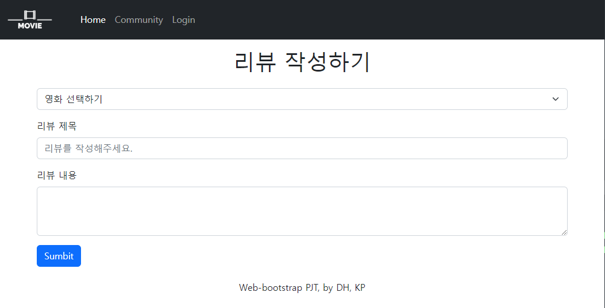
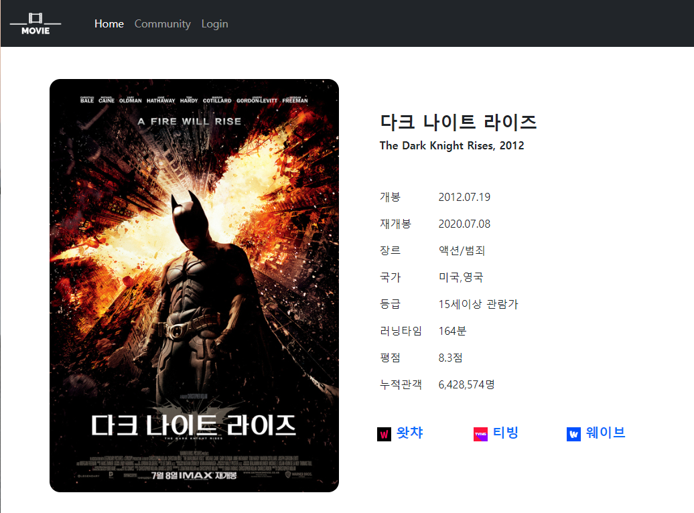
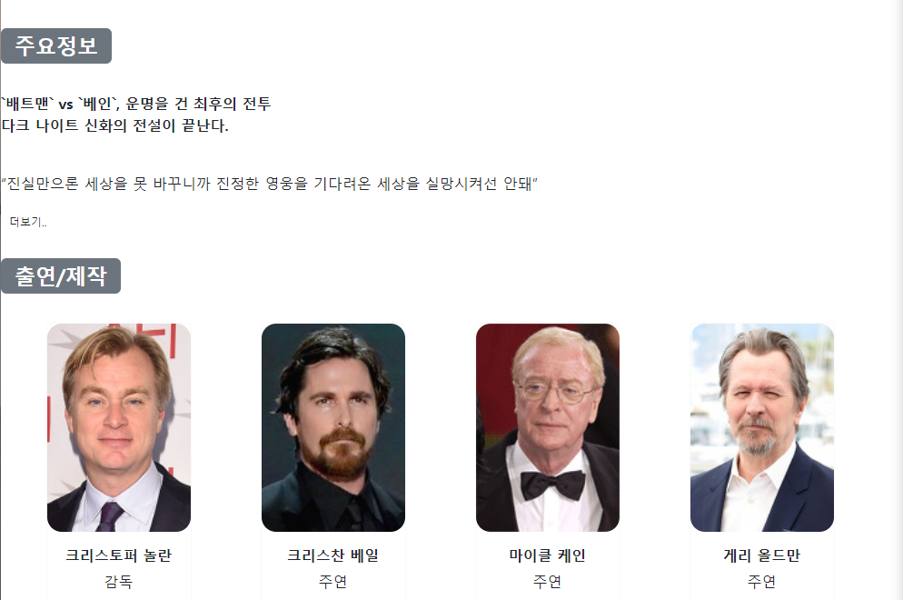

## 2022년 9월 14일(수)

> Web-Project03! 협업 프로젝트- 부트스트랩


**수호아빠의 한줄평: 진짜 최선을 다했지만.. 결과물이 엄청 마음에 들지는 않는다..ㅠㅠ**


`수호아빠의 코드 01`

```html
<!doctype html>
<html lang="en">
  <head>
    <meta charset="utf-8">
    <meta name="viewport" content="width=device-width, initial-scale=1">
    <title>form</title>
    <link href="https://cdn.jsdelivr.net/npm/bootstrap@5.2.1/dist/css/bootstrap.min.css" rel="stylesheet" integrity="sha384-iYQeCzEYFbKjA/T2uDLTpkwGzCiq6soy8tYaI1GyVh/UjpbCx/TYkiZhlZB6+fzT" crossorigin="anonymous">
  </head>
  <body>
    <script src="https://cdn.jsdelivr.net/npm/bootstrap@5.2.1/dist/js/bootstrap.bundle.min.js" integrity="sha384-u1OknCvxWvY5kfmNBILK2hRnQC3Pr17a+RTT6rIHI7NnikvbZlHgTPOOmMi466C8" crossorigin="anonymous"></script>
    <script src="https://code.jquery.com/jquery-3.2.1.slim.min.js"></script>
    <script src="https://cdnjs.cloudflare.com/ajax/libs/popper.js/1.11.0/umd/popper.min.js"></script>
    <script src="https://maxcdn.bootstrapcdn.com/bootstrap/4.0.0-beta/js/bootstrap.min.js"></script>

    <!-- 네브바 -->
    <nav class="navbar navbar-expand-lg navbar-dark text-bg-dark p-0 p-lg-0">
        <div class="container-fluid">
          <a class="navbar-brand" href="./index.html">
            
          </a>
          <button class="navbar-toggler" type="button" data-bs-toggle="collapse" 
          data-bs-target="#navbarSupportedContent" aria-controls="navbarSupportedContent" 
          aria-expanded="false" aria-label="Toggle navigation">
              <span class="navbar-toggler-icon"></span>
          </button>
          </button>
          <div class="collapse navbar-collapse" id="navbarSupportedContent">
            <ul class="navbar-nav me-auto mb-2 mb-lg-0 ms-lg-4">
                <li class="nav-item">
                    <a class="nav-link active" href="./index.html">Home</a>
                </li>
                <li class="nav-item">
                    <a class="nav-link" href="./03_community.html">Community</a>
                </li>
                <li class="nav-item">
                    <a class="nav-link" data-toggle="modal" href="#myModal">Login</a>
                </li>  
            </ul>  
        </div>
    </nav>
    <div class="modal hide" id="myModal">

        <div class="modal-dialog">
            <div class="modal-content">
              <div class="modal-header">
                <h5 class="modal-title">Modal title</h5>
                <button type="button" class="btn-close" data-dismiss="modal" aria-label="Close"></button>
              </div>
              <div class="modal-body">
                <form action="">
                    <div class="input-group">
                        <label for="username">Email address</label>
                    </div>
                    <input class="w-100" type="text" name="username" id="username" autofocus>
                    <p class="small text-black-50">We'll never share your email with anyone else.</p>
                    <div class="input-group">
                        <label for="name">password</label>
                    </div>
                    <input class="w-100" type="password" name="password">
                    <div class="form-check pt-3 pb-0">
                        <input class="form-check-input" type="checkbox" value="" id="flexCheckDefault">
                        <label class="form-check-label px-0" for="flexCheckDefault">
                          Check me out
                        </label>
                    </div>
                </form>

              </div>
              <div class="modal-footer">
                <button type="button" class="btn btn-secondary" data-dismiss="modal">Close</button>
                <button type="button" class="btn btn-primary">Submit</button>
              </div>
            </div>
          </div>
    </div>

    <!-- 섹션 -->
    <section class="px-5">

      <h1 class="text-center py-3">리뷰 작성하기</h1>

      <div class="px-3">
        <select class="form-select mb-3" aria-label="Default select example">
          <option selected>영화 선택하기</option>
          <option value="1">쇼생크 탈출</option>
          <option value="2">죽은 시인의 사회</option>
          <option value="3">다크나이트 라이즈</option>
          <option value="4">그랜드 부다페스트 호텔</option>
          <option value="5">her</option>
          <option value="6">위대한 소맨</option>
        </select>
```



`수호아빠의 코드 02`

```html
<!DOCTYPE html>
<html lang="en">
<head>
    <meta charset="UTF-8">
    <meta http-equiv="X-UA-Compatible" content="IE=edge">
    <meta name="viewport" content="width=device-width, initial-scale=1.0">
    <meta name="description" content="">
    <meta name="author" content="">
    <title>다크나이트</title>
    <link href="https://cdn.jsdelivr.net/npm/bootstrap@5.2.0/dist/css/bootstrap.min.css" rel="stylesheet"
    integrity="sha384-gH2yIJqKdNHPEq0n4Mqa/HGKIhSkIHeL5AyhkYV8i59U5AR6csBvApHHNl/vI1Bx" crossorigin="anonymous">
    <link rel="stylesheet" href="https://cdn.jsdelivr.net/npm/bootstrap-icons@1.7.1/font/bootstrap-icons.css">
    
</head>

<body>
    <script src="https://cdn.jsdelivr.net/npm/bootstrap@5.2.1/dist/js/bootstrap.bundle.min.js" integrity="sha384-u1OknCvxWvY5kfmNBILK2hRnQC3Pr17a+RTT6rIHI7NnikvbZlHgTPOOmMi466C8" crossorigin="anonymous"></script>
    <script src="https://code.jquery.com/jquery-3.2.1.slim.min.js"></script>
    <script src="https://cdnjs.cloudflare.com/ajax/libs/popper.js/1.11.0/umd/popper.min.js"></script>
    <script src="https://maxcdn.bootstrapcdn.com/bootstrap/4.0.0-beta/js/bootstrap.min.js"></script>
    <nav class="navbar navbar-expand-lg navbar-dark text-bg-dark p-0 p-lg-0">
        <div class="container-fluid">
          <a class="navbar-brand" href="#!">
            
          </a>
          <button class="navbar-toggler" type="button" data-bs-toggle="collapse" 
          data-bs-target="#navbarSupportedContent" aria-controls="navbarSupportedContent" 
          aria-expanded="false" aria-label="Toggle navigation">
              <span class="navbar-toggler-icon"></span>
          </button>
          </button>
          <div class="collapse navbar-collapse" id="navbarSupportedContent">
            <ul class="navbar-nav me-auto mb-2 mb-lg-0 ms-lg-4">
                <li class="nav-item">
                    <a class="nav-link active" href="./index.html">Home</a>
                </li>
                <li class="nav-item">
                    <a class="nav-link" href="./03_community.html">Community</a>
                </li>
                <li class="nav-item">
                    <a class="nav-link" data-toggle="modal" href="#myModal">Login</a>
                </li>  
            </ul>  
        </div>
    </nav>
    <div class="modal hide" id="myModal">

        <div class="modal-dialog">
            <div class="modal-content">
              <div class="modal-header">
                <h5 class="modal-title">Modal title</h5>
                <button type="button" class="btn-close" data-dismiss="modal" aria-label="Close"></button>
              </div>
              <div class="modal-body">
                <form action="">
                    <div class="input-group">
                        <label for="username">Email address</label>
                    </div>
                    <input class="w-100" type="text" name="username" id="username" autofocus>
                    <p class="small text-black-50">We'll never share your email with anyone else.</p>
                    <div class="input-group">
                        <label for="name">password</label>
                    </div>
                    <input class="w-100" type="password" name="password">
                    <div class="form-check pt-3 pb-0">
                        <input class="form-check-input" type="checkbox" value="" id="flexCheckDefault">
                        <label class="form-check-label px-0" for="flexCheckDefault">
                          Check me out
                        </label>
                    </div>
                </form>

              </div>
              <div class="modal-footer">
                <button type="button" class="btn btn-secondary" data-dismiss="modal">Close</button>
                <button type="button" class="btn btn-primary">Submit</button>
              </div>
            </div>
          </div>
    </div>
    <!-- 영화 간략소개 -->
    <section class="py-5 d-flex justify-content-center">
      <div class="row row-cols-1 row-cols-md-2">
        <div>
          
        </div>

      <div class="col p-4">

          <div class="p-4">
            <h3 class="fw-bold"> 다크 나이트 라이즈</h3>
            <h6 class="fw-bold"> The Dark Knight Rises, 2012</h6>
          </div>

          <div class="p-4 d-flex">
            <div>
              <p>개봉</p>
              <p>재개봉</p>
              <p>장르</p>
              <p>국가</p>
              <p>등급</p>
              <p>러닝타임</p>
              <p>평점</p>
              <p>누적관객</p>
            </div>
            <div class="px-4">
              <p>2012.07.19</p>
              <p>2020.07.08</p>
              <p>액션/범죄</p>
              <p>미국,영국</p>
              <p>15세이상 관람가</p>
              <p>164분</p>
              <p>8.3점</p>
              <p>6,428,574명</p>
            </div>
          </div>
          <div class="d-flex justify-content-between w-auto">
            <a href="https://watcha.com/contents/mW4rmed?utm_campaign=metadata&utm_source=kakao&utm_medium=movie">
              <button type="button" class="btn btn-outline-primary border-white fw-bold" style="--bs-btn-padding-y: .25rem; --bs-btn-padding-x: 1.25rem; --bs-btn-font-size: 1.25rem;">&nbsp왓챠</button>
            </a>
            <a href="https://www.tving.com/movie/player/M000363549?utm_source=Daum&utm_medium=Organic&utm_campaign=SERP">
              <button type="button" class="btn btn-outline-primary border-white fw-bold" style="--bs-btn-padding-y: .25rem; --bs-btn-padding-x: 1.25rem; --bs-btn-font-size: 1.25rem;">&nbsp티빙</button>
            </a>
            <a href="https://www.wavve.com/player/movie?movieid=MV_CD01_WR0000011176">
              <button type="button" class="btn btn-outline-primary border-white fw-bold" style="--bs-btn-padding-y: .25rem; --bs-btn-padding-x: 1rem; --bs-btn-font-size: 1.25rem;">&nbsp웨이브</button>
            </a>
          </div>
        </div>

    </section>

    <!-- 영화 소개-->
    <div>
      <div>
        <h2><span class="badge bg-secondary">주요정보</span></h2>
        &nbsp;
        <p class="fw-bold">
          `배트맨` vs `베인`, 운명을 건 최후의 전투<br>
          다크 나이트 신화의 전설이 끝난다.</p>
        &nbsp;
        <p>“진실만으론 세상을 못 바꾸니까 진정한 영웅을 기다려온 세상을 실망시켜선 안돼”</p>
        <button class="btn btn-outline-dark border-white" data-toggle="collapse" data-target="#demo" style="--bs-btn-padding-y: .25rem; --bs-btn-padding-x: .5rem; --bs-btn-font-size: .75rem;">더보기..</button>
        
        <div id="demo" class="collapse">
          <div class="p-3">
          배트맨이 조커와의 대결을 끝으로 세상에서 모습을 감춘 8년 후..<br>
          하비 덴트의 죽음에 대한 책임을 떠안은 배트맨은 그와 고든 경찰청장이 희망했던 보다 큰 선을 위해 모든 것을 희생했다.<br>
          한편 고담시의 범죄는 범죄방지 덴트법으로 인해 한동안 억제되는 듯했다.<br>
          하지만 평화가 지속되던 고담시의 파멸을 예고하며 등장한 마스크를 쓴 잔인한 악당 베인으로 인해 모든 것이 변한다.<br>
          그는 브루스 웨인이 스스로 택한 유폐 생활에 종지부를 찍게 한다.<br>
          하지만 다시 돌아온 배트맨에게 베인은 그리 만만한 상대가 아니다.<br>
          자신을 거부한 사람들의 고통을 지켜볼 것인가, 정의의 수호자로 나설 것인가.<br>
          배트맨은 승패를 알 수 없는 마지막 전투를 시작하려 하는데…
          </div>
        </div>

      </div>
      &nbsp;
      <div>
        <h2><span class="badge bg-secondary">출연/제작</span></h2>
        &nbsp;
        <div class="container text-center">
          <div class="row row-cols-1 row-cols-2 row-cols-md-4 row-cols-lg-4 row-cols-xl-6 g-2">
            <div class="col">
              <div class="card border-light" style="width: 10rem;">
                
                <div class="card-body">
                  <h5 class="fs-6 fw-bold card-title">크리스토퍼 놀란</h5>
                  <p class="fs-6 card-text">감독</p>
                </div>
              </div>
            </div>
            <div class="col">
              <div class="card border-light" style="width: 10rem;">
                
                <div class="card-body">
                  <h5 class="fs-6 fw-bold card-title">크리스찬 베일</h5>
                  <p class="fs-6 card-text">주연</p>
                </div>
              </div>
            </div>
            <div class="col">
              <div class="card border-light" style="width: 10rem;">
                
                <div class="card-body">
                  <h5 class="fs-6 fw-bold card-title">마이클 케인</h5>
                  <p class="fs-6 card-text">주연</p>
                </div>
              </div>
            </div>
            <div class="col">
              <div class="card border-light" style="width: 10rem;">
                
                <div class="card-body">
                  <h5 class="fs-6 fw-bold card-title">게리 올드만</h5>
                  <p class="fs-6 card-text">주연</p>
                </div>
              </div>
            </div>
            <div class="col">
              <div class="card border-light" style="width: 10rem;">
                
                <div class="card-body">
                  <h5 class="fs-6 fw-bold card-title">앤 해서웨이</h5>
                  <p class="fs-6 card-text">주연</p>
                </div>
              </div>
            </div>
            <div class="col">
              <div class="card border-light" style="width: 10rem;">
                
                <div class="card-body">
                  <h5 class="fs-6 fw-bold card-title">톰 하디</h5>
                  <p class="fs-6 card-text">주연</p>
                </div>
              </div>
            </div>

          </div>

        </div>
      </div>
      <div>      
        <h2><span class="badge bg-secondary">예고편</span></h2>
        <div class="text-center">
          <iframe width="560" height="315" src="https://www.youtube.com/embed/TjJCLEwW474" title="YouTube video player" frameborder="0" allow="accelerometer; autoplay; clipboard-write; encrypted-media; gyroscope; picture-in-picture" allowfullscreen></iframe>
        </div>

      </div>

    </section>

    <!-- 푸터 -->
    <footer class="text-center py-2 ">
        <div class="container sticky-bottom">
            <p>Web-bootstrap PJT, by DH, KP</p>
        </div>
    </footer>
</body>
</html>
```






