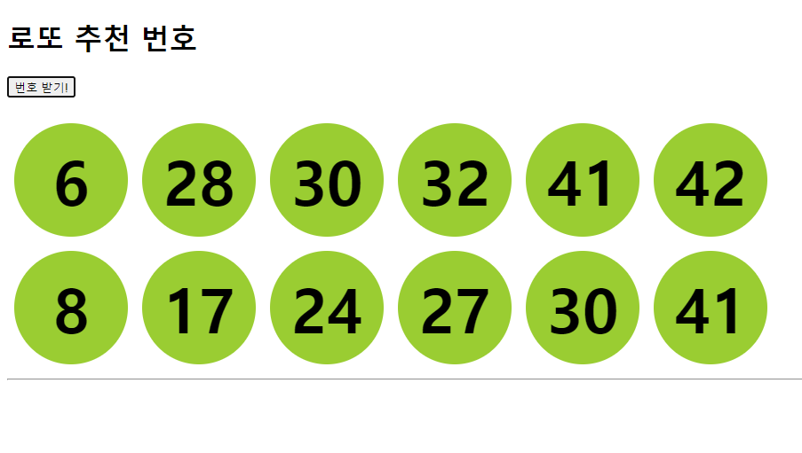

## 2022년 9월 20일(화)

> Web-JavaScript04! 로또번호 추천하는 웹 만들기 


**수호아빠의 한줄평: 자바스크립트는 감이 안온다.. **

`오늘의 완성작`



`오늘의 코드`

```html
<!DOCTYPE html>
<html lang="en">
<head>
  <meta charset="UTF-8">
  <meta http-equiv="X-UA-Compatible" content="IE=edge">
  <meta name="viewport" content="width=device-width, initial-scale=1.0">
  <title>Document</title>
  <style>
    .ball {
      display: inline-block;
      width: 8rem;
      height: 8rem;
      margin: 0.5rem;
      background-color: yellowgreen;
      border-radius: 50%;
      line-height: 8rem;
      text-align: center;

      font-size: 70px;
      font-weight: bold;
    }
    .ball-container {
      display: flex;
    }
  </style>
</head>
<body>

  <h1>로또 추천 번호</h1>
  <button id="btn"> 번호 받기!</button><br><br>
  <div id="result"></div>
  <hr>


  <script src="https://cdn.jsdelivr.net/npm/lodash@4.17.21/lodash.min.js"></script>
  <script>
    const button = document.querySelector('#btn')
    button.addEventListener('click', function(){

      console.log('번호6개')

      const numbers = _.sampleSize(_.range(1, 46), 6)
      console.log(numbers)
      numbers.sort(function(a, b){
        return a - b;
      })

      const ballContainer = document.createElement('div')
      ballContainer.classList.add('ball-container')

      const ball = document.createElement('div')
      ball.classList.add('ball')
      ball.classList.add('ball')
      ball.innerText = numbers[0]

      const ball2 = document.createElement('div')
      ball2.classList.add('ball')
      ball2.classList.add('ball')
      ball2.innerText = numbers[1]

      const ball3 = document.createElement('div')
      ball3.classList.add('ball')
      ball3.classList.add('ball')
      ball3.innerText = numbers[2]

      const ball4 = document.createElement('div')
      ball4.classList.add('ball')
      ball4.classList.add('ball')
      ball4.innerText = numbers[3]

      const ball5 = document.createElement('div')
      ball5.classList.add('ball')
      ball5.classList.add('ball')
      ball5.innerText = numbers[4]

      const ball6 = document.createElement('div')
      ball6.classList.add('ball')
      ball6.classList.add('ball')
      ball6.innerText = numbers[5]
      
      ballContainer.appendChild(ball)
      ballContainer.appendChild(ball2)
      ballContainer.appendChild(ball3)
      ballContainer.appendChild(ball4)
      ballContainer.appendChild(ball5)
      ballContainer.appendChild(ball6)

      const result = document.querySelector('#result')
      result.appendChild(ballContainer)
    
    })


  </script>

</body>
</html>
```

### 로또번호 추천해주는 웹을 만들며 배운점

1. Lodash 이용

   ```html 
   <body>
       <script src="https://cdn.jsdelivr.net/npm/lodash@4.17.21/lodash.min.js">
       // 헤더 부분이 아닌 바디의 아랫부분에 입력
   	</script>
       <script>
           
        	 const numbers = _.sampleSize(_.range(1, 46), 6)
            // 1~45까지 숫자중 6개를 임의로 선택
   
            numbers.sort(function(a, b){
            return a - b;
       	  })
            // 뽑힌 6개의 숫자를 오름차순으로 정렬        
       </script>
       
   </body>
   ```

2. createElement

   - 태그를 생성

3. appendChild

   - 태그 하위로 넣기


