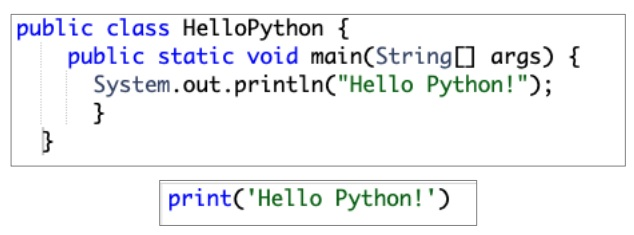
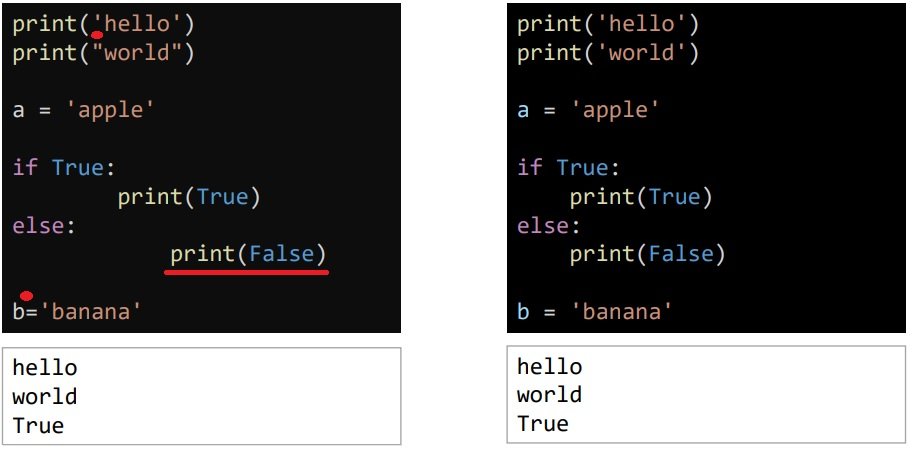
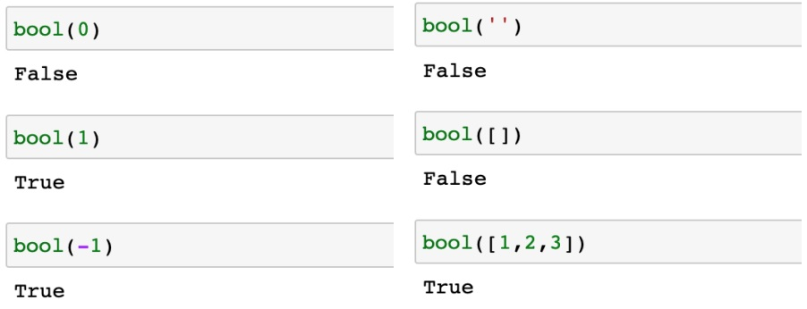
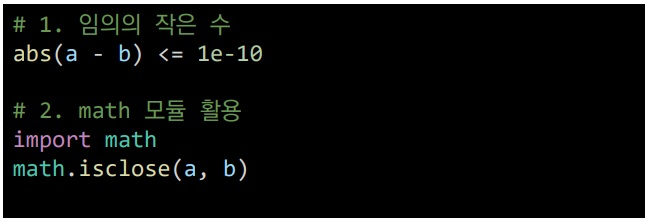
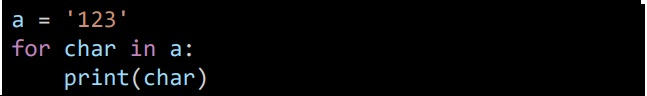
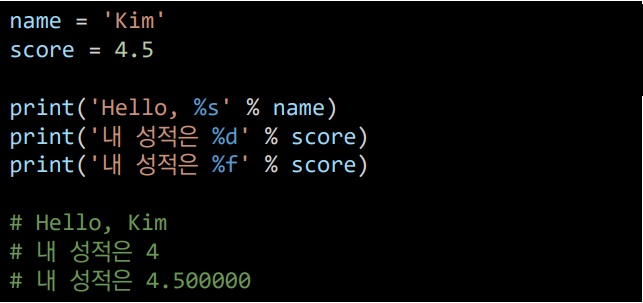
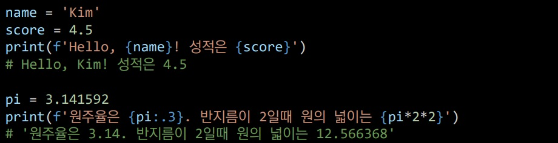

## 2022년 7월 11일(월)

> 드디어..!! 처음으로 파이썬을 알아보자!!


#### 1. 컴퓨터 프로그래밍 언어

- 컴퓨터에게 명령하기 위한 약속


#### 2. 파이썬?

- 문법이 간단

- 표현이 간결하여 짧은시간 내 마스터 가능

- C나 JAVA와 비교시 더 간결하게 작성 가능

  

- 윈도우, macOS, 리눅스, 유닉스등 운영체제 실행가능

- 인터프리터언어

  > 기계어로 변환하는 작업없이 바로 실행가능하며, 코드로 대화를 하듯 한줄 입력하고 바로 결과를 확인할 수 있음

- 객체 지향 프로그래임

  > 모든 것이 객체(숫자,문자,클래스 등의 값)로 구현되어 있음


#### 3. 파이썬 기초문법

- 코드스타일 가이드

  - 파이썬에서 제안하는 스타일 가이드

    > PEP8 ([PEP 8 – Style Guide for Python Code | peps.python.org](https://peps.python.org/pep-0008/))

  - 기업, 오픈소스 등에서 사용되는 스타일가이드

    > Google ([styleguide | Style guides for Google-originated open-source projects](https://google.github.io/styleguide/pyguide.html))

  - 문장을 구분할 때, 들여쓰기 사용

  - 들여쓰기는 스페이스키 4번 or 탭 1번을 입력

    

- 변수 연산

  ```python
  i = 5
  j = 3
  
  #1
  i + j
  #2
  i - j
  #3
  j = -2
  i * j
  
  #1 = 8
  #2 = 2
  #3 = -10
  ```

  ```python
  s = '파이썬'
  
  #1
  '안녕' + s
  #2
  s * 3
  #3
  s = 'python'
  s + ' is fun'
  
  #1 = '안녕파이썬'
  #2 = '파이썬파이썬파이썬'
  #3 = 'python is fun'
  ```

- 변수 할당

  - 같은 값을 동시에 할당 할 수 있음

    ```python
    x = y = 1004
    print(x,y)
    ```

  - 다른 값을 동시에 할당 할 수 있음

    ```python
    x, y = 1, 2
    print(x, y)
    ```

  - x = 10, y = 20 일 때, 값을 바꿔서 생성하는 코드는

    ```python
    #1
    y, x = x, y
    print(x,y)
    
    #2
    tmp = x
    x = y
    y = tmp
    print(x, y)
    ```

- 식별자

  - 파이썬 객체를 식별하는데 사용하는 이름

    - 영문 알파벳, 언더스코어(_), 숫자로 구성

    - 첫 글자 숫자 x

    - 길이제한 x

    - 대소문자 구별됨

    - 내장함수 모듈 이름 x

    - 아래 예약어 x

    

  - 주석 (# blah blah)
  
    - 코드에 대한 중요한 내용 표시
    - 컴퓨터는 주석을 인식하지 않음
    - 코드의 분석 및 수정에 용이
    - 코드 쉬운 이해에 도움
    - 속도를 느리게하거나 용량을 늘리지 않음


#### 4. 자료형 분류

- 불린형 (boolean Type)

  - True / False 값을 가진 타입

  - 비교 / 논리 연산을 수행함에 있어 활용

  - 0, 0.0, (), [], {}, ", None은 모두 False 변환

  - bool() 함수

    - 특정 데이터가 true인지 false인지 검증 

      

  - 논리 연산자

    - 논리식을 판단하여 참(Ture)와 거짓(False)를 반환함
      - A and B : A와 B 모두 True시, True (그 외 모두 false)
      - A or B : A와 B 모두 False시, False (그 외 모두 True)
      - Not : Ture를 False로, False를 True 로

- 수치형 (Numeric Type)

  - int (정수, integer)

    - 모든 정수의 타입은 int
    - 오버플로우가 발생하지 않음

  - float (부동소수점, 실수, floating point number)

    - 정수가 아닌 모든 실수는 float

    - 부동소수점

      > 실수를 컴퓨터가 표현하는 방법, 이 과정서 에러가 발생하여, 예상치 못한 결과가 발생

    - 값 비교하는 과정에서 정수가 아닌 실수인 경우 주의할 것

      > 3.14 - 3.02 = 0.1200000000001

    - 매우 작은 수보다 작은지를 확인하거나 math 모듈 활용

      

  - complex (복소수, complex number)

    - 실수부와 허수부로 구성된 복소수

    - 허수부를 j로 표현

      ```python
      a = 3+4j
      # <class 'complex'>
      a.real
      # 3.0
      a.imag
      # 4.0
      ```

  - 수치형 연산자

    | 연산자 |   내용   |
    | :----: | :------: |
    |   +    |   덧셈   |
    |   -    |   뺄셈   |
    |   *    |   곱셈   |
    |   %    |  나머지  |
    |   /    |  나눗셈  |
    |   //   |    몫    |
    |   **   | 거듭제곱 |

  - 복합 연산자 (연산과 할당이 함께 이뤄짐)

    | 연산자  |    내용    |
    | :-----: | :--------: |
    | a += b  | a = a + b  |
    | a -= b  | a = a - b  |
    |  a *=b  | a = a * b  |
    | a /= b  | a = a / b  |
    | a //= b | a = a // b |
    | a %= b  | a = a % b  |
    | a **= b | a = a ** b |

  - 비교 연산자 (값을 비교하며, True / False 값을 리턴)

    | 연산자 |            내용             |
    | :----: | :-------------------------: |
    |   <    |            미만             |
    |   <=   |            이하             |
    |   >    |            초과             |
    |   >=   |            이상             |
    |   ==   |            같음             |
    |   !=   |          같지않음           |
    |   is   |    객체 아이덴티티 (OOP)    |
    | is not | 객체 아이덴티티가 아닌 경우 |

- 문자열 (String Type)

  - 모든 문자는 str 타입

  - 문자열은 작은 따옴표('')나 큰 따옴표("")를 활용하여 표기

  - Immutable : 변경 불가능함

    

  - Iterable : 반복 가능함

    

  - 중첩따옴표

    - 작은 따옴표를 써야 할 경우 큰 따옴표로 문자열 생성
    - 큰 따옴표를 써야 할 경우 작은 따옴표로 문자열 생성

  - 삼중따옴표

    - 따옴표 안에 따옴표 넣을 때
    - 여러줄을 나눠 입력할 때

  - 문자열 연산자

    - 인덱싱

      ```python
      s[1]
      #컴퓨터는 0이 첫번재이다. 즉, s[1]은 순서상 두번째 위치에 있는 문자가 출력됨
      ```

    - 슬라이싱

      ```python
      s[2:5]
      # 세번째 이상 여섯번째 미만 출력
      s[2:5:2]
      # 세번째 이상 여섯번째 미만중 2단계씩 출력
      s[5:2-1]
      # 여섯번째 이하 두번째 초과 출력
      s[:3]
      # 처음부터 네번째 미만
      s[5:]
      # 6번째 이상부터 끝까지
      s[::]
      # 처음부터 끝까지
      # s[0:len(s):1]과 동일
      s[::-1]
      # 끝부터 처음까지
      # s[-1:-(len(s)+1:-1]과 동일
      ```

    - 결합

      ```python
      'hello, ' + 'python!'
      # 'hello, python!'
      ```

    - 반복

      ```python
      'hi' * 3
      # 'hi!hi!hi!'
      ```

    - 포함

      ```python
      'a' in 'apple'
      # Ture
      'app' in 'apple'
      # Ture
      'b' in 'apple'
      # False
      ```

  - 문자열 활용

    - Escape sequence (역슬래시 (\)를 활용하여 구분)

    | 예약문자 | 내용(의미) |
    | :------: | :--------: |
    |    \n    |  줄 바꿈   |
    |    \t    |     탭     |
    |    \r    | 캐리지리턴 |
    |    \0    |  널(null)  |
    |    \\    |     \      |
    |   \\`    |     '      |
    |   \\``   |     ''     |

    - String Interpolation (문자열을 변수를 활용하여 만드는 법)

      - %-formatiing

      

      - f-string

      

- None

  > 값이 없음을 표현, 일반적으로 반환 값이 없는 함수에서 사용


#### 5. 컨테이너

- 시퀀스형 컨테이너 (Sequence Container)
  - 문자열 immutable : 문자들의 나열
  - 리스트(List)
    - 변경 가능한 값들의 나열된 자료형
    - 순서를 가지며, 서로 다른 타입의 요소를 가질 수 있음
    - 항상 대괄호 형태로 정의하며, 요소는 콤마로 구분 [0, 1, 2, 3, 4, 5]
    - 변경 가능하며(mutable), 반복 가능함(iterable)
  - 튜플(Tuple)
    - 불변한 값들의 나열
    - 순서를 가지며, 서로 다른 타입의 요소를 가질 수 있음
    - 항상 소괄호 형태로 정의하며, 요소는 콤마로 구분 (0, 1, 3)
    - 변경 불가능하며(immutable), 반복 가능함(iterable)
  - 레인지 (Range)
    - 숫자의 시퀀스를 나타내기 위해 사용
      - 기본형 range(n) : 0부터 n-1까지의 숫자의 시퀀스
      - 범위 지정 range(n, m) : n부터 m-1까지의 숫자의 시퀀스
      - 범위 및 스텝 지정 range(n, m, s) : n부터 m-1까지 s만큼 증가시키며 숫자의 시퀀스
    - 변경 불가능하며(immutable), 반복 가능함(iterable)
- 비시퀀스형 컨테이너
  - 세트 (Set)
    - 유일한 값들의 모음(collection)
    - 순서가 없고 중복된 값이 없음. (수학에서의 집합과 동일한 구조를 가지며, 집합연산도 가능)
    - 변경 가능하며 (mutalble), 반복 가능함 (iterable)
    - 단, 셋은 순서가 없어 반복의 결과가 정의한 순서와 다를 수 있음.
  - 딕셔너리 (Dictionary)
    - 키-값(key-value) 쌍으로 이뤄진 모음(collection)
    - 키(key): 불변 자료형만 가능 (리스트, 딕셔너리 등은 불가능함)
    - 값(values): 어떠한 형태든 관계 없음
    - 키와 값은 :로 구분 됩니다. 개별 요소는 ,로 구분됩니다.
    - 변경 가능하며(mutable), 반복 가능함(iterable)
    - 딕셔너리는 반복하면 키가 반환됩니다.


