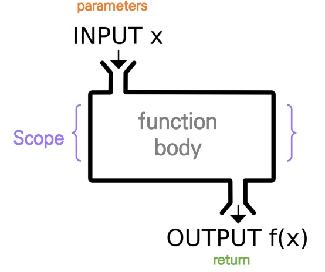

## 2022년 7월 13일(수)

> 파이썬! 함수와 함수응용!


#### 1. 함수기초


- 함수

  - 특정한 기능을 하는 코드의 조각(묶음)
  - 특정 명령을 수행하는 코드를 매번 다시 작성하지 않고, 필요 시에만 호출하여 간편히 사용

- 사용자 함수 (Custom Funtion)

  - 구현되어 있는 함수가 없는 경우, 사용자가 직접 함수를 작성가능

  ```python
  def function_name
  	# code block
      return returning_value
  ```

- 함수를 사용해야 하는 이유
  - 기능 분해, 재사용 가능
  - 기능 집중 가능: 재사용성,가독성, 생산성

- 함수 기본 구조

  - 선언과 호출(define & call)
  - 입력(Input)
  - 범위(Scope)
  - 결과값(Output)

  

- 선언과 호출

  - 함수의 선언은 def 키워드를 활용함
  - 들여쓰기를 통해 function body(실행될 코드 블록)를 작성함
    - Docstring은 함수 Body 앞에 선택적으로 작성 가능
    - 작성시에는 반드시 첫 번째 문장에 문자열 ""
  - 함수는 Parameter를 넘겨줄 수 있음
  - 함수는 동작 후에 return을 통해 결과값을 전달함
  - 함수는 함수명()으로 호출
    - parameter가 있는 경우, 함수명(값1, 값2, ---)로 호출

  ```python
  def foo():				# foo()
      return True	
  
  def add(x, y):			# add(2, 3)
      return x + y
  ```

  ```python
  num1 = 0
  num2 = 1
  
  def func1(a, b):
      return a + b
  
  def func2(a, b):
      return a - b
  
  def func3(a, b):
      return func1(a, 5) + func2(5, b)
  
  result = func3(num1, num2)
  print(result)
  
  # 답은 9
  ```

  

#### 2. 함수의 결과값 (Output)


- return

  - 함수는 반드시 값을 하나만 return한다.
  - 명시적인 return이 없는 경우에는 None을 반환한다.
  - 함수는 return과 동시에 실행이 종료된다.

  ```python
  def minus_and_product(x, y):
      return x - y
  	return x * y
  
  minus_andproduct(4, 5)
  
  # 결과값은 답 -1 한개만 나온다
  # 두번째 return은 나오지 않음.
  ```

  - 튜플 반환

  ```python
  def minus_and_product(x, y):
      return x - y, x * y
  
  minus_and_product(4, 5)
  
  # (-1, 20)
  ```

- return vs print

  - return은 함수 안에서 값을 반환하기 위해서 사용되는 키워드
  - print는 출력을 위해 사용되는 함수

#### 3. 함수의 입력 (Input)


- parameter vs argument

  - parameter : 함수를 실행할 때, 함수 내부에서 사용되는 식별자
  - argument : 함수를 호출 할 때, 넣어주는 값

  ```python
  def function(ham):	# parameter : ham
      return ham
  
  funtion('spam')		# argument : 'spam'
  ```

- argument 란?

  - 함수 호출 시 함수의 parameter를 통해 전달 되는 값
  - argument는 소괄호 안에 할당 func_name(argument)
  - 필수 argument : 반드시 전달되어야 하는 argument
  - 선택 argument : 값을 전달하지 않아도 되는 경우는 기본 값이 전달

- positional arguments

  - 기본적으로 함수 호출 시 argument는 위치에 따라 함수 내에 전달됨

  ```python
  def add (x, y):		# add(2, 3)
      return x + y	# 기본적으로 앞에있는 2가 x로, 3이 y로 전달
  ```

- keyword arguments

  - 직접 변수의 이름으로 특정 argument를 전달할 수 있음
  - keyword argument 다음에 positional argument를 활용할 수 없음

  ```python
  def add(x, y):		# add(x=2, y=5)
      return x + y	# add(2, y=5)
  					# add(x=2, 5) -> (x) keyword argument 다음에 positional argument 활용 x
  ```

- default arguments values

  - 기본값을 지정하여 함수 호출 시 argument 값을 설정하지 않도록 함
  - 정의된 것 보다 더 적은 개수의 argument들로 호출 될 수 있음

  ```python
  def add(x, y=0):	# add(2) -> add(2, y=0)
      return x + y	# add(2, 1) -> add(2, 1)
  ```

- 정해지지 않은 개수의 arguments

  - 여러 개의 positional argument를 하나의 필수 parameter로 받아서 사용
    - 몇개의 positinal argument를 받을지 모르는 함수를 정의할 때 유용
  - argument들은 튜플로 묶여 처리되며, parameter에 *를 붙여 표현

  ```python
  def add(*args):			# add(2)
      for arg in args:	# add(2, 3, 4, 5)
          print(arg)		# 여러개 묶여서 튜플로 전달됨
  ```

- 정해지지 않는 개수의 keyword arguments

  - 함수가 임의의 개수 argument를 keyword argument로 호출될 수 있도록 지정
  - argument들은 딕셔너리로 묶여 처리되며, parameter에 **를 붙여 표현

  ```python
  def family(**kwargs):
      for key, value in kwargs:
          print(key, ':', value)
          
  family(father='john', mother='jane', me='john Jr.')
  
  # {'father': 'john', 'mother': 'jane', 'me': 'john Jr.'}
  ```

  

#### 4. 함수의 범위


- 함수의 scope

  - 함수는 코드 내부에 local scope를 생성하며, 그 외의 공간인 global scope로 구분
  - scope
    - global scope : 코드 어디에서든 참조할 수 있는 공간
    - local scope : 함수가 만든 scope. 함수 내부에서만 참조 가능
  - variable
    - global variable : global scope에 정의된 변수
    - local scope : local scope에 정의된 변수

- 객체 수명주기

  - 객체는 각자의 수명주기(life cycle)가 존재
    - built-in scope
      -  파이썬이 실행된 이후부터 영원히 유지
    - global scope
      - 모듈이 호출된 시점 이후 혹은 인터프리터가 끝날 때까지 유지
    - local scope
      - 함수가 호출될 때 생성되고, 함수가 종료될 때까지 유지

  ```python
  def func():
      a = 20
      print('local', a)		# local 20
      
  func()						# NameError: name 'a' is not defined
  print('global', a)			# a는 Local scope에서만 존재
  ```

- 이름 검색 규칙(Name Resolution)

  - 파이썬에서 사용되는 이름(식별자)들은 이름공간(namespace)에 저장되어 있음
  - 아래와 같은 순서로 이름을 찾아나가며, LEGB Rule이라고 부름
    - Local scope : 함수
    - Enclosed scope : 특정 함수의 상위 함수
    - Global scope : 함수 밖의 변수, Import 모듈
    - Built-in scope : 파이썬 안에 내장되어 있는 함수 또는 속성

- 즉, 함수 내에서는 바깥 Scope의 변수에 접근 가능하나 수정은 할 수 없음

```python
print(sum)				# <built-in function sum>
print(sum(range(2)))	# 1

sum = 5					# global scope에서 sum은 5로 만들어버림
print(sum)				# 5 -> 바로 윗줄에서 
print(sum(range2))		# TypeError:'int' object is not callable
```


#### 5. 함수 응용


- 파이썬 인터프리터에는 사용할 수 있는 많은 함수와 형(type)이 내장되어 있음

- map (function, iterable)
  - 순회가능한 데이터구조(iterable)의 모든 요소에 함수(function)적용하고, 그 결과를 map object로 반환

```python
numbers = [1, 2, 3]
result = map(str, numbers)
print(result, type(result))	# <map object at 0x000001AF158103D0> <class 'map'>	로 내용이 저장됨

print(list(result))			# ['1', '2', '3']
```

- 알고리즘 문제 풀이시 input 값들을 숫자로 바로 활용하고 싶을 때

```python
n, m = map(int, input().split())	# 3, 5 입력!

print(n, m)							# 3 5
print(type(n), type(m))				# <class 'int'> <class 'int'>
```

