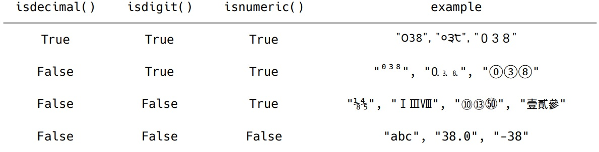

## 2022년 7월 14일(목)

> 파이썬! 데이터 구조! 메서드!?


### 메서드(methds) : 타입.메서드()


- 시퀀스
  - 문자열(string)
  - 리스트(List)
- 컬렉션
  - 세트(Set)
  - 딕셔너리(Dictionary)


### 시퀀스 (순서가 있는 데이터 구조)


#### 1. 문자열(String Type)

- 문자들의 나열(sequence of characters)
- 모든 문자는 str 타입
- 문자열은 작은 따옴표(')나 큰 따옴표(")를 활용하여 표기
- 문자열을 묶을 때 도일한 문장부호 활용
- PEP8에서는 소스코드 내에서 하나의 문장부호를 선택하여 유지하도록 함

```python
print('hello')			# hello

print(type('hello'))	# class 'str'

print('철수 "안녕"')	  # 철수 "안녕" 

print("철수 '안녕'")	  # 철수 '안녕'
```

- 문자열 탐색

```python
# .find(x) : x의 첫 번째 위치를 반환. 없으면, -1을 반환

print('apple'.find('p')) # 1

print('apple').find('k') # -1

# .index(x) : x의 첫번쨰 위치를 반환. 없으면, 오류 발생

print('apple'.index('p'))	# 1

'apple'.index('k')			# Error

# .isalpha() : 알파벳 문자 여부 (단순 알파벳이 아닌 유니코드상 Letter, 한국어도 포함)

print('abc'.isalpha())		# True

# .isupper() :  대문자 여부

print('Ab'.isupper())		# False

# .islower : 소문자 여부

print('ab'.islower())		# True

# .istitle() : 타이틀 형식 여부 (맨 앞자리가 대문자인지)

print('Title Title!'.istitle())	#True
```

- 문자열 관련 검증 메서드
  - .isdecimal() ⊆ 
  - .isdigit() ⊆ 
  - .isnumeric()



- 문자열 변경

```python
# .replace (old, new[,count]) : 바꿀 대상 글자를 새로운 글자로 바꿔서 반환. count 지정하면 해당 개수만큼 시행

print('coone'.replace('o', 'a'))	# caane

print('wooooowoo'.replace('o', '!', 2))	# w!!oooWoo

# .strip([chars]) : strip은 양쪽, lstrip은 왼쪽, rstip은 오른쪽, 문자열 지정 없으면 공백을 제거함

print('      와우!\n'.strip())		# '와우!'

print('      와우!\n'.lstrip())		# '와우!\n'

print('      와우!\n'.strip())		# '       와우!'

print('안녕하세요????'.rstrip('?'))	  # '안녕하세요'

# .split(sep=None, maxsplit=-1) : 문자열을 특정한 단위로 나눠 리스트로 반환
# sep이 None이거나 지정되지 않으면 연속된 공백문자를 단일한 공백문자로 간주, 선행/후행 공백은 빈 문자열에 포함시키지 않음.
# maxsplit이 -1인 경우에는 제한이 없음.

print('a,b,c'.split('_'))	# ['a,b,c']

print('a b c'.split())		# ['a', 'b', 'c']

# 'seperator'.join([iterable]) : 반복가능한(iterable) 컨테이너 요소들을 separator(구분자)로 합쳐 문자열 반환
# iterable에 문자열이 아닌 값이 있으면 TypeError 발생

print(''.join(['3', '5']))		# 35

# .title() : '나 공백 이후를 대문자로 변경
# .upper() : 모두 대문자로 변경
# .lower() : 모두 소문자로 변경
# .swapcase() : 대문자와 소문자를 서로 변경

a = 'hI! Everyone.'

print(a)					# hI! Everyone.

print(a.capitalzie())		# Hi! everyone.

print(a.title())			# Hi! Everyone.

print(a.upper())			# HI! EVERYONE.

print(a.lower())			# hi! everyone.

print(a.swapcase())			# Hi! eVERYONE.
```


#### 2. 리스트 (List)

- 리스트의 정의
  - 변경 가능한 값들의 나열된 자료형
  - 순서를 가지며, 서로 다른 타입의 요소를 가질 수 있음
  - 변경 가능하며(mutable), 반복 가능함(iterable)
  - 항상 대괄호 형태로 정의하며, 요소는 콤마로 구분
    - [ 0, 1, 2, 3, 4, 5 ]

- 값 추가 및 삭제

```python
a = ['a', 'b', 'c']

# .append(x) : 리스트에 값을 추가함

a.append('d')			# ['a', 'b', 'c', 'd']

# .extend(iterable) : 리스트에 iterable의 항목을 추가함

a.extend('e', 'f')		# ['a', 'b', 'c', 'e', 'f']

# .insert(i, x) : 정해진 위치 i에 값을 추가함, 리스트 길이보다 i값이 더 크면 맨 뒤

a.insert(1, 'g')		# ['a', 'g', 'b', 'c']

# .remove(x) : 리스트에서 값이 x인 것 삭제, 단 입력한 값이 없으면 Error

a.remove('a')			# ['b', 'c']

# .pop(i) : 정해진 위치 i에 있는 값을 삭제 후, 그 항복 반환. i가 지정되지 않으면 마지막 항목 삭제 후 반환

new_a = a.pop()
print(new_a)			# ['c']
print(a)				# ['a', 'b']

# .clear() : 모든 항목을 삭제함

a.clear()				# []

# .index(x) : 포함된 값 들중 선택한 x를 넣으면 x의 index 값을 반환, 넣은 값이 찾을 수 없으면 Error

a.index('a')			# 0

# .count(x) : 원하는 값이 포함된 개수를 반환함

a.count('b')			# 1
```

- 탐색 및 정렬

```python
a = [3, 2, 5, 1]

# .sort() : 원본 리스트를 정렬함. None 반환. sorted 함수와 다름

New_a = a.sort()
print(a, New_a = a.sort())			# [1, 2, 3, 5] None / 원본이 변경되었고 반환 값 없음

Allnew_a = sorted(a)
print(a, AllNew_a = sorted(a))		# [3, 2, 5, 1] [1, 2, 3, 5] / 원본 변경 없고, 정렬된 값을 반환

# .reverse() : 순서를 반대로 뒤집음(정렬하는 것이 아님). None 반환.

new_a = a.reverse()
print(a, new_a)						# [1, 5, 2, 3] None
```


### 컬렉션 (순서가 없는 데이터 구조)


#### 1. 세트 (set)

- 유일한 값들의 모음(collection)
- 순서가 없고 중복된 값이 없음.
- 수학에서의 집합과 동일한 구조를 가지며, 집합 연산도 가능
- 변경 가능하며(mutable), 반복가능함(iterable)

```python
# .copy() 세트의 얕은 복사본을 반환

# .add(x) 항목 x가 세트 a에 없다면 추가

# .pop() 세트s에서 랜덤하게 항목을 반환하고, 해당 항목을 제거, 세트가 비어 있을 경우, KeyError

# .remove(x) 항목 x를 세트 a에서 삭제. 항목이 존재하지 않을 경우, Error

# .discard(x) 항목 x가 세트 s에 있는 경우, 항목 x를 세트s에서 삭제

# .update(t) 세트 t에 있는 모든 항목 중 세트 a에 없는 항목을 추가

# .clear() 모든 항목을 제거

# .isdisjoint(t) 세트 a가 세트 t의 서로 같은 항목을 하나라도 갖고 있지 않은 경우, True반환

# .issubset(t) 세트 a가 세트 t의 하위 세트인 경우, True반환

# .issuperset(t) 세트 a가 세트 t의 상위 세트인 경우, True반환 
```


#### 2. 딕셔터리 (Dictionary)

- 키-값(key-value) 쌍으로 이뤄진 모음(collection)
  - 키(key) : 불변 자료형만 가능 (리스트, 딕셔너리 등은 불가능함)
  - 값(values) : 어떠한 형태든 관계 없음
- 키와 값은 :로 구분 됩니다. 개별 요소는 ,로 구분됩니다.
- 변경 가능하며(mutalble), 반복 가능함(iterable)
  - 딕셔너리는 반복하면 키가 반환됩니다.

```python
a = {'b':1, 'c':2}

a['b']					# 1
```

- 조회

```python
# .get(key [,default]) : key를 통해 value를 가져옴. KeyError가 발생하지 않으며, default 값을 설정할 수 있음 (기본: None)

dict = {'apple': '사과', 'banana': '바나나'}

dict('pineapple')					# Error
print(dict.get('pineapple'))		# None

print(dict.get('apple'))			# 사과

print(dict.get('pineapple', 0))		# 0
```

- 추가 및 삭제

```python
# .pop(key [,default]) : key가 딕셔너리에 있으면 제거하고 해당 값을 반환. 그렇지 않으면 default 반환. default 값 없으면 key Error

# .update([other])

dict = {'apple': '사과', 'banana': '바나나'}

dict.update(apple='사과')

print(my_dict)								# {'apple': '사과', 'banana': '바나나'}
```

